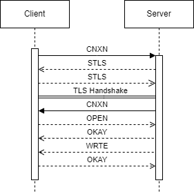

> This article was translated by GPT 5.5.

## Preface
The corresponding implementation for everything below can be found in the test repository [Antagonism](https://github.com/4o3F/Antagonism). If anything is unclear, comments are welcome.  
ADB's TLS-based authentication and communication protocols were mainly implemented to improve [Ascent](https://github.com/4o3F/Ascent). The official Android version of ADB built directly with the NDK has issues on some systems, such as [Samsung's system](https://github.com/termux/termux-packages/issues/7946).  
By implementing the pairing and authenticated communication flow for ADB wireless debugging in Rust, and then calling it from Flutter through Flutter Rust bridge, we can solve the problems caused by forcibly compiling an ADB Client designed for desktop systems onto mobile devices.

## ADB Wireless Debugging Pairing Protocol
First, note that Android uses BoringSSL, Google's OpenSSL-based library. Many parts have been changed, so try not to use OpenSSL to implement certain Android communication flows, because unexpected issues may occur.
### Certificate Generation
First, we need to generate an X509 certificate. Note that **this certificate and key must be stored properly**. They are the only identifier used later during authentication. The certificate generation code is as follows, and this part references the OpenSSL example.

{}

```rust
fn generate_cert() -> anyhow::Result<(boring::x509::X509, boring::pkey::PKey<boring::pkey::Private>)> {
    let rsa = boring::rsa::Rsa::generate(2048).context("failed to generate rsa keypair")?;
    // put it into the pkey struct
    let pkey = boring::pkey::PKey::from_rsa(rsa).context("failed to create pkey struct from rsa keypair")?;

    // make a new x509 certificate with the pkey we generated
    let mut x509builder = boring::x509::X509::builder().context("failed to make x509 builder")?;
    x509builder
        .set_version(2)
        .context("failed to set x509 version")?;

    // set the serial number to some big random positive integer
    let mut serial = boring::bn::BigNum::new().context("failed to make new bignum")?;
    serial
        .rand(32, boring::bn::MsbOption::ONE, false)
        .context("failed to generate random bignum")?;
    let serial = serial
        .to_asn1_integer()
        .context("failed to get asn1 integer from bignum")?;
    x509builder
        .set_serial_number(&serial)
        .context("failed to set x509 serial number")?;

    // call fails without expiration dates
    // I guess they are important anyway, but still
    let not_before = boring::asn1::Asn1Time::days_from_now(0).context("failed to parse 'notBefore' timestamp")?;
    let not_after = boring::asn1::Asn1Time::days_from_now(360)
        .context("failed to parse 'notAfter' timestamp")?;
    x509builder
        .set_not_before(&not_before)
        .context("failed to set x509 start date")?;
    x509builder
        .set_not_after(&not_after)
        .context("failed to set x509 expiration date")?;

    // add the issuer and subject name
    // it's set to "/CN=LinuxTransport"
    // if we want we can make that configurable later
    let mut x509namebuilder = boring::x509::X509Name::builder().context("failed to get x509name builder")?;
    x509namebuilder
        .append_entry_by_text("CN", "LinuxTransport")
        .context("failed to append /CN=LinuxTransport to x509name builder")?;
    let x509name = x509namebuilder.build();
    x509builder
        .set_issuer_name(&x509name)
        .context("failed to set x509 issuer name")?;
    x509builder
        .set_subject_name(&x509name)
        .context("failed to set x509 subject name")?;

    // set the public key
    x509builder
        .set_pubkey(&pkey)
        .context("failed to set x509 pubkey")?;

    // it also needs several extensions
    // in the openssl configuration file, these are set when generating certs
    //     basicConstraints=CA:true
    //     subjectKeyIdentifier=hash
    //     authorityKeyIdentifier=keyid:always,issuer
    // that means these extensions get added to certs generated using the
    // command line tool automatically. but since we are constructing it, we
    // need to add them manually.
    // we need to do them one at a time, and they need to be in this order
    // let conf = boring::conf::Conf::new(boring::conf::ConfMethod::).context("failed to make new conf struct")?;
    // it seems like everything depends on the basic constraints, so let's do
    // that first.
    let bc = boring::x509::extension::BasicConstraints::new()
        .ca()
        .build()
        .context("failed to build BasicConstraints extension")?;
    x509builder
        .append_extension(bc)
        .context("failed to append BasicConstraints extension")?;

    // the akid depends on the skid. I guess it copies the skid when the cert is
    // self-signed or something, I'm not really sure.
    let skid = {
        // we need to wrap these in a block because the builder gets borrowed away
        // from us
        let ext_con = x509builder.x509v3_context(None, None);
        boring::x509::extension::SubjectKeyIdentifier::new()
            .build(&ext_con)
            .context("failed to build SubjectKeyIdentifier extention")?
    };
    x509builder
        .append_extension(skid)
        .context("failed to append SubjectKeyIdentifier extention")?;

    // now that the skid is added we can add the akid
    let akid = {
        let ext_con = x509builder.x509v3_context(None, None);
        boring::x509::extension::AuthorityKeyIdentifier::new()
            .keyid(true)
            .issuer(false)
            .build(&ext_con)
            .context("failed to build AuthorityKeyIdentifier extention")?
    };
    x509builder
        .append_extension(akid)
        .context("failed to append AuthorityKeyIdentifier extention")?;

    // self-sign the certificate
    x509builder
        .sign(&pkey, boring::hash::MessageDigest::sha256())
        .context("failed to self-sign x509 cert")?;

    let x509 = x509builder.build();

    Ok((x509, pkey))
}
```

{}
Note that the certificate must be CA-signed; otherwise, it will report an error about using a CA certificate for communication.
### Connection
There are a few points to note:
+ Because the certificate is used for later authentication, ADBD forcibly requires both the server and the client to verify certificates. In other words, L4 must be set to PEER mode; otherwise, the client will not send its own certificate and verification will fail.
+ The certificate sent by ADBD also does not include a complete certificate signing chain, so the client's verifier must be configured to pass verification for any certificate at L10.
```rust
let domain = host.clone() + ":" + port.as_str();
let method = boring::ssl::SslMethod::tls();
let mut connector = boring::ssl::SslConnector::builder(method)?;
connector.set_verify(boring::ssl::SslVerifyMode::PEER);
// The following two line is critical for ADB client auth, without them system_server will throw out "No peer certificate" error.
connector.set_certificate(x509.clone().unwrap().as_ref())?;
connector.set_private_key(pkey.clone().unwrap().as_ref())?;

let mut config = connector.build().configure()?;
config.set_verify_callback(boring::ssl::SslVerifyMode::PEER, |_, _| true);
let stream = tokio::net::TcpStream::connect(domain.as_str()).await?;
let mut stream = tokio_boring::connect(config, host.as_str(), stream).await?;
```
Next, we need to store the certificate in memory for later use.
```rust
let mut exported_key_material = [0; 64];
stream.ssl().export_keying_material(&mut exported_key_material, EXPORTED_KEY_LABEL, None)?;
```
### SPAKE2 Verification Sending Phase
**Note that SPAKE2 must use BoringSSL's implementation; RustCrypto's implementation is inconsistent with it.**  
ADB uses the SPAKE2 protocol for the initial key exchange, so we first need to generate a SPAKE2 message as Alice.  
+ `password` is the 6-digit pairing code.
+ `CLIENT_NAME` is `adb pair client\u{0}`.
+ `SERVER_NAME` is `adb pair server\u{0}`.  
Do not omit the trailing zero.
```rust
let mut password = vec![0u8; code.as_bytes().len() + exported_key_material.len()];
password[..code.as_bytes().len()].copy_from_slice(code.as_bytes());
password[code.as_bytes().len()..].copy_from_slice(&exported_key_material);
let spake2_context = boring::curve25519::Spake2Context::new(
    boring::curve25519::Spake2Role::Alice,
    CLIENT_NAME,
    SERVER_NAME,
)?;
let mut outbound_msg = vec![0u8; 32];
spake2_context.generate_message(outbound_msg.as_mut_slice(), 32, password.as_ref())?;
```
Next, generate our Header. Headers are big-endian, 6 bytes long, and have the following structure:
```text
VERSION         u8
MESSAGE_TYPE    u8
MESSAGE_LENGTH  i32
```
```rust
// Set header
let mut header = bytebuffer::ByteBuffer::new();
header.resize(6);
header.set_endian(bytebuffer::Endian::BigEndian);
// Write in data
// Write version
header.write_u8(1);
// Write message type
header.write_u8(0);
// Write message length
header.write_i32(outbound_msg.len() as i32);
// Send data
stream.write_all(header.as_bytes()).await?;
stream.write_all(outbound_msg.as_slice()).await?;
```
### SPAKE2 Verification Receiving Phase
First, read the Header to check whether the message type matches and to obtain the message length.
```rust
stream.read_u8().await?;
let msg_type = stream.read_u8().await?;
let payload_length = stream.read_i32().await?;
if msg_type != 0u8 {
    log.write_all(("Message type miss match\n").as_bytes())?;
    panic!("Message type miss match");
}
```
Next, read the Bob key that was sent and process it to obtain the SPAKE2 key.
```rust
let mut payload_raw = vec![0u8; payload_length as usize];
stream.read_exact(payload_raw.as_mut_slice()).await?;
let mut bob_key = vec![0u8; 64];
spake2_context.process_message(bob_key.as_mut_slice(), 64, payload_raw.as_mut_slice())?;
```
Next, use HKDF SHA256 to expand the SPAKE2 key into the key used for AES encryption below.
```rust
let mut secret_key = [0u8; 16];
hkdf::Hkdf::<sha2::Sha256>::new(None, bob_key.as_ref()).expand("adb pairing_auth aes-128-gcm key".as_bytes(), &mut secret_key).unwrap();
```

### RSA Key Processing Phase
Next, the X509 certificate needs to be converted into the special certificate type used by Android. The whole process uses BoringSSL's built-in BigNum to avoid introducing too many dependencies.  
+ `ANDROID_PUBKEY_MODULUS_SIZE: i32 = 2048 / 8`
+ `ANDROID_PUBKEY_ENCODED_SIZE: i32 = 3 * 4 + 2 * ANDROID_PUBKEY_MODULUS_SIZE`
+ `ANDROID_PUBKEY_MODULUS_SIZE_WORDS: i32 = ANDROID_PUBKEY_MODULUS_SIZE / 4`

{}

```rust
pub fn encode_rsa_publickey(public_key: boring::rsa::Rsa<boring::pkey::Public>) -> Result<Vec<u8>, anyhow::Error> {
    let mut r32: boring::bn::BigNum;
    let mut n0inv: boring::bn::BigNum;
    let mut rr: boring::bn::BigNum;

    let mut tmp: boring::bn::BigNum;

    let mut ctx = boring::bn::BigNumContext::new()?;

    if (public_key.n().to_vec().len() as i32) < ANDROID_PUBKEY_MODULUS_SIZE {
        return Err(anyhow!(String::from("Invalid key length ") + public_key.n().to_vec().len().to_string().as_str()));
    }

    let mut key_struct = bytebuffer::ByteBuffer::new();
    key_struct.resize(ANDROID_PUBKEY_ENCODED_SIZE as usize);
    key_struct.set_endian(bytebuffer::Endian::LittleEndian);
    key_struct.write_i32(ANDROID_PUBKEY_MODULUS_SIZE_WORDS);

    // Compute and store n0inv = -1 / N[0] mod 2 ^ 32
    r32 = boring::bn::BigNum::new()?;
    r32.set_bit(32)?;
    n0inv = public_key.n().to_owned()?;
    tmp = n0inv.to_owned()?;
    // do n0inv mod r32
    n0inv.checked_rem(tmp.as_mut(), r32.as_ref(), ctx.as_mut())?;
    tmp = n0inv.to_owned()?;
    n0inv.mod_inverse(tmp.as_mut(), r32.as_ref(), ctx.as_mut())?;
    tmp = n0inv.to_owned()?;
    n0inv.checked_sub(r32.as_ref(), tmp.as_mut())?;

    // This is hacky.....
    key_struct.write_u32(n0inv.to_dec_str().unwrap().parse::<u32>().unwrap());

    key_struct.write(big_endian_to_little_endian_padded(
        ANDROID_PUBKEY_MODULUS_SIZE as usize,
        public_key.n().to_owned().unwrap())
        .unwrap().as_slice())?;

    rr = boring::bn::BigNum::new()?;
    rr.set_bit(ANDROID_PUBKEY_MODULUS_SIZE * 8)?;
    tmp = rr.to_owned()?;
    rr.mod_sqr(tmp.as_ref(), public_key.n().to_owned().unwrap().as_ref(), ctx.as_mut())?;

    key_struct.write(big_endian_to_little_endian_padded(
        ANDROID_PUBKEY_MODULUS_SIZE as usize,
        rr.to_owned().unwrap())
        .unwrap().as_slice())?;

    println!("{:?}", public_key.e().to_string().parse::<i32>().unwrap());
    key_struct.write_i32(public_key.e().to_string().parse::<i32>().unwrap());

    Ok(key_struct.into_vec())
}

fn encode_rsa_publickey_with_name(public_key: boring::rsa::Rsa<boring::pkey::Public>) -> Result<Vec<u8>, anyhow::Error> {
    let name = " Ascent@Antagonism\u{0}";
    let pkey_size = 4 * (f64::from(ANDROID_PUBKEY_ENCODED_SIZE) / 3.0).ceil() as usize;
    let mut bos = bytebuffer::ByteBuffer::new();
    bos.resize(pkey_size + name.len());
    let base64 = boring::base64::encode_block(encode_rsa_publickey(public_key).unwrap().as_slice());
    bos.write(base64.as_bytes())?;
    bos.write(name.as_bytes())?;
    Ok(bos.into_vec())
}
```

{}
### PeerInfo Generation Phase
First, prepare the Crypter used for AES 128 GCM encryption. As usual, use BoringSSL directly.
```rust
let encrypt_iv: i64 = 0;
let mut crypter = boring::symm::Crypter::new(
    boring::symm::Cipher::aes_128_gcm(),
    boring::symm::Mode::Encrypt,
    secret_key.as_ref(),
    Some(iv))?;
```
Next, prepare the 12-byte IV used for encryption. Note that this is little-endian at this point.
```rust
let mut iv_bytes = bytebuffer::ByteBuffer::new();
iv_bytes.resize(12);
iv_bytes.set_endian(bytebuffer::Endian::LittleEndian);
iv_bytes.write_i64(encrypt_iv);
let iv = iv_bytes.as_bytes();
```
Generate the PeerInfo packet. Note that this is stored in big-endian at this point.  
`MAX_PEER_INFO_SIZE: i32 = 1 << 13`
```rust
let mut peerinfo = bytebuffer::ByteBuffer::new();
peerinfo.resize(MAX_PEER_INFO_SIZE as usize);
peerinfo.set_endian(bytebuffer::Endian::BigEndian);
peerinfo.write_u8(0);
peerinfo.write(encode_rsa_publickey_with_name(x509.unwrap().public_key().unwrap().rsa().unwrap()).unwrap().as_slice())?;
```
Then encrypt the PeerInfo packet with AES.
```rust
let mut encrypted = vec![0u8; peerinfo.as_bytes().len()];
crypter.update(peerinfo.as_bytes(), encrypted.as_mut_slice())?;
    let fin = crypter.finalize(encrypted.as_mut_slice())?;
if fin != 0 {
    log.write_all(("Finalize error").as_bytes())?;
    panic!("Finalize error");
}
```
Note that AES GCM decryption ultimately requires not only the IV and the key, but also a TAG. However, BoringSSL's implementation does not automatically append the TAG, so we need to handle it manually.
```rust
let mut encryption_tag = vec![0u8; 16];
crypter.get_tag(encryption_tag.as_mut_slice())?;
encrypted.append(encryption_tag.as_mut());
```
### PeerInfo Exchange Phase
If desired, you can save the PeerInfo sent by ADBD here and verify ADBD when connecting later. However, since I used an internal-network environment throughout, I did not need this verification process, so this section only describes sending PeerInfo.  
First, send the Header. Note that the message type has now changed from 0 to 1.
```rust
let mut header = bytebuffer::ByteBuffer::new();
header.resize(6);
header.set_endian(bytebuffer::Endian::BigEndian);
// Write in data
header.write_u8(1);
// Write message type
header.write_u8(1);
// Write message length
header.write_i32(encrypted.len() as i32);
```
Then send the message.
```rust
stream.write_all(header.as_bytes()).await?;
stream.write_all(encrypted.as_slice()).await?;
stream.flush().await?;
```

## ADB Wireless Debugging Connection Protocol
Overview of the full protocol flow. The drawio file is [here](adb_tls_connect.drawio).  

### Packet Format
All packets are defined as follows.

{}

```rust
struct Message {
    command: u32,
    arg0: u32,
    arg1: u32,
    data_length: u32,
    data_check: u32,
    magic: u32,
}

impl Message {
    fn parse(buffer: &mut bytebuffer::ByteBuffer) -> Message {
        Message {
            command: buffer.read_u32().unwrap(),
            arg0: buffer.read_u32().unwrap(),
            arg1: buffer.read_u32().unwrap(),
            data_length: buffer.read_u32().unwrap(),
            data_check: buffer.read_u32().unwrap(),
            magic: buffer.read_u32().unwrap(),
        }
    }
}
```

{}
The data_check part of the packet needs a checksum generated from the data to prevent transmission errors. The checksum generation method is as follows.
```rust
fn get_payload_checksum(data: Vec<u8>, offset: i32, length: i32) -> i32 {
    let mut checksum: i32 = 0;
    for i in offset..(offset + length) {
        checksum += (data[i as usize] & 0xFF) as i32;
    }
    checksum
}
```
The complete packet generation process is as follows.

{}

```rust
fn generate_message(command: i32, arg0: i32, arg1: i32, data: Vec<u8>) -> bytebuffer::ByteBuffer {
    let mut message = bytebuffer::ByteBuffer::new();
    message.resize(ADB_HEADER_LENGTH + data.len());
    message.set_endian(bytebuffer::Endian::LittleEndian);
    message.write_i32(command);
    message.write_i32(arg0);
    message.write_i32(arg1);
    if data.len() != 0 {
        message.write_i32(data.len() as i32);
        message.write_i32(get_payload_checksum(data.clone(), 0, data.len() as i32));
    } else {
        message.write_i32(0);
        message.write_i32(0);
    }
    message.write_i32(!command);
    if data.len() != 0 {
        message.write_bytes(data.as_slice());
    }
    message
}
```

{}
Below are all required packet command values and additional constants.
```rust
const A_CNXN: i32 = 0x4e584e43;
const A_OPEN: i32 = 0x4e45504f;
const A_OKAY: i32 = 0x59414b4f;
const A_WRTE: i32 = 0x45545257;
const A_STLS: i32 = 0x534c5453;

const A_VERSION: i32 = 0x01000001;
const MAX_PAYLOAD: i32 = 1024 * 1024;
const A_STLS_VERSION: i32 = 0x01000000;
```
### Connection
First, connect using a standard TCP data stream. There is not much to say here.
```rust
let host = String::from("127.0.0.1:") + port.as_str();
let host = host.as_str();
let mut stream = tokio::net::TcpStream::connect(host).await.unwrap();
```
### Sending the CNXN Message
```rust
let cnxn_message = generate_message(
    A_CNXN,
    A_VERSION,
    MAX_PAYLOAD,
    Vec::from(SYSTEM_IDENTITY_STRING_HOST.as_bytes()),
);
stream.write_all(cnxn_message.as_bytes()).await.unwrap();
```
### Receiving the STLS Message
Note that this is also stored in little-endian. Also, for devices running Android 11 or later, TLS certificate authentication should be mandatory rather than signature authentication. I could not force TCP signature authentication on my device.
```rust
let mut message_raw = vec![0u8; ADB_HEADER_LENGTH];
stream.read_exact(message_raw.as_mut_slice()).await.unwrap();
let mut header = bytebuffer::ByteBuffer::from_vec(message_raw); // STLS header
header.resize(ADB_HEADER_LENGTH);
header.set_endian(bytebuffer::Endian::LittleEndian);

let message = Message::parse(&mut header);
if message.command != A_STLS as u32 {
    panic!("Not STLS command");
}
info!("STLS Received")
```
### Sending the STLS Message
There is not much to say here.
```rust
let stls_message = generate_message(A_STLS, A_STLS_VERSION, 0, Vec::new());
stream.write_all(stls_message.as_bytes()).await.unwrap();
```
### TLS Handshake Phase
Note here that if your device is rooted, ADBD may automatically disable certificate verification and allow connections from any certificate. In that case, you need to use Magisk to override `ro.boot.verifiedbootstate` to `green`, then restart ADBD so verification can proceed normally.  
The settings from L13 to L23 make the packets consistent with those sent by the official ADB Client. Note that disabling SNI at L23 is crucial. The section from L19 to L21 exports the key for this TLS-encrypted connection, which can be used for debugging in Wireshark.

{}

```rust
let cert_file = std::fs::File::open(cert_path).unwrap();
let pkey_file = std::fs::File::open(pkey_path).unwrap();
let x509_raw: Vec<u8> = cert_file.bytes().map(|x| x.unwrap()).collect();
let x509_raw = x509_raw.as_slice();
let pkey_raw: Vec<u8> = pkey_file.bytes().map(|x| x.unwrap()).collect();
let pkey_raw = pkey_raw.as_slice();

let x509 = Some(boring::x509::X509::from_pem(x509_raw).unwrap());
let pkey = Some(boring::pkey::PKey::private_key_from_pem(pkey_raw).unwrap());

let method = boring::ssl::SslMethod::tls();
let mut connector = boring::ssl::SslConnector::builder(method).unwrap();
connector.set_verify(boring::ssl::SslVerifyMode::NONE);
connector.set_certificate(x509.clone().unwrap().as_ref()).unwrap();
connector.set_private_key(pkey.clone().unwrap().as_ref()).unwrap();
connector.set_options(boring::ssl::SslOptions::NO_TLSV1);
connector.set_options(boring::ssl::SslOptions::NO_TLSV1_2);
connector.set_options(boring::ssl::SslOptions::NO_TLSV1_1);
connector.set_keylog_callback(move |_, line| {
    info!("{}", line);
});
let mut config = connector.build().configure().unwrap();
config.set_use_server_name_indication(false);
let mut stream = tokio_boring::connect(config, host, stream).await.unwrap();
```

{}
### Receiving the CNXN Message
After the secure TLS connection is successfully established, ADBD sends its own information.
```rust
let mut message_raw = vec![0u8; ADB_HEADER_LENGTH];
stream.read_exact(message_raw.as_mut_slice()).await.unwrap();
let mut header = bytebuffer::ByteBuffer::from_vec(message_raw); // CNXN header
header.resize(ADB_HEADER_LENGTH);
header.set_endian(bytebuffer::Endian::LittleEndian);

let message = Message::parse(&mut header);
info!("CNXN Received");
let mut data_raw = vec![0u8; message.data_length as usize];
stream.read_exact(data_raw.as_mut_slice()).await.unwrap();
let data = String::from_utf8(data_raw).unwrap();
info!("CNXN data: {}", data)
```
### SHELL Commands
Next, start executing commands. Since there is abundant material available about the ADB command flow after the TLS tunnel is established, this section only uses command execution as an example.
#### Sending the OPEN Message
```rust
let shell_cmd = "shell:logcat -d\u{0}";
let open_message = generate_message(A_OPEN, 233, 0, Vec::from(shell_cmd.as_bytes()));
stream.write_all(open_message.as_bytes()).await.unwrap();
```
#### Receiving the OKAY Message
Wait for ADBD to send an OKAY message indicating that the next step can proceed. Almost all ADB stream flows require both sides to send OKAY messages to confirm progress, one step at a time.
```rust
let mut message_raw = vec![0u8; ADB_HEADER_LENGTH];
stream.read_exact(message_raw.as_mut_slice()).await.unwrap();
let mut header = bytebuffer::ByteBuffer::from_vec(message_raw); // CNXN header
header.resize(ADB_HEADER_LENGTH);
header.set_endian(bytebuffer::Endian::LittleEndian);

let message = Message::parse(&mut header);
if message.command != A_OKAY as u32 {
    panic!("Not OKAY command");
}
info!("OKAY Received");
```
#### Receiving the WRTE Message
The WRTE message received here is the command execution result. If the OPEN command above used `shell:` instead of appending a command after it, the response would be the terminal prompt, such as `OPPO: $/`.  
```rust
let mut message_raw = vec![0u8; ADB_HEADER_LENGTH];
stream.read_exact(message_raw.as_mut_slice()).await.unwrap();
let mut header = bytebuffer::ByteBuffer::from_vec(message_raw); // CNXN header
header.resize(ADB_HEADER_LENGTH);
header.set_endian(bytebuffer::Endian::LittleEndian);

let message = Message::parse(&mut header);
if message.command != A_WRTE as u32 {
    panic!("Not WRTE command");
}
info!("WRTE Received");
let mut data_raw = vec![0u8; message.data_length as usize];
stream.read_exact(data_raw.as_mut_slice()).await.unwrap();
link = String::from_utf8(data_raw).unwrap();
info!("WRTE data: {}", link)
```
#### Sending the OKAY Message
Tell ADBD that we have finished processing the information in the previously received WRTE message and can continue interacting.
```rust
let okay_message = generate_message(A_OKAY, 233, 0, Vec::new());
stream.write_all(okay_message.as_bytes()).await.unwrap();
info!("OKAY Sent");
```
