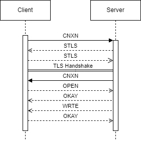

## 前言
以下内容都可以在测试仓库[Antagonism](https://github.com/4o3F/Antagonism)中找到对应的实现，如果有任何不清楚的地方欢迎评论  
ADB基于TLS的认证和通讯协议主要是为了完善[Ascent](https://github.com/4o3F/Ascent)，直接用NDK编译的Android版官方ADB在一些系统上会出现问题，比如说[Samsung的系统](https://github.com/termux/termux-packages/issues/7946)  
通过用Rust实现ADB无线调试的配对与认证通信流程，再通过Flutter Rust bridge在Flutter中调用，可以解决强行将为桌面端设计的ADB Client编译到移动端造成的问题

## ADB无线调试配对协议
首先要注意，安卓使用的是Google基于OpenSSL编写的BoringSSL，很多地方都有改动，所以尽量不要使用OpenSSL来实现安卓的一些通讯，可能会出现异常
### 生成证书
首先我们需要生成一份X509格式的证书，注意**这个证书和密钥必须妥善保存**，这是后期在认证时候的唯一标识，生成证书的代码如下，这部分参考了OpenSSL的example
```rust
fn generate_cert() -> anyhow::Result<(boring::x509::X509, boring::pkey::PKey<boring::pkey::Private>)> {
    let rsa = boring::rsa::Rsa::generate(2048).context("failed to generate rsa keypair")?;
    // put it into the pkey struct
    let pkey = boring::pkey::PKey::from_rsa(rsa).context("failed to create pkey struct from rsa keypair")?;

    // make a new x509 certificate with the pkey we generated
    let mut x509builder = boring::x509::X509::builder().context("failed to make x509 builder")?;
    x509builder
        .set_version(2)
        .context("failed to set x509 version")?;

    // set the serial number to some big random positive integer
    let mut serial = boring::bn::BigNum::new().context("failed to make new bignum")?;
    serial
        .rand(32, boring::bn::MsbOption::ONE, false)
        .context("failed to generate random bignum")?;
    let serial = serial
        .to_asn1_integer()
        .context("failed to get asn1 integer from bignum")?;
    x509builder
        .set_serial_number(&serial)
        .context("failed to set x509 serial number")?;

    // call fails without expiration dates
    // I guess they are important anyway, but still
    let not_before = boring::asn1::Asn1Time::days_from_now(0).context("failed to parse 'notBefore' timestamp")?;
    let not_after = boring::asn1::Asn1Time::days_from_now(360)
        .context("failed to parse 'notAfter' timestamp")?;
    x509builder
        .set_not_before(&not_before)
        .context("failed to set x509 start date")?;
    x509builder
        .set_not_after(&not_after)
        .context("failed to set x509 expiration date")?;

    // add the issuer and subject name
    // it's set to "/CN=LinuxTransport"
    // if we want we can make that configurable later
    let mut x509namebuilder = boring::x509::X509Name::builder().context("failed to get x509name builder")?;
    x509namebuilder
        .append_entry_by_text("CN", "LinuxTransport")
        .context("failed to append /CN=LinuxTransport to x509name builder")?;
    let x509name = x509namebuilder.build();
    x509builder
        .set_issuer_name(&x509name)
        .context("failed to set x509 issuer name")?;
    x509builder
        .set_subject_name(&x509name)
        .context("failed to set x509 subject name")?;

    // set the public key
    x509builder
        .set_pubkey(&pkey)
        .context("failed to set x509 pubkey")?;

    // it also needs several extensions
    // in the openssl configuration file, these are set when generating certs
    //     basicConstraints=CA:true
    //     subjectKeyIdentifier=hash
    //     authorityKeyIdentifier=keyid:always,issuer
    // that means these extensions get added to certs generated using the
    // command line tool automatically. but since we are constructing it, we
    // need to add them manually.
    // we need to do them one at a time, and they need to be in this order
    // let conf = boring::conf::Conf::new(boring::conf::ConfMethod::).context("failed to make new conf struct")?;
    // it seems like everything depends on the basic constraints, so let's do
    // that first.
    let bc = boring::x509::extension::BasicConstraints::new()
        .ca()
        .build()
        .context("failed to build BasicConstraints extension")?;
    x509builder
        .append_extension(bc)
        .context("failed to append BasicConstraints extension")?;

    // the akid depends on the skid. I guess it copies the skid when the cert is
    // self-signed or something, I'm not really sure.
    let skid = {
        // we need to wrap these in a block because the builder gets borrowed away
        // from us
        let ext_con = x509builder.x509v3_context(None, None);
        boring::x509::extension::SubjectKeyIdentifier::new()
            .build(&ext_con)
            .context("failed to build SubjectKeyIdentifier extention")?
    };
    x509builder
        .append_extension(skid)
        .context("failed to append SubjectKeyIdentifier extention")?;

    // now that the skid is added we can add the akid
    let akid = {
        let ext_con = x509builder.x509v3_context(None, None);
        boring::x509::extension::AuthorityKeyIdentifier::new()
            .keyid(true)
            .issuer(false)
            .build(&ext_con)
            .context("failed to build AuthorityKeyIdentifier extention")?
    };
    x509builder
        .append_extension(akid)
        .context("failed to append AuthorityKeyIdentifier extention")?;

    // self-sign the certificate
    x509builder
        .sign(&pkey, boring::hash::MessageDigest::sha256())
        .context("failed to self-sign x509 cert")?;

    let x509 = x509builder.build();

    Ok((x509, pkey))
}
```
注意下必须要是由CA签名的证书，否则的话会提示在用CA证书来进行通讯的错误
### 连接
有几点要注意的
+ 由于证书要用于后续认证，所以ADBD会强制要求服务器和客户端双方全都校验证书，也就是在L4必须设置为PEER模式，否则的话客户端不会发送自己的证书导致验证失败
+ ADBD发送来的证书也没有完整的证书签名链，所以必须要设置客户端的验证器让其对任何证书都校验通过L10
```rust
let domain = host.clone() + ":" + port.as_str();
let method = boring::ssl::SslMethod::tls();
let mut connector = boring::ssl::SslConnector::builder(method)?;
connector.set_verify(boring::ssl::SslVerifyMode::PEER);
// The following two line is critical for ADB client auth, without them system_server will throw out "No peer certificate" error.
connector.set_certificate(x509.clone().unwrap().as_ref())?;
connector.set_private_key(pkey.clone().unwrap().as_ref())?;

let mut config = connector.build().configure()?;
config.set_verify_callback(boring::ssl::SslVerifyMode::PEER, |_, _| true);
let stream = tokio::net::TcpStream::connect(domain.as_str()).await?;
let mut stream = tokio_boring::connect(config, host.as_str(), stream).await?;
```
接下来我们需要将证书保存在内存中，之后会用到
```rust
let mut exported_key_material = [0; 64];
stream.ssl().export_keying_material(&mut exported_key_material, EXPORTED_KEY_LABEL, None)?;
```
### SPAKE2验证发送阶段
**注意SPAKE2必须使用BoringSSL的实现，RustCrypto的实现与其不一致**  
ADB使用SPAKE2协议来进行初始密钥交换，所以我们首先要以Alice身份生成一个SPAKE2消息  
+ `password`为6位配对码
+ `CLIENT_NAME`为`adb pair client\u{0}`
+ `SERVER_NAME`为`adb pair server\u{0}`  
注意最后一位的0不要落下
```rust
let mut password = vec![0u8; code.as_bytes().len() + exported_key_material.len()];
password[..code.as_bytes().len()].copy_from_slice(code.as_bytes());
password[code.as_bytes().len()..].copy_from_slice(&exported_key_material);
let spake2_context = boring::curve25519::Spake2Context::new(
    boring::curve25519::Spake2Role::Alice,
    CLIENT_NAME,
    SERVER_NAME,
)?;
let mut outbound_msg = vec![0u8; 32];
spake2_context.generate_message(outbound_msg.as_mut_slice(), 32, password.as_ref())?;
```
接下来生成我们的Header，Header均为大端输入，6个字节，结构如下
```text
VERSION         u8
MESSAGE_TYPE    u8
MESSAGE_LENGTH  i32
```
```rust
// Set header
let mut header = bytebuffer::ByteBuffer::new();
header.resize(6);
header.set_endian(bytebuffer::Endian::BigEndian);
// Write in data
// Write version
header.write_u8(1);
// Write message type
header.write_u8(0);
// Write message length
header.write_i32(outbound_msg.len() as i32);
// Send data
stream.write_all(header.as_bytes()).await?;
stream.write_all(outbound_msg.as_slice()).await?;
```
### SPAKE2验证接收阶段
首先先读取Header检查消息类型是否匹配，并得知消息长度
```rust
stream.read_u8().await?;
let msg_type = stream.read_u8().await?;
let payload_length = stream.read_i32().await?;
if msg_type != 0u8 {
    log.write_all(("Message type miss match\n").as_bytes())?;
    panic!("Message type miss match");
}
```
接下来读取发来的Bob key并处理得到SPAKE2密钥
```rust
let mut payload_raw = vec![0u8; payload_length as usize];
stream.read_exact(payload_raw.as_mut_slice()).await?;
let mut bob_key = vec![0u8; 64];
spake2_context.process_message(bob_key.as_mut_slice(), 64, payload_raw.as_mut_slice())?;
```
接下来使用HKDF SHA256将SPAKE2密钥扩展为下文中AES加密所用的密钥
```rust
let mut secret_key = [0u8; 16];
hkdf::Hkdf::<sha2::Sha256>::new(None, bob_key.as_ref()).expand("adb pairing_auth aes-128-gcm key".as_bytes(), &mut secret_key).unwrap();
```

### RSA密钥处理阶段
接下来需要将X509证书变为安卓所使用的特殊证书类型，全程使用BoringSSL自带的BigNum避免引入过多依赖  
+ `ANDROID_PUBKEY_MODULUS_SIZE: i32 = 2048 / 8`
+ `ANDROID_PUBKEY_ENCODED_SIZE: i32 = 3 * 4 + 2 * ANDROID_PUBKEY_MODULUS_SIZE`
+ `ANDROID_PUBKEY_MODULUS_SIZE_WORDS: i32 = ANDROID_PUBKEY_MODULUS_SIZE / 4`
```rust
pub fn encode_rsa_publickey(public_key: boring::rsa::Rsa<boring::pkey::Public>) -> Result<Vec<u8>, anyhow::Error> {
    let mut r32: boring::bn::BigNum;
    let mut n0inv: boring::bn::BigNum;
    let mut rr: boring::bn::BigNum;

    let mut tmp: boring::bn::BigNum;

    let mut ctx = boring::bn::BigNumContext::new()?;

    if (public_key.n().to_vec().len() as i32) < ANDROID_PUBKEY_MODULUS_SIZE {
        return Err(anyhow!(String::from("Invalid key length ") + public_key.n().to_vec().len().to_string().as_str()));
    }

    let mut key_struct = bytebuffer::ByteBuffer::new();
    key_struct.resize(ANDROID_PUBKEY_ENCODED_SIZE as usize);
    key_struct.set_endian(bytebuffer::Endian::LittleEndian);
    key_struct.write_i32(ANDROID_PUBKEY_MODULUS_SIZE_WORDS);

    // Compute and store n0inv = -1 / N[0] mod 2 ^ 32
    r32 = boring::bn::BigNum::new()?;
    r32.set_bit(32)?;
    n0inv = public_key.n().to_owned()?;
    tmp = n0inv.to_owned()?;
    // do n0inv mod r32
    n0inv.checked_rem(tmp.as_mut(), r32.as_ref(), ctx.as_mut())?;
    tmp = n0inv.to_owned()?;
    n0inv.mod_inverse(tmp.as_mut(), r32.as_ref(), ctx.as_mut())?;
    tmp = n0inv.to_owned()?;
    n0inv.checked_sub(r32.as_ref(), tmp.as_mut())?;

    // This is hacky.....
    key_struct.write_u32(n0inv.to_dec_str().unwrap().parse::<u32>().unwrap());

    key_struct.write(big_endian_to_little_endian_padded(
        ANDROID_PUBKEY_MODULUS_SIZE as usize,
        public_key.n().to_owned().unwrap())
        .unwrap().as_slice())?;

    rr = boring::bn::BigNum::new()?;
    rr.set_bit(ANDROID_PUBKEY_MODULUS_SIZE * 8)?;
    tmp = rr.to_owned()?;
    rr.mod_sqr(tmp.as_ref(), public_key.n().to_owned().unwrap().as_ref(), ctx.as_mut())?;

    key_struct.write(big_endian_to_little_endian_padded(
        ANDROID_PUBKEY_MODULUS_SIZE as usize,
        rr.to_owned().unwrap())
        .unwrap().as_slice())?;

    println!("{:?}", public_key.e().to_string().parse::<i32>().unwrap());
    key_struct.write_i32(public_key.e().to_string().parse::<i32>().unwrap());

    Ok(key_struct.into_vec())
}

fn encode_rsa_publickey_with_name(public_key: boring::rsa::Rsa<boring::pkey::Public>) -> Result<Vec<u8>, anyhow::Error> {
    let name = " Ascent@Antagonism\u{0}";
    let pkey_size = 4 * (f64::from(ANDROID_PUBKEY_ENCODED_SIZE) / 3.0).ceil() as usize;
    let mut bos = bytebuffer::ByteBuffer::new();
    bos.resize(pkey_size + name.len());
    let base64 = boring::base64::encode_block(encode_rsa_publickey(public_key).unwrap().as_slice());
    bos.write(base64.as_bytes())?;
    bos.write(name.as_bytes())?;
    Ok(bos.into_vec())
}
```
### PeerInfo生成阶段
首先准备AES 128 GCM加密所使用的Crypter，照例直接使用BoringSSL的
```rust
let encrypt_iv: i64 = 0;
let mut crypter = boring::symm::Crypter::new(
    boring::symm::Cipher::aes_128_gcm(),
    boring::symm::Mode::Encrypt,
    secret_key.as_ref(),
    Some(iv))?;
```
接着准备12字节加密用IV，注意此时为小端
```rust
let mut iv_bytes = bytebuffer::ByteBuffer::new();
iv_bytes.resize(12);
iv_bytes.set_endian(bytebuffer::Endian::LittleEndian);
iv_bytes.write_i64(encrypt_iv);
let iv = iv_bytes.as_bytes();
```
生成PeerInfo包，注意此时为大端储存  
`MAX_PEER_INFO_SIZE: i32 = 1 << 13`
```rust
let mut peerinfo = bytebuffer::ByteBuffer::new();
peerinfo.resize(MAX_PEER_INFO_SIZE as usize);
peerinfo.set_endian(bytebuffer::Endian::BigEndian);
peerinfo.write_u8(0);
peerinfo.write(encode_rsa_publickey_with_name(x509.unwrap().public_key().unwrap().rsa().unwrap()).unwrap().as_slice())?;
```
然后对PeerInfo包进行AES加密
```rust
let mut encrypted = vec![0u8; peerinfo.as_bytes().len()];
crypter.update(peerinfo.as_bytes(), encrypted.as_mut_slice())?;
    let fin = crypter.finalize(encrypted.as_mut_slice())?;
if fin != 0 {
    log.write_all(("Finalize error").as_bytes())?;
    panic!("Finalize error");
}
```
注意AES GCM加密最终解密需要的除了IV，密钥，还有一个TAG，然而BoringSSL的实现中并没有自动附加TAG因而我们需要手动处理
```rust
let mut encryption_tag = vec![0u8; 16];
crypter.get_tag(encryption_tag.as_mut_slice())?;
encrypted.append(encryption_tag.as_mut());
```
### PeerInfo交换阶段
如果想的话其实可以在这里对ADBD发来的PeerInfo进行保存，之后再连接的时候对ADBD也进行验证，但是由于我全程使用内网环境，对这一验证过程并没有什么需求，因而此处只讲述PeerInfo的发送  
首先发送Header，注意此时的消息类型已经从0变为1了
```rust
let mut header = bytebuffer::ByteBuffer::new();
header.resize(6);
header.set_endian(bytebuffer::Endian::BigEndian);
// Write in data
header.write_u8(1);
// Write message type
header.write_u8(1);
// Write message length
header.write_i32(encrypted.len() as i32);
```
然后发送消息
```rust
stream.write_all(header.as_bytes()).await?;
stream.write_all(encrypted.as_slice()).await?;
stream.flush().await?;
```

## ADB无线调试连接协议
协议全过程总览，drawio文件[在这里](adb_tls_connect.drawio)  

### 数据包格式
所有数据包的定义如下
```rust
struct Message {
    command: u32,
    arg0: u32,
    arg1: u32,
    data_length: u32,
    data_check: u32,
    magic: u32,
}

impl Message {
    fn parse(buffer: &mut bytebuffer::ByteBuffer) -> Message {
        Message {
            command: buffer.read_u32().unwrap(),
            arg0: buffer.read_u32().unwrap(),
            arg1: buffer.read_u32().unwrap(),
            data_length: buffer.read_u32().unwrap(),
            data_check: buffer.read_u32().unwrap(),
            magic: buffer.read_u32().unwrap(),
        }
    }
}
```
数据包的data_check部分需要对数据生成checksum以防止传输出错，checksum生成方法如下
```rust
fn get_payload_checksum(data: Vec<u8>, offset: i32, length: i32) -> i32 {
    let mut checksum: i32 = 0;
    for i in offset..(offset + length) {
        checksum += (data[i as usize] & 0xFF) as i32;
    }
    checksum
}
```
完整的数据包生成过程如下
```rust
fn generate_message(command: i32, arg0: i32, arg1: i32, data: Vec<u8>) -> bytebuffer::ByteBuffer {
    let mut message = bytebuffer::ByteBuffer::new();
    message.resize(ADB_HEADER_LENGTH + data.len());
    message.set_endian(bytebuffer::Endian::LittleEndian);
    message.write_i32(command);
    message.write_i32(arg0);
    message.write_i32(arg1);
    if data.len() != 0 {
        message.write_i32(data.len() as i32);
        message.write_i32(get_payload_checksum(data.clone(), 0, data.len() as i32));
    } else {
        message.write_i32(0);
        message.write_i32(0);
    }
    message.write_i32(!command);
    if data.len() != 0 {
        message.write_bytes(data.as_slice());
    }
    message
}
```
下面是所有需要的数据包command部分以及额外的固定值
```rust
const A_CNXN: i32 = 0x4e584e43;
const A_OPEN: i32 = 0x4e45504f;
const A_OKAY: i32 = 0x59414b4f;
const A_WRTE: i32 = 0x45545257;
const A_STLS: i32 = 0x534c5453;

const A_VERSION: i32 = 0x01000001;
const MAX_PAYLOAD: i32 = 1024 * 1024;
const A_STLS_VERSION: i32 = 0x01000000;
```
### 连接
首先使用标准TCP数据流进行连接，不多说
```rust
let host = String::from("127.0.0.1:") + port.as_str();
let host = host.as_str();
let mut stream = tokio::net::TcpStream::connect(host).await.unwrap();
```
### 发送CNXN消息
```rust
let cnxn_message = generate_message(
    A_CNXN,
    A_VERSION,
    MAX_PAYLOAD,
    Vec::from(SYSTEM_IDENTITY_STRING_HOST.as_bytes()),
);
stream.write_all(cnxn_message.as_bytes()).await.unwrap();
```
### 接收STLS消息
注意也是小端储存，同时对于Android 11以上的设备，应该必须使用TLS证书验证而不是签名验证，我无法在我的设备上强制使用TCP的签名验证
```rust
let mut message_raw = vec![0u8; ADB_HEADER_LENGTH];
stream.read_exact(message_raw.as_mut_slice()).await.unwrap();
let mut header = bytebuffer::ByteBuffer::from_vec(message_raw); // STLS header
header.resize(ADB_HEADER_LENGTH);
header.set_endian(bytebuffer::Endian::LittleEndian);

let message = Message::parse(&mut header);
if message.command != A_STLS as u32 {
    panic!("Not STLS command");
}
info!("STLS Received")
```
### 发送STLS消息
没什么好说的
```rust
let stls_message = generate_message(A_STLS, A_STLS_VERSION, 0, Vec::new());
stream.write_all(stls_message.as_bytes()).await.unwrap();
```
### TLS握手阶段
此处注意，如果你的设备Root了，ADBD可能会自动关闭证书验证并允许任何证书连接，这时候需要使用Magisk覆盖`ro.boot.verifiedbootstate`为`green`而后重启ADBD才能正常进行验证  
L13到L23进行的设置使得其与官方ADB Client发送的数据包一致，注意L23的关闭SNI至关重要，L19到L21的部分会导出这次TLS加密连接的密钥，可以用于在Wireshark中Debug使用
```rust
let cert_file = std::fs::File::open(cert_path).unwrap();
let pkey_file = std::fs::File::open(pkey_path).unwrap();
let x509_raw: Vec<u8> = cert_file.bytes().map(|x| x.unwrap()).collect();
let x509_raw = x509_raw.as_slice();
let pkey_raw: Vec<u8> = pkey_file.bytes().map(|x| x.unwrap()).collect();
let pkey_raw = pkey_raw.as_slice();

let x509 = Some(boring::x509::X509::from_pem(x509_raw).unwrap());
let pkey = Some(boring::pkey::PKey::private_key_from_pem(pkey_raw).unwrap());

let method = boring::ssl::SslMethod::tls();
let mut connector = boring::ssl::SslConnector::builder(method).unwrap();
connector.set_verify(boring::ssl::SslVerifyMode::NONE);
connector.set_certificate(x509.clone().unwrap().as_ref()).unwrap();
connector.set_private_key(pkey.clone().unwrap().as_ref()).unwrap();
connector.set_options(boring::ssl::SslOptions::NO_TLSV1);
connector.set_options(boring::ssl::SslOptions::NO_TLSV1_2);
connector.set_options(boring::ssl::SslOptions::NO_TLSV1_1);
connector.set_keylog_callback(move |_, line| {
    info!("{}", line);
});
let mut config = connector.build().configure().unwrap();
config.set_use_server_name_indication(false);
let mut stream = tokio_boring::connect(config, host, stream).await.unwrap();
```
### 接收CNXN消息
成功建立安全TLS连接后，ADBD会发送自己的信息
```rust
let mut message_raw = vec![0u8; ADB_HEADER_LENGTH];
stream.read_exact(message_raw.as_mut_slice()).await.unwrap();
let mut header = bytebuffer::ByteBuffer::from_vec(message_raw); // CNXN header
header.resize(ADB_HEADER_LENGTH);
header.set_endian(bytebuffer::Endian::LittleEndian);

let message = Message::parse(&mut header);
info!("CNXN Received");
let mut data_raw = vec![0u8; message.data_length as usize];
stream.read_exact(data_raw.as_mut_slice()).await.unwrap();
let data = String::from_utf8(data_raw).unwrap();
info!("CNXN data: {}", data)
```
### SHELL指令
接下来开始执行指令，由于建立起TLS隧道后的ADB指令流程有丰富资料可以查询，此处仅以执行指令为例
#### 发送OPEN消息
```rust
let shell_cmd = "shell:logcat -d\u{0}";
let open_message = generate_message(A_OPEN, 233, 0, Vec::from(shell_cmd.as_bytes()));
stream.write_all(open_message.as_bytes()).await.unwrap();
```
#### 接收OKAY消息
等待ADBD发送OKAY消息提示可以进行下一步，所有的ADB流过程基本都需要双方互相发送OKAY进行确认，一步步进行
```rust
let mut message_raw = vec![0u8; ADB_HEADER_LENGTH];
stream.read_exact(message_raw.as_mut_slice()).await.unwrap();
let mut header = bytebuffer::ByteBuffer::from_vec(message_raw); // CNXN header
header.resize(ADB_HEADER_LENGTH);
header.set_endian(bytebuffer::Endian::LittleEndian);

let message = Message::parse(&mut header);
if message.command != A_OKAY as u32 {
    panic!("Not OKAY command");
}
info!("OKAY Received");
```
#### 接收WRTE消息
此处接收到的WRTE消息为指令的执行结果，如果在上面发送OPEN指令的时候使用的是`shell:`而非后面跟随指令，则会回复终端的提示符，类似`OPPO: $/`  
```rust
let mut message_raw = vec![0u8; ADB_HEADER_LENGTH];
stream.read_exact(message_raw.as_mut_slice()).await.unwrap();
let mut header = bytebuffer::ByteBuffer::from_vec(message_raw); // CNXN header
header.resize(ADB_HEADER_LENGTH);
header.set_endian(bytebuffer::Endian::LittleEndian);

let message = Message::parse(&mut header);
if message.command != A_WRTE as u32 {
    panic!("Not WRTE command");
}
info!("WRTE Received");
let mut data_raw = vec![0u8; message.data_length as usize];
stream.read_exact(data_raw.as_mut_slice()).await.unwrap();
link = String::from_utf8(data_raw).unwrap();
info!("WRTE data: {}", link)
```
#### 发送OKAY消息
提示ADBD我们已经处理完成上一条接收到的WRTE中的信息可以继续进行交互了
```rust
let okay_message = generate_message(A_OKAY, 233, 0, Vec::new());
stream.write_all(okay_message.as_bytes()).await.unwrap();
info!("OKAY Sent");
```