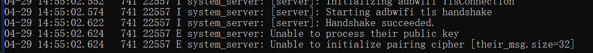

> This article was translated by GPT 5.5.

## Preface

> ~~Ascent is not open source yet. It will be open sourced some time after the official release, mainly to prevent the whole project from being taken away, stuffed with ads, and distributed everywhere.~~
> ~~But I did not harden the main program either, so it only keeps honest people honest~~  
> [Ascent repo is here](https://github.com/4o3F/Ascent)  
> [adb4arm repo is here](https://github.com/4o3F/adb4arm)  

Ascent was originally developed to make it easier to obtain miHoYo game gacha history links on Android with only a single device,
but later I found that this whole flow could also be used for other programs that need `adb shell` permission to run, such as Ice Box,
so they can be enabled when there is only one standalone device and no computer.

After the whole program is open sourced, I will also try to turn it into a general-purpose tool app.

During development, restrictions in newer Android versions and some limitations of ADB itself made things quite difficult for someone at my level.
In particular, a lot of material online was too old or incorrect, which caused plenty of trouble. Here I will sort out the main points for people who want to take a similar route.

Because the whole thing depends heavily on ADB wireless debugging, it cannot be used without Wi-Fi. I have not thought of a workaround for now.

## ADB Pairing and Connection

ADB wireless debugging must be paired before it can connect. During pairing, both sides exchange keys for authentication.
My original idea was to write a simulator in Rust, inspired by [https://github.com/MuntashirAkon/libadb-android](https://github.com/MuntashirAkon/libadb-android).

My specific code is here: [https://github.com/4o3F/Antagonism](https://github.com/4o3F/Antagonism).
I tried for almost a month (I was really bad at it) but ultimately failed. Especially since Android's ADB could not be directly replaced as a module, and I was not very familiar with GDB debugging, I could not solve the ADB Host decryption failure. If any expert can point out the problem, I would really appreciate it.

After testing, I suspected the problem was in the SPAKE2 data exchange, possibly due to inconsistent implementations between BoringSSL and RustCrypto.
But I could not implement a working version myself, so after being tortured by it for half a month, I gave up on this approach.

The direction then shifted to directly porting the ADB Client that originally runs on Windows and Linux to the ARM platform.
Existing materials are all based on older ADB versions, while the ADB Client with pairing support is newer. With no better option, I pieced together a workable solution from existing materials. It is not open source yet either: [https://github.com/4o3F/adb4arm](https://github.com/4o3F/adb4arm), and I will make it public at a suitable time.


## Android App Permissions & Running Binary Files

On newer Android versions, no files inside an app's data directory currently have execute permission; the directory can only be used as a data folder.
Therefore, you cannot simply extract a binary into the data directory and then grant execute permission with `chmod`. However, during installation, all files in the APK's `bin` directory that match `^lib.*\.so$`
will be extracted into a separate executable directory. All files under that directory have execute permission, but the directory itself has no write permission. So the binary executable must be extracted into this library directory,
and all its write and read data must be placed in the app's data directory. This means that although the binary can now execute, ADB, whose current target platforms are Windows and Linux, still needs to be modified so it can run on Android phones.

## ADB Modifications

To prevent ADB from reading and writing files under directories without permission, the ADB command handling code needs to be modified. See the GitHub repo for details.  

{}

```C++
// File: /adb/adb_utils.cpp L347
// Original
    if (tmp_dir == nullptr) tmp_dir = "/tmp";
// Edited
    if (tmp_dir == nullptr) tmp_dir = "/data/local/tmp";
/*
On Android, /data/local/tmp is a temporary directory available to all apps, so ADB's temporary directory needs to be changed.
*/


// File: /adb/client/commandline.cpp
// Original L1773
        if (argc < 2 || argc > 3) error_exit("usage: adb pair HOST[:PORT] [PAIRING CODE]");

        std::string password;
        if (argc == 2) {
            printf("Enter pairing code: ");
            fflush(stdout);
            if (!std::getline(std::cin, password) || password.empty()) {
                error_exit("No pairing code provided");
            }
        } else {
            password = argv[2];
        }

// Edited L1603
        if (argc < 3 || argc > 4) error_exit("usage: adb pair HOST[:PORT] [PAIRING CODE]");

        std::string password = argv[2];
        std::string path = argv[3];
        setenv("HOME", path.c_str(), 1);
        path = path + std::string("/adb.log");
        setenv("ANDROID_ADB_LOG_PATH", path.c_str(), 1);

/*
This changes the adb pair command so it additionally accepts a log file path and saves the log file in the app's data folder for easier debugging.
*/


// File: /adb/client/commandline.cpp
// Original L2067
    } else if (!strcmp(argv[0], "start-server")) {
        std::string error;

// Edited L1893
    } else if (!strcmp(argv[0], "start-server")) {
        std::string error;
        std::string path = argv[1];
        setenv("HOME", path.c_str(), 1);
        path = path + std::string("/adb.log");
        setenv("ANDROID_ADB_LOG_PATH", path.c_str(), 1);

/*
This changes the adb start-server command to also pass in the log file path, avoiding errors caused by lost environment variables.
*/
```

{}
The main change is to alter the command arguments so that all paths where ADB needs to save files are changed to data folders that the app can read and write, avoiding errors.

## Flutter Isolate and Background Service
This issue mainly occurs when adapting to older Android versions or Android systems that cannot use split screen. Ascent uses notification quick replies to obtain the pairing code.  
But to send notifications, Android needs to start a Background Service, and this service is isolated from the main process. Flutter separately starts an Isolate to run it.
In that case, data obtained by the background service cannot be passed to the main process, so a communication method is needed. I will explain below how I handled this.

## Flutter Rust Bridge and Multithreaded Data Synchronization
Actually, the best way to solve Android multithreaded data synchronization should be to use native code, implement an EventBus or directly use shared memory, and store all data on the Java side.
But this project is something I was tinkering with personally, so I chose Flutter Rust Bridge with Rust to solve it.

According to Flutter Rust Bridge's introduction, the native code it calls runs on a brand-new process, and that process never stops. So I chose to use Rust to implement a super ~~simple~~ crude EventBus for cross-process data synchronization on the Flutter UI side.
The whole code is under 50 lines.

{}

```rust
use std::collections::HashMap;
use std::sync::{Arc, Mutex};
use flutter_rust_bridge::support::lazy_static;

use anyhow::{Result};
use flutter_rust_bridge::*;

lazy_static!(
    static ref GLOBAL_DATA: Mutex<HashMap<String, String>> = Mutex::new(HashMap::<String, String>::new());
);


pub fn write_data(key: String, value: String) {
    GLOBAL_DATA.lock().unwrap().insert(key, value);
}

pub fn get_data(key: String) -> String {
    GLOBAL_DATA.lock().unwrap().get(key.as_str()).unwrap().clone()
}

pub fn count_data() -> i32 {
    GLOBAL_DATA.lock().unwrap().keys().len() as i32
}

lazy_static! {
    static ref EVENTS: Arc<Mutex<Vec<StreamSink<Event>>>> = Arc::new(Mutex::new(Vec::new()));
}

#[frb(dart_metadata = ("freezed"))]
#[derive(Clone)]
pub struct Event {
    pub address: String,
    pub payload: String,
}

impl Event {
    pub fn as_string(&self) -> String {
        format!("{}: {}", self.address, self.payload)
    }
}

pub fn register_event_listener(listener: StreamSink<Event>) -> Result<()> {
    println!("Event listener registered!");
    EVENTS.lock().unwrap().push(listener);
    Ok(())
}

pub fn create_event(address: String, payload: String) {
    println!("Event created!");
    let events = EVENTS.lock().unwrap();
    for sink in events.iter() {
        sink.add(Event { address: address.clone(), payload: payload.clone() });
    }
}

pub fn get_listener_count() -> i32 {
    return EVENTS.lock().unwrap().len() as i32
}
```

{}
Actually, one look shows that I did not write `unregister` for the `listener` at all, so if it is registered enough times, it can crash the app. This is also a point worth optimizing.

> Update complete. Please leave a comment if any part needs further explanation.  
> Last updated: 2023/8/12
