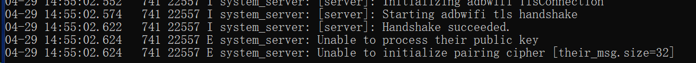

## 前言

> ~~Ascent目前并未开源，等待正式发布后一段时候才会开源，这主要是为了防止整个项目直接被人拿走加一堆广告就四处分发，~~
> ~~但是主题程序我也没有做加固，防君子不防小人~~  
> [Ascent repo在此](https://github.com/4o3F/Ascent)  
> [adb4arm repo在此](https://github.com/4o3F/adb4arm)  

Ascent原本是为了方便单设备在安卓系统上获取米哈游游戏的抽卡历史记录链接而开发的，
但后来发现这一整套流程也可以用于其他需要adb shell权限来运行的程序，比如说冰箱等，
方便在只有单独一台设备而无电脑的情况下开启

整个程序开源后我也会尝试将其变为一个通用型的工具软件。

开发过程中由于高版本安卓系统的限制以及ADB自身的一些限制，对于我这水平的还是有不小的难度的，
尤其是大量资料版本过老或者不正确，造成了不小的麻烦。在此我会将主要要点梳理一下，供想要走类似途径的人查阅。

由于整体高度依赖ADB无线调试，因此无法在无Wifi的情况下使用，暂时没有想到绕过的办法。

## ADB配对与连接

ADB无线调试必须要先进行配对后才能进行连接，配对的时候双方会交换密钥进行认证，
这个过程原本我想的是用Rust来写一个模拟的，灵感来源自[https://github.com/MuntashirAkon/libadb-android](https://github.com/MuntashirAkon/libadb-android)

我的具体代码在这里[https://github.com/4o3F/Antagonism](https://github.com/4o3F/Antagonism)
进行了小一个月的尝试(菜的一P)但是最终没能成功。尤其是在安卓的ADB无法直接当成一个模块替换，而GDB调试我又不是很熟练的情况下，无法解决ADB Host解密失败的问题，如果有佬能指出问题所在将不胜感激

测试后怀疑是SPAKE2交换数据的地方出现了问题，可能是BoringSSL和RustCrypto的实现不一致，
但是我无法自己实现一个可行的，在折磨了半个月后遂放弃该方案。

方向转变为直接将原本在Windows和Linux上运行的ADB Client端移植到ARM平台来运行
现有资料都是基于低版本的ADB，而带着配对功能的ADB Client则版本更高，无奈只能用现有资料拼凑出了一份可行方案，暂时也未开源[https://github.com/4o3F/adb4arm](https://github.com/4o3F/adb4arm)择时公开


## 安卓应用权限&运行二进制文件

安卓应用目前在高版本情况下，APP的数据文件夹内任何文件都不包含执行权限，只能单纯作为数据文件夹使用，
因而不能单纯的直接解压到数据文件夹内再通过`chmod`指令赋予执行权限，但是在安装的时候，APK的`bin`目录下所有符合`^lib.*\.so$`
的文件将被解压到一个单独的执行文件夹，这个文件夹下的所有文件有执行权限，但是该目录没有写权限，因而需要把二进制可执行文件解压到这个库文件夹下面，
再让其所有的写和读数据都在APP的数据文件夹，因此虽然能执行二进制文件了，但是还需要对目前设计目标平台为Windows和Linux的ADB进行改造，使其能够在安卓手机上运行

## ADB改造

为了避免ADB在无权限的目录下进行文件读写，需要对ADB的命令处理代码做改造，详情可见GitHub repo  
```C++
// File: /adb/adb_utils.cpp L347
// Original
    if (tmp_dir == nullptr) tmp_dir = "/tmp";
// Edited
    if (tmp_dir == nullptr) tmp_dir = "/data/local/tmp";
/*
安卓系统中/data/local/tmp目录是给所有应用使用的临时目录，因而要把ADB的临时目录更改下
*/


// File: /adb/client/commandline.cpp
// Original L1773
        if (argc < 2 || argc > 3) error_exit("usage: adb pair HOST[:PORT] [PAIRING CODE]");

        std::string password;
        if (argc == 2) {
            printf("Enter pairing code: ");
            fflush(stdout);
            if (!std::getline(std::cin, password) || password.empty()) {
                error_exit("No pairing code provided");
            }
        } else {
            password = argv[2];
        }

// Edited L1603
        if (argc < 3 || argc > 4) error_exit("usage: adb pair HOST[:PORT] [PAIRING CODE]");

        std::string password = argv[2];
        std::string path = argv[3];
        setenv("HOME", path.c_str(), 1);
        path = path + std::string("/adb.log");
        setenv("ANDROID_ADB_LOG_PATH", path.c_str(), 1);

/*
此处更改了adb pair的指令，使其额外传入一个日志文件的路径，将日志文件保存在APP的数据文件夹中便于Debug
*/


// File: /adb/client/commandline.cpp
// Original L2067
    } else if (!strcmp(argv[0], "start-server")) {
        std::string error;

// Edited L1893
    } else if (!strcmp(argv[0], "start-server")) {
        std::string error;
        std::string path = argv[1];
        setenv("HOME", path.c_str(), 1);
        path = path + std::string("/adb.log");
        setenv("ANDROID_ADB_LOG_PATH", path.c_str(), 1);

/*
更改adb start-server指令，同样传入日志文件路径，避免环境变量丢失导致的出错
*/
```
主要的更改就是通过更改命令传入参数，将ADB所需要保存的文件等路径全都改为APP可以读写的数据文件夹，避免出错

## Flutter Isolated与Background Service
这个问题主要发生在适配低版本或者无法分屏的安卓系统中，Ascent利用通知的快速回复来达成获取配对码的目的  
但安卓系统想要发送通知需要启动一个Background Service，而这个服务是与主进程相互隔离的，Flutter会单独启动一个Isolated来运行，
这样的话后台服务拿到的数据无法传递给主进程，因而需要想个办法进行通讯，下面会解释我是如何处理这个问题的

## Flutter Rust Bridge与多线程数据同步
其实解决安卓的多线程数据同步问题最好的应该是借助原生代码，实现一个EventBus或者直接共享内存，将数据全部储存在Java代码一侧，
但这项目是我本人的折腾用项目，因而选择使用Flutter Rust Bridge搭配Rust来解决。

根据Flutter Rust Bridge的介绍，调用的原生代码是运行在一条全新的进程上的，而这条进程一直不会停止，因而我选择用Rust来实现一个超~~简易~~简陋EventBus来实现数据Flutter UI端的数据跨进程同步，
全部代码不超过50行
```rust
use std::collections::HashMap;
use std::sync::{Arc, Mutex};
use flutter_rust_bridge::support::lazy_static;

use anyhow::{Result};
use flutter_rust_bridge::*;

lazy_static!(
    static ref GLOBAL_DATA: Mutex<HashMap<String, String>> = Mutex::new(HashMap::<String, String>::new());
);


pub fn write_data(key: String, value: String) {
    GLOBAL_DATA.lock().unwrap().insert(key, value);
}

pub fn get_data(key: String) -> String {
    GLOBAL_DATA.lock().unwrap().get(key.as_str()).unwrap().clone()
}

pub fn count_data() -> i32 {
    GLOBAL_DATA.lock().unwrap().keys().len() as i32
}

lazy_static! {
    static ref EVENTS: Arc<Mutex<Vec<StreamSink<Event>>>> = Arc::new(Mutex::new(Vec::new()));
}

#[frb(dart_metadata = ("freezed"))]
#[derive(Clone)]
pub struct Event {
    pub address: String,
    pub payload: String,
}

impl Event {
    pub fn as_string(&self) -> String {
        format!("{}: {}", self.address, self.payload)
    }
}

pub fn register_event_listener(listener: StreamSink<Event>) -> Result<()> {
    println!("Event listener registered!");
    EVENTS.lock().unwrap().push(listener);
    Ok(())
}

pub fn create_event(address: String, payload: String) {
    println!("Event created!");
    let events = EVENTS.lock().unwrap();
    for sink in events.iter() {
        sink.add(Event { address: address.clone(), payload: payload.clone() });
    }
}

pub fn get_listener_count() -> i32 {
    return EVENTS.lock().unwrap().len() as i32
}
```
其实一看就会发现我根本没有写`listener`的`unregister`，所以其实只要注册的次数够多是可以崩掉APP的，也算是一个值得优化的点

> 更新完毕，需要进一步解释的部分请留言  
> 最后更新： 2023/8/12
