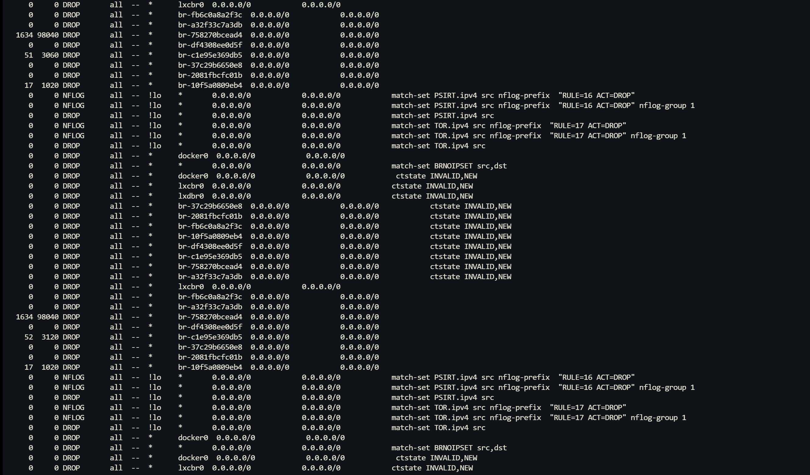
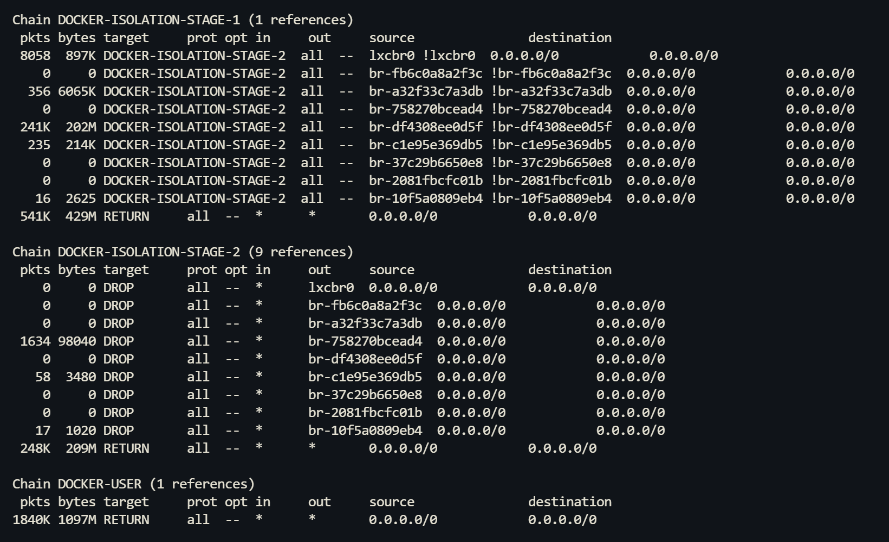

> This article was translated by GPT 5.5.

During debugging, I ran into a rather strange issue. I was using an Nginx instance inside Docker as a reverse proxy for other containers, but found that for the same IP address, some ports were reachable while others were not. This made me strongly suspect a firewall issue.

Further investigation showed that all containers in the `10.x.x.x` subnet could not connect to containers in the `172.x.x.x` subnet. Since this was a NAS machine and its firmware had just been updated a few days earlier, I first suspected that the NAS's built-in firewall was blocking the traffic. However, further packet capture on the firewall did not show any blocked packets.

I then checked whether Linux iptables had any filtering rules. The following command can be used to watch iptables packet drop information in real time:
```
watch -n 2 -d sudo iptables -nvL | grep DROP
```



The first column is the number of dropped packets. When testing with cURL, the dropped packet count on `br-c1e95e365db9` increased. I then checked the corresponding iptables rule chain, as shown below.



Docker implements isolation between NAT networks and bridged-network containers through the `DOCKER-ISOLATION-STAGE-1` and `DOCKER-ISOLATION-STAGE-2` rule chains.

The virtual network interface `lxcbr0` corresponds to the NAT network, while interfaces starting with `br-` are bridged networks. If a packet leaving `lxcbr0` does not target the `lxcbr0` interface, it is sent to the `DOCKER-ISOLATION-STAGE-2` rule chain. In `STAGE-2`, if the corresponding target is a bridged-network container, the packet is directly dropped, thereby implementing isolation between networks.

Older versions of Docker used a single rule chain to implement this, but the matching complexity was $O(n^2)$, so it was changed to two-stage matching, reducing the complexity to $O(2n)$.
