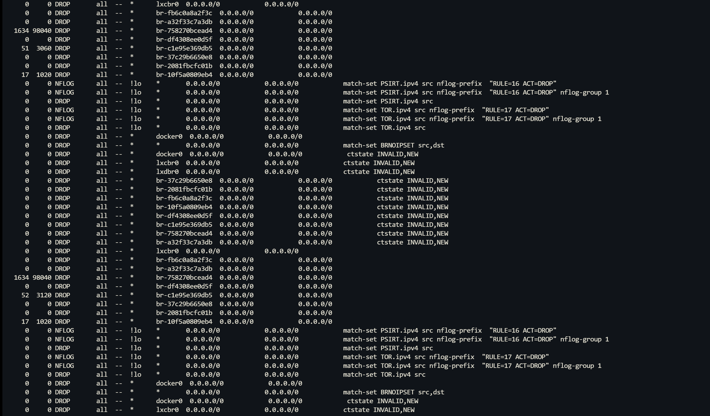
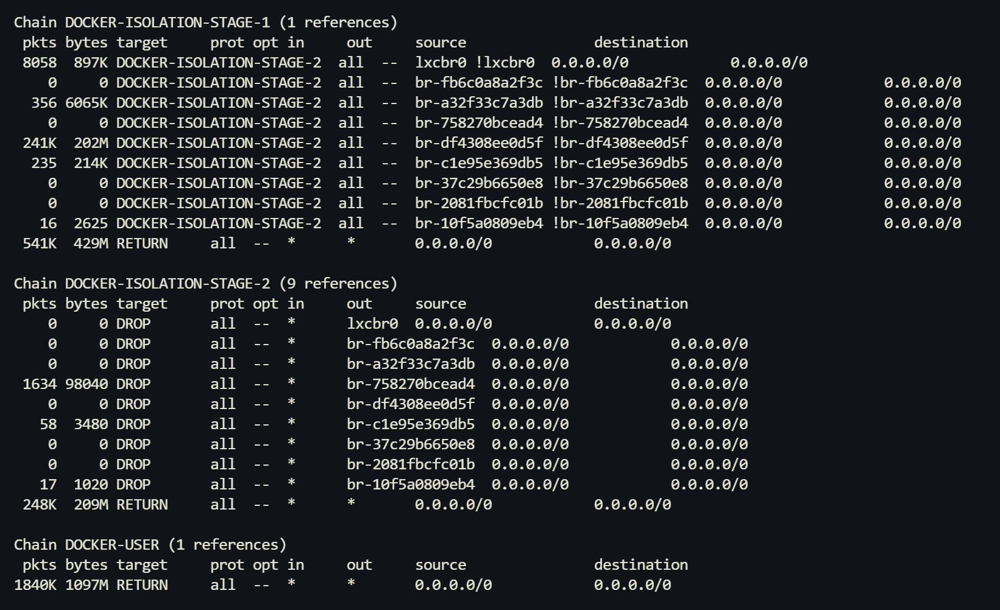

调试过程中遇到个比较奇怪的问题，使用一个Docker内的Nginx对其他容器进行反向代理，但是发现同一个IP，
有的端口可以连接，而有的则不行，因此高度怀疑是防火墙导致的问题。

继续排查发现所有位于`10.x.x.x`网段下的容器都无法连接`172.x.x.x`网段下的容器，由于这是一台NAS机器且前几天刚更新过固件，
因此先怀疑是NAS自带的防火墙进行了拦截，但进一步使用防火墙抓包却没有发现被拦截的包。

进一步排查Linux的iptables是否有过滤，使用如下命令来实时查看iptables拦截包相关信息
```
watch -n 2 -d sudo iptables -nvL | grep DROP
```



其中第一列为拦截的包的数量，可见在使用cURL测试的时候，可见`br-c1e95e365db9`上拦截包数有增长，再观察其对应的iptables规则组如下图所示



通过`DOCKER-ISOLATION-STAGE-1`和`DOCKER-ISOLATION-STAGE-2`这两个规则组，Docker实现了NAT网络与桥接网络容器之间的隔离。

`lxcbr0`这个虚拟网卡为NAT对应的网卡，而`br-`开头的则是桥接得到的网络，可见从`lxcbr0`出来的包若目标不是`lxcbr0`网卡，
则将其转入`DOCKER-ISOLATION-STAGE-2`规则组，而在`STAGE-2`中，若对应的目标为桥接网络容器，则直接DROP掉，进而实现了网络间的隔离。

低版本的Docker使用了单一规则组来实现，但是匹配复杂度为 $O(n^2)$ ，因此将其变为了两阶段匹配，复杂度降低到了 $O(2n)$ 。