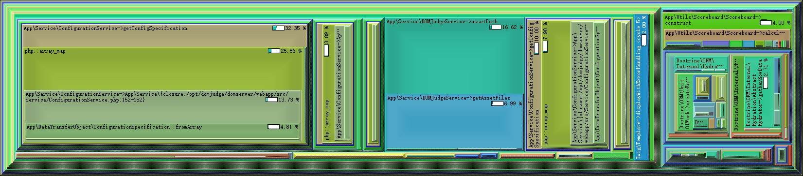
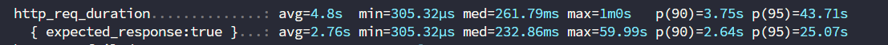
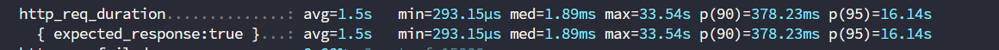

> This article was translated by GPT 5.5.

## Preparations

### Contestant Machines

Because the official 2025 ICPC World Final image is now directly distributed as a disk image file, we still used the 2024 image this time.  
Note that the contestant machines need to be fully powered off before being moved, and some of their clocks may become incorrect. Therefore, an NTP time server needs to be set up, using [ntpd-rs](https://github.com/pendulum-project/ntpd-rs)
for the deployment.

The structure recorded under Natsume's `static` directory is as follows:
```text
static/
├── caddy.deb
├── client_config.toml
├── clion.key
├── configure_client.sh
├── configure_judgehost.sh
├── key.pub
├── natsume_client
├── wallpaper.jpg
└── wallpaper.png
```

The other parts still keep the previous configuration unchanged. Existing Natsume features such as batch processing already cover everything completely, so no new changes are needed.

### Server

#### PHP-related Configuration
+ Set `memory_limit = 2G` in `/etc/php/8.3/fpm/php.ini`, because overly large sample tests and similar files can cause memory exhaustion while problems are being processed.
+ Modify the MariaDB configuration at `/etc/mysql/my.cnf`:
  ```
  [mysqld]
  max_connections=1000
  innodb_log_file_size=512M
  max_allowed_packet=500M
  ```
+ Add `admin` and `jury` to this DomJudge Team, so that Jury Solution will be tested automatically when problems are uploaded.
+ After uploading team photos and school logos, confirm the permissions with `sudo chown -R www-data:www-data /opt/domjudge/domserver/webapp/public`.
+ CDS must be run on Linux. It cannot run properly on Windows and will produce all kinds of strange issues.
+ Note that presAdmin and presClient need different commands:
  ```
  .\presAdmin.bat https://10.12.13.20:2335/api/contests/ presAdmin <password>
  .\client.bat https://10.12.13.20:2335/api/ presentation <password>
  ```
+ When configuring CDS, note that the CCS URL must not end with `/`; otherwise it will also treat `/` as part of the contest id, which is very annoying.
+ Chinese text in presClient is an old issue and needs to be fixed by changing fonts.

#### Optimized Public Scoreboard Reverse Proxy
The public scoreboard cache was optimized so that it caches all required file types.

{}

```Caddyfile
{
    auto_https off
    debug
    cache {
        ttl 0s
    }
}

:80 {
    @staticfile path_regexp allowed_files \.(js|css|png|jpg|ttf|woff2|svg|ico)$
    handle @staticfile {
        cache {
            ttl 604800s
        }
        reverse_proxy http://10.12.13.20 {
            header_down Cache-Control "public, max-age=604800, must-revalidate"
        }
    }

    handle /* {
        cache {
            ttl 3s
            stale 5s
        }
        rewrite * /public?static=true
        reverse_proxy http://10.12.13.20
    }
}
```

{}

#### Printing

The newly written printing code was mainly intended to solve Chinese encoding issues. We directly switched to Typst, which also avoids the heavy Latex dependency.

Halfway through the contest, one team reported that they could not print. After checking, we found that their team name contained `# ""`, which caused Typst compilation to fail. An escape was urgently added as a temporary fix to get it through.

~~~python
#!/usr/bin/env python3
import subprocess
import sys
import tempfile
import os
import random
from datetime import datetime

# Allowed file MIME types mapped to Typst syntax highlighting names
ALLOWED_MIME = {
    "text/x-c": "C",
    "text/x-c++": "Cpp",
    "text/x-java-source": "Java",
    "text/x-python": "Python",
    "text/x-script.python": "Python",
    "text/plain": "Python",  # Some systems label Python as text/plain
}

# Printer IP address list
PRINTER_IPS = ['10.12.13.150','10.12.13.151','10.12.13.152','10.12.13.153']

OUTPUT_DIR = "/opt/domjudge/print_backup"

def escape_typst_string(s: str) -> str:
    """
    Escape characters that would break Typst strings or syntax:
    - Escape backslashes first
    - Then escape double quotes, because the text is placed inside double quotes
    - Then escape braces to avoid conflicts with Typst interpolation or blocks
    """
    if s is None:
        return ""
    s = s.replace("\\", "\\\\")
    s = s.replace('"', '\\"')
    s = s.replace("{", "\\{")
    s = s.replace("}", "\\}")
    return s


def main():
    # Check the input argument count. Only output a short error message when arguments are missing.
    if len(sys.argv) < 8:
        print("Error: Missing required script arguments.")
        sys.exit(1)

    file_path, original, language, username, teamname, teamid, location = sys.argv[1:8]
    teamname = escape_typst_string(teamname)
    

    # --- Step 1: Check MIME type ---
    try:
        # Detect the file MIME type
        mime_type = subprocess.check_output(["file", "-b", "--mime-type", file_path], text=True).strip()
    except subprocess.CalledProcessError:
        print("Error: Failed to detect file type.")
        sys.exit(1)
    except FileNotFoundError:
        print("Error: Required 'file' command not found.")
        sys.exit(1)

    if mime_type not in ALLOWED_MIME:
        print("Error: Unsupported file type. Printing denied.")
        sys.exit(1)

    lang_detected = ALLOWED_MIME[mime_type]

    # --- Step 2: Ensure the output directory exists ---
    os.makedirs(OUTPUT_DIR, exist_ok=True)

    # --- Step 3: Generate the Typst template and compile PDF ---
    timestamp = datetime.now().strftime("%Y%m%d_%H%M%S")
    pdf_filename = f"team{teamid}_{timestamp}.pdf"
    pdf_file = os.path.join(OUTPUT_DIR, pdf_filename)
    
    with tempfile.TemporaryDirectory() as tmpdir:
        typst_file = os.path.join(tmpdir, "print.typ")

        # Read source code content
        try:
            with open(file_path, "r", encoding="utf-8", errors="ignore") as src:
                code = src.read()
        except IOError:
            print("Error: Failed to read source file.")
            sys.exit(1)

        # Build Typst content
        typst_content = f"""
#set text(font: "Noto Sans CJK SC", size: 9pt)
#set page(
    header: [
        // Display teamname on the left
        #text(8pt, "Team Name: {teamname}")
        // Flexible space that pushes the right-side element to the far right
        #h(1fr) 
        // Display location on the right
        #text(8pt, "Location: {location}")
        // Header bottom divider line
        #line(length: 100%)
    ],
    margin: (x: 1cm, y: 1.5cm)
)

= Source Code: {original}

```{lang_detected.lower()}
{code}
```
"""
        # Write the temporary file for compilation
        with open(typst_file, "w", encoding="utf-8") as f:
            f.write(typst_content)

        # Compile Typst to PDF
        try:
            # Make sure 'typst-cli' is installed and configured in PATH
            # Do not output anything on success
            subprocess.run(["typst", "compile", typst_file, pdf_file], check=True, capture_output=True, text=True)
        except subprocess.CalledProcessError as e:
            # Compilation failed; output a concise error message
            print("Error: Source code compilation failed.")
            sys.exit(1)
        except FileNotFoundError:
            print("Error: Required 'typst' command not found.")
            sys.exit(1)

    # --- Step 4: Randomly select a printer and dispatch the print job ---
    
    if not PRINTER_IPS:
        print("Error: No printer addresses configured.")
        sys.exit(1)

    chosen_ip = random.choice(PRINTER_IPS)
    curl_url = f'http://{chosen_ip}:12306/'
    
    # Removed: print(f"Selected printer IP: {chosen_ip}")

    # Build the curl command
    curl_cmd = [
        'curl',
        '-X', 'POST',
        '--fail-with-body', 
        '--connect-timeout', '10', 
        '--max-time', '30',        
        '-H', 'Content-Type: application/octet-stream',
        '--data-binary', f'@{pdf_file}', 
        curl_url
    ]

    try:
        # Execute the curl command
        print_result = subprocess.run(
            curl_cmd, 
            check=True, 
            capture_output=True, 
            text=True
        )
        
        # --- Step 5: Output the final result ---
        # On success, only output the main success message
        print(f"✅ Print job successfully dispatched")
        # Removed: detailed printer-response stdout/stderr
        
    except subprocess.CalledProcessError as e:
        # Print job failed; output a concise error message and the server response if present
        server_response = e.stdout.strip()
        if server_response:
            print(f"❌ Print job failed to dispatch. Server responded: {server_response}")
        else:
            print(f"❌ Print job failed to dispatch. Check network connection or printer status.")
        sys.exit(1)
        
    except FileNotFoundError:
        print("Error: Required 'curl' command not found.")
        sys.exit(1)

if __name__ == "__main__":
    main()
~~~

The corresponding printing command inside DomJudge is as follows:

```shell
python3 /opt/domjudge/print_filter_typst.py [file] [original] [language] [username] [teamname] [teamid] [location] 2>&1
```

#### Scoreboard Reveal

~~Resolver still needs more fonts. Compared with presentation, directly replacing them with SimHei will cause problems, so the original fonts still have to be merged with the new fonts.~~
After spending nearly three days on all kinds of troubleshooting, and considering that it still blew up even with 10GB of memory during the actual scoreboard reveal, we all agreed that whoever wrote Resolver had some issues. Rather than keep fighting it, it would be faster to rewrite one ourselves. Just like Natsume, we plan to put one together before next time.

## Issues During the Contest

Compared with the complete mess of the last invitational contest, this one was much better than expected. After all, I was basically the only person handling the whole process, with Senior OrangeJ taking some time to help me configure the judgehosts and help during the contest. The parts we had already worked on before basically did not have any problems this time.

Except that DomJudge somehow crashed during the warm-up contest. The symptoms were that CPU load was not high, PHP FPM processes looked completely healthy, but it was simply inaccessible. Restarting PHP FPM fixed it immediately. The main problem was that there were no error logs at all,
and it could not be reproduced reliably, because the day before we had run a stress test ourselves with Oha and nothing went wrong, which was very strange. Later we prepared to change every part we could think of. Judging from the official contest, the main issue should have been in the following place:

```
pm = static
pm.max_children = 500      ; ~40 per gig of memory(16gb system -> 500)
pm.max_requests = 5000
pm.status_path = /fpm_status
```

The default `max_children` is 40, which is completely unable to support all contestant access in the contest venue. After that, since we could not confirm whether it had really been fixed, we chose a simple and crude approach: monitor it directly and restart it if it dies. I had GPT put together the following script.

{}

```shell
#!/bin/bash

# ========== Configuration ==========
URL="http://10.12.13.20/public"     # URL to monitor
TIMEOUT=5                           # Timeout (seconds)
INTERVAL=5                          # Interval between checks (seconds)
SERVICE="php8.3-fpm"                # Service name to restart; can be changed to php8.2-fpm, etc.
LOG_FILE="./fpm_monitor.log"
# ==============================

while true; do
    START_TIME=$(date +%s%3N)
    HTTP_CODE=$(curl -o /dev/null -s -w "%{http_code}" --max-time $((TIMEOUT)) "$URL")
    END_TIME=$(date +%s%3N)

    ELAPSED_MS=$((END_TIME - START_TIME))
    ELAPSED_SEC=$(echo "scale=3; $ELAPSED_MS / 1000" | bc)

    if (( $(echo "$ELAPSED_SEC > $TIMEOUT" | bc -l) )) || [ "$HTTP_CODE" -ne 200 ]; then
        fpm_status=$(curl -s --max-time 1 http://localhost:8080/fpm_status)
        echo $fpm_status >> "$LOG_FILE"
        echo -e "\n" >> "$LOG_FILE"
        echo "$(date '+%F %T') [WARN] $URL response time ${ELAPSED_SEC}s or code=$HTTP_CODE, restarting $SERVICE" >> "$LOG_FILE"
        systemctl restart "$SERVICE"
    else
        echo "$(date '+%F %T') [INFO] $URL response time ${ELAPSED_SEC}s or code=$HTTP_CODE" >> "$LOG_FILE"
    fi

    sleep "$INTERVAL"
done
```

{}

Even with this in place, at the very end of the official contest, because everyone was submitting like crazy, the server CPU was completely maxed out and it did crash once. But because it was restarted fast enough, the contestants probably barely noticed.

Monitoring throughout the contest showed that the main server bandwidth stayed basically stable at 50MB/s, while the public scoreboard server was maxed out the whole time. Next time, both servers need to be configured with link aggregation; otherwise the network pressure is too high.

After the warm-up contest ended, both of us were completely focused on making sure the official contest would not crash. Neither of us had ever handled a scoreboard reveal before, and neither of us noticed that the Unfreeze Time was wrong 🤦‍♂️, which caused the scoreboard to be released immediately at the end. Next time, just do not set Unfreeze Time at all.
For the scoreboard reveal, we will see about rewriting a parser ourselves later. Resolver is simply too hard to use. It is hard to imagine that the latest stable version of a program could be less compatible than a previous version.......


## Follow-up Optimizations
### Optimize PHP Session Storage

Checking the PHP FPM Slowlog showed the following:

{}

```
[19-Oct-2025 06:22:30]  [pool domjudge] pid 494122
script_filename = /opt/domjudge/domserver/webapp/public/index.php
[0x000075337d813fc0] execute() /opt/domjudge/domserver/lib/vendor/symfony/http-foundation/Session/Storage/Handler/PdoSessionHandler.php:631
[0x000075337d813ee0] doRead() /opt/domjudge/domserver/lib/vendor/symfony/http-foundation/Session/Storage/Handler/AbstractSessionHandler.php:69
[0x000075337d813e40] read() /opt/domjudge/domserver/lib/vendor/symfony/http-foundation/Session/Storage/Handler/PdoSessionHandler.php:297
[0x000075337d813dc0] read() /opt/domjudge/domserver/lib/vendor/symfony/http-foundation/Session/Storage/Handler/AbstractSessionHandler.php:49
[0x000075337d813d40] validateId() /opt/domjudge/domserver/lib/vendor/symfony/http-foundation/Session/Storage/Proxy/SessionHandlerProxy.php:69
[0x000075337d813cc0] validateId() /opt/domjudge/domserver/lib/vendor/symfony/http-foundation/Session/Storage/NativeSessionStorage.php:172
[0x000075337d813c70] session_start() /opt/domjudge/domserver/lib/vendor/symfony/http-foundation/Session/Storage/NativeSessionStorage.php:172
[0x000075337d813bc0] start() /opt/domjudge/domserver/lib/vendor/symfony/http-foundation/Session/Storage/NativeSessionStorage.php:311
[0x000075337d813b40] getBag() /opt/domjudge/domserver/lib/vendor/symfony/http-foundation/Session/Session.php:222
[0x000075337d813ab0] getBag() /opt/domjudge/domserver/lib/vendor/symfony/http-foundation/Session/Session.php:242
[0x000075337d813a50] getAttributeBag() /opt/domjudge/domserver/lib/vendor/symfony/http-foundation/Session/Session.php:69
[0x000075337d8139d0] get() /opt/domjudge/domserver/lib/vendor/symfony/security-http/Firewall/ContextListener.php:98
[0x000075337d8138d0] authenticate() /opt/domjudge/domserver/lib/vendor/symfony/security-http/Firewall/AbstractListener.php:26
[0x000075337d813850] __invoke() /opt/domjudge/domserver/lib/vendor/symfony/security-http/Firewall.php:128
[0x000075337d8137b0] callListeners() /opt/domjudge/domserver/lib/vendor/symfony/security-http/Firewall.php:95
[0x000075337d8136c0] onKernelRequest() /opt/domjudge/domserver/lib/vendor/symfony/event-dispatcher/EventDispatcher.php:260
[0x000075337d8135f0] Symfony\Component\EventDispatcher\{closure}() /opt/domjudge/domserver/lib/vendor/symfony/event-dispatcher/EventDispatcher.php:220
[0x000075337d813530] callListeners() /opt/domjudge/domserver/lib/vendor/symfony/event-dispatcher/EventDispatcher.php:56
[0x000075337d813480] dispatch() /opt/domjudge/domserver/lib/vendor/symfony/http-kernel/HttpKernel.php:157
[0x000075337d8133a0] handleRaw() /opt/domjudge/domserver/lib/vendor/symfony/http-kernel/HttpKernel.php:76
```

{}
It can be seen that there are a large number of Slowlog entries at `PdoSessionHandler`. Further analysis shows that all PHP sessions are stored in MariaDB, causing every request from every logged-in contestant to perform at least two database read operations,
which greatly increases database load. Since Symfony can directly switch to Redis as the Session Store, I really do not understand why the database is used for sessions. Even storing them in files would be much better than storing them in the database. Therefore, switch to Redis as the session storage:
```
sudo apt-get install php-redis redis-server
systemctl restart php8.3-fpm
```

Then modify `webapp/config/services.yaml`:

{}

```yaml
# This file is the entry point to configure your own services.
# Files in the packages/ subdirectory configure your dependencies.

# Put parameters here that don't need to change on each machine where the app is deployed
# https://symfony.com/doc/current/best_practices.html#use-parameters-for-application-configuration
imports:
    - { resource: static.yaml }

parameters:
    locale: en
    # Enable this to support removing time intervals from the contest.
    # This code is rarely tested and we discourage using it.
    removed_intervals: false
    # Minimum password length for users
    min_password_length: 10

services:
    # default configuration for services in *this* file
    _defaults:
        autowire: true      # Automatically injects dependencies in your services.
        autoconfigure: true # Automatically registers your services as commands, event subscribers, etc.

    # makes classes in src/ available to be used as services
    # this creates a service per class whose id is the fully-qualified class name
    App\:
        resource: '../src/'
        exclude:
            - '../src/DependencyInjection'
            - '../src/Entity'
            - '../src/Migrations'
            - '../src/Kernel.php'
    
    # Add the following section
    Redis:
        class: Redis
        calls:
            - connect: ['127.0.0.1', 6379]

    Symfony\Component\HttpFoundation\Session\Storage\Handler\RedisSessionHandler:
        arguments: ['@Redis']
        public: true

    session.handler.redis:
        alias: Symfony\Component\HttpFoundation\Session\Storage\Handler\RedisSessionHandler
        public: true
```

{}

Modify `webapp/config/packages/framework.yaml`:

{}

```yaml
# see https://symfony.com/doc/current/reference/configuration/framework.html
framework:
    secret: '%env(APP_SECRET)%'
    esi: false
    fragments: false
    http_method_override: true
    annotations: false
    handle_all_throwables: true
    serializer:
        enabled: true
        name_converter: serializer.name_converter.camel_case_to_snake_case

    # Enables session support. Note that the session will ONLY be started if you read or write from it.
    # Remove or comment this section to explicitly disable session support.
    session:
        # Change this
        # handler_id: "%env(DATABASE_URL)%"
        handler_id: 'session.handler.redis'
        cookie_secure: auto
        cookie_samesite: lax
        storage_factory_id: session.storage.factory.native

    php_errors:
        log: true

    assets:
        version: "v=%domjudge.version%"

when@test:
    framework:
        test: true
        session:
            storage_factory_id: session.storage.factory.mock_file
```

{}
After completing the above changes, they will not take effect directly. The cache needs to be cleared in the Symfony Console. Note that the console location depends on the version:
+ For DomJudge 8.3.2, run `php webapp/bin/console cache:clear`.
+ For DomJudge 9.0.0, run `php bin/dj_console cache:clear`.

### Optimize Bandwidth Spikes

Monitoring during the contest showed that the server bandwidth had many spikes. Later analysis showed that one scoreboard request transferred about 9MB of data. The server has gigabit bandwidth, and 9MB per request plus concurrency is a terrifying amount,
so Nginx needs to be configured with Brotli compression.

First download the Nginx source code and build dependencies:
```shell
apt source nginx && apt build-dep nginx
```

Then pull the Brotli source code:
```shell
git clone --depth=1 https://github.com/google/ngx_brotli.git
```

Next, to improve speed, you can modify the submodule URLs in `.gitmodules` to use mirrors, thereby accelerating the pull.
```shell
git submodule update --init
```
Then return to the nginx source directory and run:
```shell
./configure --with-compat --add-dynamic-module=../ngx_brotli && make modules
```
Note that `ngx_brotli` is the path to the source code that was just pulled.

Next, check whether the `/usr/lib/nginx/modules/` path exists. If it does not, create it, then copy the compiled `objs/*.so` files over:
```shell
cp objs/*.so /usr/share/nginx/modules/
```

Then load the modules by modifying `/etc/nginx/nginx.conf` and adding the following outside the `http` block:
```
load_module modules/ngx_http_brotli_filter_module.so;
load_module modules/ngx_http_brotli_static_module.so;
```

Then modify the Nginx configuration and add the following section to the server block:
```
server {
        listen 80;
        listen [::]:80;
        brotli            on;
        brotli_static     on;
        brotli_comp_level 6;

        # If you are reading from the event feed, make sure this is large enough.
        # If you have a slow event feed reader, nginx needs to keep the connection
        # open long enough between two write operations
        send_timeout 36000s;
        include /opt/domjudge/domserver/etc/nginx-conf-inner;
}
```

This can directly compress the 9MB HTML page to under 1MB, greatly reducing bandwidth pressure.

Later, Open Telemetry was also configured and profiling was run again. The conclusion was that DomJudge is written so poorly that every part can become a bottleneck, and optimizing it is not worth the cost compared with rewriting it.

### Optimize Code

Xdebug can be used for profiling. The following figure shows the timing of the public scoreboard page after profiling:



It can be seen that a single `getConfig` actually takes more than 30% of the time, and the `array_map` inside it also takes a long time. Looking at the code shows the following:

{}

```php
    public function getConfigSpecification(): array
    {
        // We use Symfony resource caching so we can load the config on every
        // request without having a performance impact.
        // See https://symfony.com/doc/4.3/components/config/caching.html for
        // more information.
        $cacheFile = $this->cacheDir . '/djDbConfig.php';
        $this->configCache->cache($cacheFile,
            function (ConfigCacheInterface $cache) {
                // @codeCoverageIgnoreStart
                $yamlDbConfigFile = $this->etcDir . '/db-config.yaml';
                $fileLocator      = new FileLocator($this->etcDir);
                $loader           = new YamlConfigLoader($fileLocator);
                $yamlConfig       = $loader->load($yamlDbConfigFile);

                // We first modify the data such that it contains the category as a field,
                // since requesting data is faster in that case.
                $config = [];
                foreach ($yamlConfig as $category) {
                    foreach ($category['items'] as $item) {
                        $config[$item['name']] = $item + ['category' => $category['category']];
                    }
                }

                $code          = var_export($config, true);
                $specification = <<<EOF
<?php

return {$code};
EOF;

                $cache->write($specification,
                    [new FileResource($yamlDbConfigFile)]);
                // @codeCoverageIgnoreEnd
            });
        return array_map(
            fn(array $item) => ConfigurationSpecification::fromArray($item),
            require $cacheFile
        );
    }
```

{}

Seriously? It rebuilds the objects every time, so of course the overhead is huge. No wonder the stress test looked like this:



Make it generate the corresponding objects directly when creating the cache. The modification is as follows:

{}

```php
    public function getConfigSpecification(): array
    {
        // We use Symfony resource caching so we can load the config on every
        // request without having a performance impact.
        // See https://symfony.com/doc/4.3/components/config/caching.html for
        // more information.
        $cacheFile = $this->cacheDir . '/djDbConfig.php';
        $this->configCache->cache($cacheFile,
            function (ConfigCacheInterface $cache) {
                // @codeCoverageIgnoreStart
                $yamlDbConfigFile = $this->etcDir . '/db-config.yaml';
                $fileLocator      = new FileLocator($this->etcDir);
                $loader           = new YamlConfigLoader($fileLocator);
                $yamlConfig       = $loader->load($yamlDbConfigFile);

                // We first modify the data such that it contains the category as a field,
                // since requesting data is faster in that case.
                $config = [];
                foreach ($yamlConfig as $category) {
                    foreach ($category['items'] as $item) {
//                        $config[$item['name']] = $item + ['category' => $category['category']];
                        $config[$item['name']] = ConfigurationSpecification::fromArray(
                                $item + ['category' => $category['category']]
                        );
                    }
                }

                $code          = var_export(serialize($config), true);
                $specification = <<<EOF
<?php

return unserialize({$code});
EOF;

                $cache->write($specification,
                    [new FileResource($yamlDbConfigFile)]);
                // @codeCoverageIgnoreEnd
            });

//        return array_map(
//            fn(array $item) => ConfigurationSpecification::fromArray($item),
//            require $cacheFile
//        );
        return require $cacheFile;
    }
```

{}

Then run the stress test again with k6, as shown below:



It can be seen that all metrics dropped significantly. Profiling again gives the following figure:


The `assetPath` issue already has a PR fixing it, so I will not elaborate further here.
