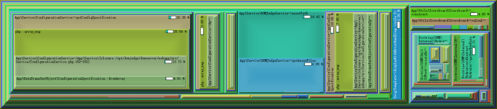
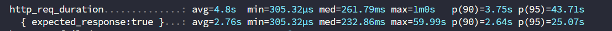
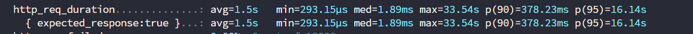
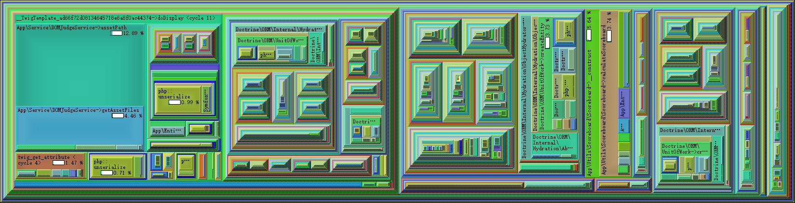

## 前期准备

### 选手机

由于ICPC World Final官方镜像2025的直接是磁盘镜像文件了，因此这回还是采用2024版本的镜像。  
注意由于选手机需要完全断电再搬运，有的时间会乱掉，因此需要搭建起来一台NTP授时服务器，采用[ntpd-rs](https://github.com/pendulum-project/ntpd-rs)
来搭建。

Natsume的`static`目录下的结构记录如下
```text
static/
├── caddy.deb
├── client_config.toml
├── clion.key
├── configure_client.sh
├── configure_judgehost.sh
├── key.pub
├── natsume_client
├── wallpaper.jpg
└── wallpaper.png
```

其他部分依然维持之前的配置不变，批量化处理等现有的Natsume功能已经能够完全覆盖了，无须新的更改。

### 服务器

#### PHP相关配置
+ 在`/etc/php/8.3/fpm/php.ini`中设置`memory_limit = 2G`，因为题目被处理过程中如果样例点等过大会导致爆内存
+ 修改MariaDB配置`/etc/mysql/my.cnf`
  ```
  [mysqld]
  max_connections=1000
  innodb_log_file_size=512M
  max_allowed_packet=500M
  ```
+ 将`admin`和`jury`加到DomJudge这个Team里面，这样上传题目的时候会自动测试Jury Solution
+ 上传完队伍图片和学校LOGO后要确认权限，`sudo chown -R www-data:www-data /opt/domjudge/domserver/webapp/public`
+ CDS必须要使用Linux来跑，Windows上跑不起来会有奇奇怪怪的问题
+ presAdmin和presClient注意要有不同的指令
  ```
  .\presAdmin.bat https://10.12.13.20:2335/api/contests/ presAdmin <password>
  .\client.bat https://10.12.13.20:2335/api/ presentation <password>
  ```
+ 注意CDS配置的时候CCS URL最后不能有/，不然的话他会把/也识别为contest id的一部分，很无语
+ presClient的中文，这是老问题了需要换字体来修复

#### 优化后的外榜反代
优化了外榜缓存，使其缓存所有需要的文件类型
```Caddyfile
{
    auto_https off
    debug
    cache {
        ttl 0s
    }
}

:80 {
    @staticfile path_regexp allowed_files \.(js|css|png|jpg|ttf|woff2|svg|ico)$
    handle @staticfile {
        cache {
            ttl 604800s
        }
        reverse_proxy http://10.12.13.20 {
            header_down Cache-Control "public, max-age=604800, must-revalidate"
        }
    }

    handle /* {
        cache {
            ttl 3s
            stale 5s
        }
        rewrite * /public?static=true
        reverse_proxy http://10.12.13.20
    }
}
```

#### 打印

新编写的打印代码，主要是为了解决中文编码问题，直接换Typst了也省着Latex那么重的依赖了

比赛到一半有个队报告说他们无法打印，查了下才发现他们队名里面带`# ""`导致Typst编译不了了，紧急临时加了个转义给干过去了

~~~python
#!/usr/bin/env python3
import subprocess
import sys
import tempfile
import os
import random
from datetime import datetime

# 允许的文件 MIME 类型映射到 Typst 语法高亮名称
ALLOWED_MIME = {
    "text/x-c": "C",
    "text/x-c++": "Cpp",
    "text/x-java-source": "Java",
    "text/x-python": "Python",
    "text/x-script.python": "Python",
    "text/plain": "Python",  # 有些系统将 Python 标记为 text/plain
}

# 打印机 IP 地址列表
PRINTER_IPS = ['10.12.13.150','10.12.13.151','10.12.13.152','10.12.13.153']

OUTPUT_DIR = "/opt/domjudge/print_backup"

def escape_typst_string(s: str) -> str:
    """
    转义会破坏 Typst 字符串/语法的字符：
    - 先转义反斜杠
    - 再转义双引号（因为我们把文本放在双引号里）
    - 再转义大括号，防止与 Typst 内部插值或块冲突
    """
    if s is None:
        return ""
    s = s.replace("\\", "\\\\")
    s = s.replace('"', '\\"')
    s = s.replace("{", "\\{")
    s = s.replace("}", "\\}")
    return s


def main():
    # 检查输入参数数量。仅在参数不足时输出简短错误信息。
    if len(sys.argv) < 8:
        print("Error: Missing required script arguments.")
        sys.exit(1)

    file_path, original, language, username, teamname, teamid, location = sys.argv[1:8]
    teamname = escape_typst_string(teamname)
    

    # --- 步骤 1: 检查 MIME 类型 ---
    try:
        # 检测文件 MIME 类型
        mime_type = subprocess.check_output(["file", "-b", "--mime-type", file_path], text=True).strip()
    except subprocess.CalledProcessError:
        print("Error: Failed to detect file type.")
        sys.exit(1)
    except FileNotFoundError:
        print("Error: Required 'file' command not found.")
        sys.exit(1)

    if mime_type not in ALLOWED_MIME:
        print("Error: Unsupported file type. Printing denied.")
        sys.exit(1)

    lang_detected = ALLOWED_MIME[mime_type]

    # --- 步骤 2: 确保输出目录存在 ---
    os.makedirs(OUTPUT_DIR, exist_ok=True)

    # --- 步骤 3: 生成 Typst 模板并编译 PDF ---
    timestamp = datetime.now().strftime("%Y%m%d_%H%M%S")
    pdf_filename = f"team{teamid}_{timestamp}.pdf"
    pdf_file = os.path.join(OUTPUT_DIR, pdf_filename)
    
    with tempfile.TemporaryDirectory() as tmpdir:
        typst_file = os.path.join(tmpdir, "print.typ")

        # 读取源代码内容
        try:
            with open(file_path, "r", encoding="utf-8", errors="ignore") as src:
                code = src.read()
        except IOError:
            print("Error: Failed to read source file.")
            sys.exit(1)

        # 构建 Typst 内容
        typst_content = f"""
#set text(font: "Noto Sans CJK SC", size: 9pt)
#set page(
    header: [
        // 左侧展示 teamname
        #text(8pt, "Team Name: {teamname}")
        // 弹性空间，将右侧元素推到最右边
        #h(1fr) 
        // 右侧展示 location
        #text(8pt, "Location: {location}")
        // 页眉底部分隔线
        #line(length: 100%)
    ],
    margin: (x: 1cm, y: 1.5cm)
)

= Source Code: {original}

```{lang_detected.lower()}
{code}
```
"""
        # 写入临时文件供编译
        with open(typst_file, "w", encoding="utf-8") as f:
            f.write(typst_content)

        # 编译 Typst 到 PDF
        try:
            # 确保 'typst-cli' 已安装并配置在 PATH 中
            # 成功时不输出任何信息
            subprocess.run(["typst", "compile", typst_file, pdf_file], check=True, capture_output=True, text=True)
        except subprocess.CalledProcessError as e:
            # 编译失败，输出简洁错误信息
            print("Error: Source code compilation failed.")
            sys.exit(1)
        except FileNotFoundError:
            print("Error: Required 'typst' command not found.")
            sys.exit(1)

    # --- 步骤 4: 随机选择打印机并推送打印任务 ---
    
    if not PRINTER_IPS:
        print("Error: No printer addresses configured.")
        sys.exit(1)

    chosen_ip = random.choice(PRINTER_IPS)
    curl_url = f'http://{chosen_ip}:12306/'
    
    # 移除：print(f"Selected printer IP: {chosen_ip}")

    # 构建 curl 命令
    curl_cmd = [
        'curl',
        '-X', 'POST',
        '--fail-with-body', 
        '--connect-timeout', '10', 
        '--max-time', '30',        
        '-H', 'Content-Type: application/octet-stream',
        '--data-binary', f'@{pdf_file}', 
        curl_url
    ]

    try:
        # 执行 curl 命令
        print_result = subprocess.run(
            curl_cmd, 
            check=True, 
            capture_output=True, 
            text=True
        )
        
        # --- 步骤 5: 输出最终结果 ---
        # 成功时，仅输出主要的成功信息
        print(f"✅ Print job successfully dispatched")
        # 移除：打印机响应的详细 stdout/stderr
        
    except subprocess.CalledProcessError as e:
        # 打印任务失败，输出简洁的错误信息和服务器响应（如果存在）
        server_response = e.stdout.strip()
        if server_response:
            print(f"❌ Print job failed to dispatch. Server responded: {server_response}")
        else:
            print(f"❌ Print job failed to dispatch. Check network connection or printer status.")
        sys.exit(1)
        
    except FileNotFoundError:
        print("Error: Required 'curl' command not found.")
        sys.exit(1)

if __name__ == "__main__":
    main()
~~~

对应的DomJudge内的打印指令如下

```shell
python3 /opt/domjudge/print_filter_typst.py [file] [original] [language] [username] [teamname] [teamid] [location] 2>&1
```

#### 滚榜

~~Resolver的字体还需要更多字体，相比于presentation，直接替换成黑体会出问题，还得合并原始的和新的字体~~
在付出了接近3天的各种折腾时间后，鉴于实际滚榜的时候给了10GB内存仍然爆炸，我们一致同意写Resolver这玩意的人有点问题，与其折腾他不如自己重新写一个来得快，就跟Natsume一样，准备下回之前搓一个出来

## 赛中问题

相比于上回邀请赛的一团乱麻这回算是比预料中的好太多了，毕竟全程基本只有我一个人在搞，再加上OrangeJ师兄抽空帮我配一下评测机+赛时帮忙，之前搞过的部分这回基本没出啥问题

除了DomJudge在热身赛的时候莫名其妙的崩了，表现为CPU负载不高，PHP FPM进程看起来完全健康，然而就是直接访问不了，重启下PHP FPM立刻就能好，主要是这没有任何错误日志，
也无法稳定复现，因为前一天我们自己拿Oha试了下跑压力测试啥事没有，就很奇怪，后来准备把能想到的部分都改一遍，根据正赛情况判断主要问题应该出现在下面这个地方

```
pm = static
pm.max_children = 500      ; ~40 per gig of memory(16gb system -> 500)
pm.max_requests = 5000
pm.status_path = /fpm_status
```

默认的max_children是40，完全撑不起来赛场所有选手的访问，在这之后由于无法确认到底真的修复了没有，觉得起一种简单粗暴的办法，直接监控死了就重新拉，让GPT搓了一个出来

```shell
#!/bin/bash

# ========== 配置部分 ==========
URL="http://10.12.13.20/public"     # 要监控的URL
TIMEOUT=5                           # 超时时间（秒）
INTERVAL=5                          # 每次检查间隔（秒）
SERVICE="php8.3-fpm"                # 要重启的服务名，可改成 php8.2-fpm 等
LOG_FILE="./fpm_monitor.log"
# ==============================

while true; do
    START_TIME=$(date +%s%3N)
    HTTP_CODE=$(curl -o /dev/null -s -w "%{http_code}" --max-time $((TIMEOUT)) "$URL")
    END_TIME=$(date +%s%3N)

    ELAPSED_MS=$((END_TIME - START_TIME))
    ELAPSED_SEC=$(echo "scale=3; $ELAPSED_MS / 1000" | bc)

    if (( $(echo "$ELAPSED_SEC > $TIMEOUT" | bc -l) )) || [ "$HTTP_CODE" -ne 200 ]; then
        fpm_status=$(curl -s --max-time 1 http://localhost:8080/fpm_status)
        echo $fpm_status >> "$LOG_FILE"
        echo -e "\n" >> "$LOG_FILE"
        echo "$(date '+%F %T') [WARN] $URL response time ${ELAPSED_SEC}s or code=$HTTP_CODE, restarting $SERVICE" >> "$LOG_FILE"
        systemctl restart "$SERVICE"
    else
        echo "$(date '+%F %T') [INFO] $URL response time ${ELAPSED_SEC}s or code=$HTTP_CODE" >> "$LOG_FILE"
    fi

    sleep "$INTERVAL"
done
```

但即使这样，在正赛的最后，由于所有人全都再狂交直接把服务器CPU全部打满，到了是崩了下，但由于拉的够快选手应该几乎无感觉

全程监控可见主服务器宽带基本稳定在50MB/s的状态，而外榜服务器则全程打满，下回需要给两台服务器都搞成链路聚合的，不然网络压力过大了。

热身赛完事后，俩人全都一门心思在保证正赛别崩上，俩人谁都没搞过滚榜，也都没看出来Unfreeze Time不对🤦‍♂️，导致一结束直接放榜了，下回注意直接不设置Unfreeze Time就好了，
滚榜的话就看之后重新写一个解析程序来搞吧，Resolver实在是太难用了，很难想象一个最新稳定版没有之前版本兼容性强的程序.......


## 后续优化
### 优化PHP Session储存

检查PHP FPM Slowlog，可见如下
```
[19-Oct-2025 06:22:30]  [pool domjudge] pid 494122
script_filename = /opt/domjudge/domserver/webapp/public/index.php
[0x000075337d813fc0] execute() /opt/domjudge/domserver/lib/vendor/symfony/http-foundation/Session/Storage/Handler/PdoSessionHandler.php:631
[0x000075337d813ee0] doRead() /opt/domjudge/domserver/lib/vendor/symfony/http-foundation/Session/Storage/Handler/AbstractSessionHandler.php:69
[0x000075337d813e40] read() /opt/domjudge/domserver/lib/vendor/symfony/http-foundation/Session/Storage/Handler/PdoSessionHandler.php:297
[0x000075337d813dc0] read() /opt/domjudge/domserver/lib/vendor/symfony/http-foundation/Session/Storage/Handler/AbstractSessionHandler.php:49
[0x000075337d813d40] validateId() /opt/domjudge/domserver/lib/vendor/symfony/http-foundation/Session/Storage/Proxy/SessionHandlerProxy.php:69
[0x000075337d813cc0] validateId() /opt/domjudge/domserver/lib/vendor/symfony/http-foundation/Session/Storage/NativeSessionStorage.php:172
[0x000075337d813c70] session_start() /opt/domjudge/domserver/lib/vendor/symfony/http-foundation/Session/Storage/NativeSessionStorage.php:172
[0x000075337d813bc0] start() /opt/domjudge/domserver/lib/vendor/symfony/http-foundation/Session/Storage/NativeSessionStorage.php:311
[0x000075337d813b40] getBag() /opt/domjudge/domserver/lib/vendor/symfony/http-foundation/Session/Session.php:222
[0x000075337d813ab0] getBag() /opt/domjudge/domserver/lib/vendor/symfony/http-foundation/Session/Session.php:242
[0x000075337d813a50] getAttributeBag() /opt/domjudge/domserver/lib/vendor/symfony/http-foundation/Session/Session.php:69
[0x000075337d8139d0] get() /opt/domjudge/domserver/lib/vendor/symfony/security-http/Firewall/ContextListener.php:98
[0x000075337d8138d0] authenticate() /opt/domjudge/domserver/lib/vendor/symfony/security-http/Firewall/AbstractListener.php:26
[0x000075337d813850] __invoke() /opt/domjudge/domserver/lib/vendor/symfony/security-http/Firewall.php:128
[0x000075337d8137b0] callListeners() /opt/domjudge/domserver/lib/vendor/symfony/security-http/Firewall.php:95
[0x000075337d8136c0] onKernelRequest() /opt/domjudge/domserver/lib/vendor/symfony/event-dispatcher/EventDispatcher.php:260
[0x000075337d8135f0] Symfony\Component\EventDispatcher\{closure}() /opt/domjudge/domserver/lib/vendor/symfony/event-dispatcher/EventDispatcher.php:220
[0x000075337d813530] callListeners() /opt/domjudge/domserver/lib/vendor/symfony/event-dispatcher/EventDispatcher.php:56
[0x000075337d813480] dispatch() /opt/domjudge/domserver/lib/vendor/symfony/http-kernel/HttpKernel.php:157
[0x000075337d8133a0] handleRaw() /opt/domjudge/domserver/lib/vendor/symfony/http-kernel/HttpKernel.php:76
```
可见`PdoSessionHandler`处有大量的Slowlog，进一步分析可见PHP session全部存在了MariaDB中，导致所有登录的选手一次请求至少有两次读取数据库操作，
进而大幅增加了数据库负载，由于Symfony可以直接换Redis作为Session Store，完全不理解为什么要拿数据库存会话，甚至拿文件存都要比数据库好得多。因此切换成Redis作为会话存储
```
sudo apt-get install php-redis redis-server
systemctl restart php8.3-fpm
```

然后修改`webapp/config/services.yaml`

```yaml
# This file is the entry point to configure your own services.
# Files in the packages/ subdirectory configure your dependencies.

# Put parameters here that don't need to change on each machine where the app is deployed
# https://symfony.com/doc/current/best_practices.html#use-parameters-for-application-configuration
imports:
    - { resource: static.yaml }

parameters:
    locale: en
    # Enable this to support removing time intervals from the contest.
    # This code is rarely tested and we discourage using it.
    removed_intervals: false
    # Minimum password length for users
    min_password_length: 10

services:
    # default configuration for services in *this* file
    _defaults:
        autowire: true      # Automatically injects dependencies in your services.
        autoconfigure: true # Automatically registers your services as commands, event subscribers, etc.

    # makes classes in src/ available to be used as services
    # this creates a service per class whose id is the fully-qualified class name
    App\:
        resource: '../src/'
        exclude:
            - '../src/DependencyInjection'
            - '../src/Entity'
            - '../src/Migrations'
            - '../src/Kernel.php'
    
    # 添加下面的部分
    Redis:
        class: Redis
        calls:
            - connect: ['127.0.0.1', 6379]

    Symfony\Component\HttpFoundation\Session\Storage\Handler\RedisSessionHandler:
        arguments: ['@Redis']
        public: true

    session.handler.redis:
        alias: Symfony\Component\HttpFoundation\Session\Storage\Handler\RedisSessionHandler
        public: true
```

修改`webapp/config/packages/framework.yaml`

```yaml
# see https://symfony.com/doc/current/reference/configuration/framework.html
framework:
    secret: '%env(APP_SECRET)%'
    esi: false
    fragments: false
    http_method_override: true
    annotations: false
    handle_all_throwables: true
    serializer:
        enabled: true
        name_converter: serializer.name_converter.camel_case_to_snake_case

    # Enables session support. Note that the session will ONLY be started if you read or write from it.
    # Remove or comment this section to explicitly disable session support.
    session:
        # 修改此处
        # handler_id: "%env(DATABASE_URL)%"
        handler_id: 'session.handler.redis'
        cookie_secure: auto
        cookie_samesite: lax
        storage_factory_id: session.storage.factory.native

    php_errors:
        log: true

    assets:
        version: "v=%domjudge.version%"

when@test:
    framework:
        test: true
        session:
            storage_factory_id: session.storage.factory.mock_file
```
上述修改完成后不会直接生效，需要在Symfony Console中清理缓存，注意版本会影响console位置
+ 对于DomJudge 8.3.2执行`php webapp/bin/console cache:clear`
+ 对于DomJudge 9.0.0执行`php bin/dj_console cache:clear`

### 优化宽带尖峰

赛间监控可见服务器宽带有大量的尖峰，后续分析可见，一次榜单的请求就有大约9MB的数据被传输，服务器是千兆宽带9MB一次请求再加上并发是一个很恐怖的量了，
因此需要给Nginx配置一下Botli压缩。

先下载Nginx的源码并编译依赖
```shell
apt source nginx && apt build-dep nginx
```

然后拉取Botli的源码
```shell
git clone --depth=1 https://github.com/google/ngx_brotli.git
```

接下来为了优化速度可以修改`.gitmodules`内的子模块地址，改成镜像进而加速拉取。
```shell
git submodule update --init
```
然后返回到nginx的源码目录并执行
```shell
./configure --with-compat --add-dynamic-module=../ngx_brotli && make modules
```
注意`ngx_brotli`为刚刚拉取的源码的路径。

接下来看一下`/usr/lib/nginx/modules/`这个路径有没有，没有的话新建，然后把编译好的`objs/*.so`复制过去
```shell
cp objs/*.so /usr/share/nginx/modules/
```

然后把模块加载进去，修改`/etc/nginx/nginx.conf`，在`http`块外面添加
```
load_module modules/ngx_http_brotli_filter_module.so;
load_module modules/ngx_http_brotli_static_module.so;
```

接着修改Nginx的配置，在server块中添加如下部分
```
server {
        listen 80;
        listen [::]:80;
        brotli            on;
        brotli_static     on;
        brotli_comp_level 6;

        # If you are reading from the event feed, make sure this is large enough.
        # If you have a slow event feed reader, nginx needs to keep the connection
        # open long enough between two write operations
        send_timeout 36000s;
        include /opt/domjudge/domserver/etc/nginx-conf-inner;
}
```

这样便可以直接把9MB的HTML页面压缩到1MB以下，大幅降低宽带压力。

后面又配上了Open Telemetry并重新Profile了一下，得出结论DomJudge写的实在是太烂，所有地方都会是瓶颈，优化得不偿失不如重写。

### 优化代码

可以拿Xdebug进行一下profile，如下图是profile后的public榜单页面耗时



可见一个`getConfig`竟然花费了30%以上的时间，而且其中的`array_map`竟然也花费了很长时间，去看代码可见如下

```php
    public function getConfigSpecification(): array
    {
        // We use Symfony resource caching so we can load the config on every
        // request without having a performance impact.
        // See https://symfony.com/doc/4.3/components/config/caching.html for
        // more information.
        $cacheFile = $this->cacheDir . '/djDbConfig.php';
        $this->configCache->cache($cacheFile,
            function (ConfigCacheInterface $cache) {
                // @codeCoverageIgnoreStart
                $yamlDbConfigFile = $this->etcDir . '/db-config.yaml';
                $fileLocator      = new FileLocator($this->etcDir);
                $loader           = new YamlConfigLoader($fileLocator);
                $yamlConfig       = $loader->load($yamlDbConfigFile);

                // We first modify the data such that it contains the category as a field,
                // since requesting data is faster in that case.
                $config = [];
                foreach ($yamlConfig as $category) {
                    foreach ($category['items'] as $item) {
                        $config[$item['name']] = $item + ['category' => $category['category']];
                    }
                }

                $code          = var_export($config, true);
                $specification = <<<EOF
<?php

return {$code};
EOF;

                $cache->write($specification,
                    [new FileResource($yamlDbConfigFile)]);
                // @codeCoverageIgnoreEnd
            });
        return array_map(
            fn(array $item) => ConfigurationSpecification::fromArray($item),
            require $cacheFile
        );
    }
```

无语好吧，这每次都要重新构建一次对象，那开销能不大么。怪不得压力测试的时候如下所示



直接让其在生成缓存的时候就是对应的对象，修改如下

```php
    public function getConfigSpecification(): array
    {
        // We use Symfony resource caching so we can load the config on every
        // request without having a performance impact.
        // See https://symfony.com/doc/4.3/components/config/caching.html for
        // more information.
        $cacheFile = $this->cacheDir . '/djDbConfig.php';
        $this->configCache->cache($cacheFile,
            function (ConfigCacheInterface $cache) {
                // @codeCoverageIgnoreStart
                $yamlDbConfigFile = $this->etcDir . '/db-config.yaml';
                $fileLocator      = new FileLocator($this->etcDir);
                $loader           = new YamlConfigLoader($fileLocator);
                $yamlConfig       = $loader->load($yamlDbConfigFile);

                // We first modify the data such that it contains the category as a field,
                // since requesting data is faster in that case.
                $config = [];
                foreach ($yamlConfig as $category) {
                    foreach ($category['items'] as $item) {
//                        $config[$item['name']] = $item + ['category' => $category['category']];
                        $config[$item['name']] = ConfigurationSpecification::fromArray(
                                $item + ['category' => $category['category']]
                        );
                    }
                }

                $code          = var_export(serialize($config), true);
                $specification = <<<EOF
<?php

return unserialize({$code});
EOF;

                $cache->write($specification,
                    [new FileResource($yamlDbConfigFile)]);
                // @codeCoverageIgnoreEnd
            });

//        return array_map(
//            fn(array $item) => ConfigurationSpecification::fromArray($item),
//            require $cacheFile
//        );
        return require $cacheFile;
    }
```

再重新用k6进行压力测试，如下所示



可见所有指标均显著下降，重新profile如下图所示



`assetPath`那个问题已经有一个PR在修了，在此不多赘述。