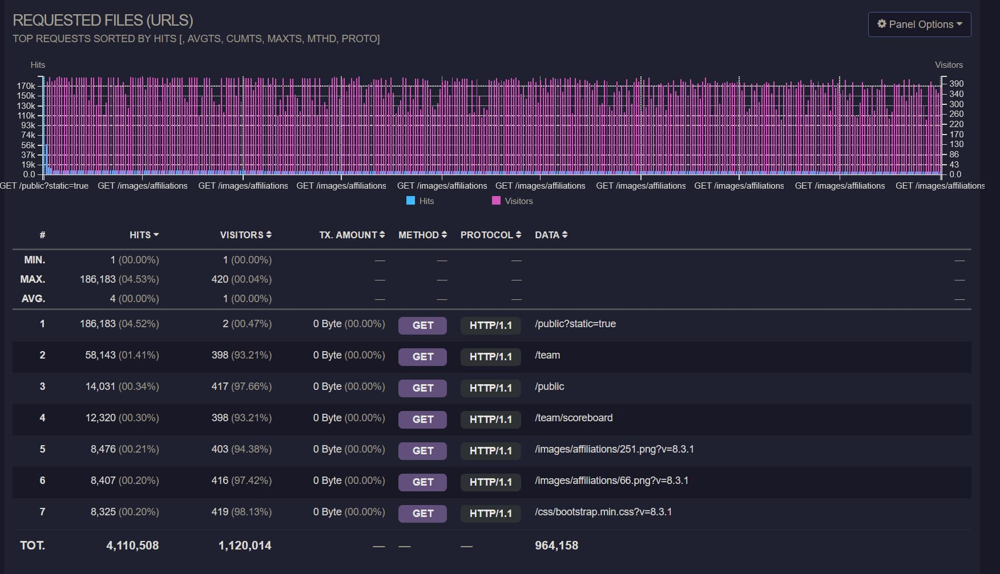
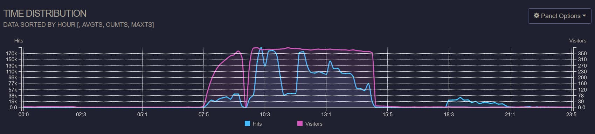
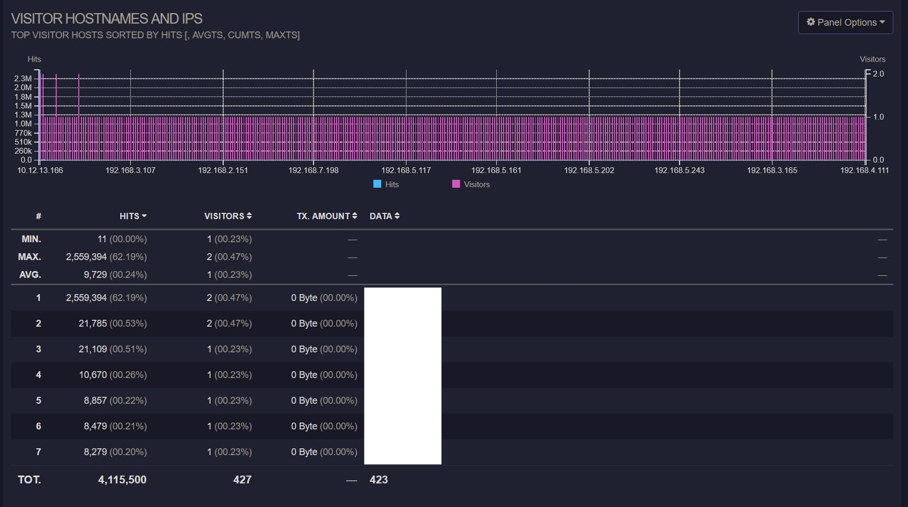
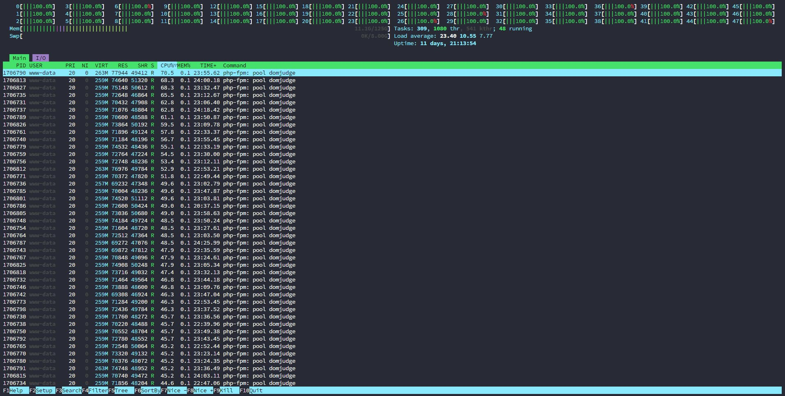

> This article was translated by GPT 5.5.

> The early preparation for this contest was basically all done by myself, and it was genuinely exhausting....  
> I finally solved the automatic login issue that had been on the list for years, filled all the pits left from the previous EC, and then, well, a whole new pile of issues appeared. I was completely numb.

## Issue Analysis

After the contest, I used goaccess to analyze the Nginx access logs from 5/4. First, the requested URLs are shown below.



It is clear that the paths contestants actually needed to access, such as `/team` and `/public`, accounted for only a very small portion, while static-file requests made up more than 95%. The public scoreboard alone reached an unexpectedly high `4.52%`.
All of these requests passed through Nginx and hit php-fpm directly. At the same time, because the server system had been installed on the server's only mechanical hard drive, a large number of PHP processes ended up waiting on disk IO,
causing request latency to explode.

Looking at the time-series data, as shown below:



The dip in Visitors corresponds to the opening ceremony between the practice contest and the official contest. However, the request volume during the official contest was very irregular. The section starting at 18:00 was my post-contest attempt to simulate load testing,
which means the large number of requests during the official contest was abnormal. These requests also passed through Nginx and directly hit PHP, so the server became completely stuck starting at 14:32. The public scoreboard was disabled at 14:
40,
and after restarting the php-fpm service directly at 14:42, the server recovered at 14:44. However, because Nginx was not touched, a large number of requests still continued flowing in, and the server remained very sluggish until the end.

The request sources are shown below:



The first row is the reverse proxy server for the public scoreboard. As shown, the vast majority of requests came from there. After using k6 to simulate requests and load-test the service, I was able to reproduce the situation at that time, as shown in the following htop output.



The load-test script is below.

{}

```js
import http from 'k6/http';
import {sleep, check} from 'k6';
import {Trend} from 'k6/metrics';


export const options = {
    vus: 4000,
    // iterations: 500,
    duration: '2m',

    thresholds: {
        http_req_duration: ['p(95)<500'],
    },
    insecureSkipTLSVerify: true
};

const timingBlocked = new Trend('http_blocked');
const timingConnecting = new Trend('http_connecting');
const timingSending = new Trend('http_sending');
const timingWaiting = new Trend('http_waiting');
const timingReceiving = new Trend('http_receiving');

export default function () {
    const res = http.get('http://10.12.13.20', {
        timeout: '60000000s'
    });

    check(res, {
        'status is 200': (r) => r.status === 200,
    });

    timingBlocked.add(res.timings.blocked);
    timingConnecting.add(res.timings.connecting);
    timingSending.add(res.timings.sending);
    timingWaiting.add(res.timings.waiting);
    timingReceiving.add(res.timings.receiving);

    sleep(1);
}
```

{}

This confirms the root cause: for whatever reason, a large number of requests poured into the public scoreboard server. Because the traffic was not cached layer by layer and reduced before reaching the origin, the PHP service was dragged down directly.

## Pre-contest Preparation Memo

### DomJudge Issues

1. Note that DomJudge
   8.3.1 has an issue with the database constraint for Submission. It needs to be fixed by referring to the relevant migration scripts in [https://github.com/DOMjudge/domjudge/tree/main/webapp/migrations](https://github.com/DOMjudge/domjudge/tree/main/webapp/migrations).
2. DomJudge's import implementation is honestly frustrating. If JSON is used, affiliations need to be imported separately. If TSV is used, it creates multiple affiliations with the same name and also does not automatically assign External
   ID, which causes a direct 500 as soon as you click in to view it. What a mess. (Update:
   Note that when importing TSV, the eighth column should be set manually and must not be null. Sort and deduplicate all affiliations, then assign each one an ID. Otherwise, externalid becomes null, DomJudge cannot deduplicate affiliations, and later validation fails with a 500.)
3. When importing teams, TSV cannot import the location field, and account JSON import is also broken and cannot be parsed. Therefore, the only option was to modify the database directly after importing, which was also painful. This definitely needs to be changed later; maybe a program should be written to import directly from the Excel spreadsheet.
4. To avoid conflicts between login names such as Team001 and the original administrator account with ID 1, the Data Source in Configuration must be set to External rather than just local.
5. Several settings need to be enabled: `Allow team submission download` under `Display`, and `xheader` should be added under `Authentication`.
6. The max_child setting in the php-fpm configuration needs to be changed; otherwise, the server cannot handle too many requests.
7. The server-side scripts used for printing are shown below. However, because enscript cannot handle utf-8 characters, all Chinese text becomes garbled and needs further modification. Also, some teams submitted compiled ELF files and ended up printing hundreds of pages, so this needs an additional limit to the first 10 pages. The code below is only a backup and definitely needs to be changed later.
8. Note that when importing accounts.tsv, it only considers the integer part. Therefore, manually writing a program that directly calls the API to import teams and accounts and associate them, while also handling affiliations, may be a better option.

### Contestant Machine Automation

I wrote an automation program in advance that integrated most operations needed on contestant machines. Most of the process can be referenced directly from the README.md in [this GitHub repository](https://github.com/4o3F/Natsume).
It already covers automatically setting up the reverse proxy, unlocking/locking users, resetting user data, binding seat numbers, and synchronizing account passwords.

**When `configure_client.sh` is used to update `natsume_client`, the timeout for `parallel-ssh`
must absolutely be set very high. Otherwise, it can easily time out while downloading the publickey, and then everything breaks, leaving you to manually fix machines one by one.**

### Public Scoreboard Cache

Because the public scoreboard needs to be mapped out by the university information office, another reverse proxy needs to be configured on a non-DomServer server. Although the reverse proxy used for last year's EC Final worked, it directly saturated the bandwidth, and there was no time to fix it on-site.
Below is a fixed version. Note that this requires Caddy to include the [cache-handler](https://github.com/caddyserver/cache-handler) middleware.

Note that all static files are cached for a long time, while the scoreboard is cached for 3s. A 5s stale time is also configured to prevent cache breakdown.

{}

```Caddyfile
{
    auto_https off
    debug
    cache {
        ttl 0s
    }
}

:80 {
    @staticfile path_regexp allowed_files \.(js|css|png)$
    handle @staticfile {
        cache {
            ttl 604800s
        }
        reverse_proxy http://10.12.13.20 {
            header_down Cache-Control "public, max-age=604800, must-revalidate"
        }
    }

    handle /* {
        cache {
            ttl 3s
            stale 5s
        }
        rewrite * /public?static=true
        reverse_proxy http://10.12.13.20
    }
}
```

{}

With this setup, data can be cached on the reverse proxy server. This matters especially when Team Affiliation is included: if the page is fully displayed, one request can generate around 100 MB of response data, which directly blows up the server bandwidth.

### Nginx Request Filtering

Based on the analysis above, besides using Caddy to cache and block most external requests, we also need to prevent a large number of requests from within the internal network. Therefore, Nginx should be configured with per-IP rate limiting and static-file caching.

First, define the limit zones. Modify `/etc/nginx/nginx.conf` and add the following section inside the http block. This limits each IP to at most 5 requests per second.

```text
limit_req_zone $binary_remote_addr zone=req_limit_per_ip:10m rate=5r/s;
limit_conn_zone $binary_remote_addr zone=conn_limit_per_ip:10m;
```

Then change the outer server configuration by modifying nginx-conf.

```text
server {
        listen 80;
        listen [::]:80;

        # If you are reading from the event feed, make sure this is large enough.
        # If you have a slow event feed reader, nginx needs to keep the connection
        # open long enough between two write operations
        send_timeout 36000s;
        include /opt/domjudge/domserver/etc/nginx-conf-inner;
        
        # Add the following section to optimize file handling
        open_file_cache          max=1000 inactive=20s;
        open_file_cache_valid    30s;
        open_file_cache_min_uses 2;
        open_file_cache_errors   on;
}
```

After that, change the inner location configuration to rate-limit all PHP-related requests. Modify nginx-conf-inner as shown below.

{}

```text
server_name _default_;
client_max_body_size 0;
set $domjudgeRoot /opt/domjudge/domserver/webapp/public;
set $prefix '';
location / {
        root $domjudgeRoot;
        try_files $uri @domjudgeFront;
        # Cache all static files for 2h
        location ~* \.(css|js|jpg|jpeg|png|gif|ico|woff|woff2|ttf|eot|svg)$ {
            access_log off;
            expires 2h;
            add_header Cache-Control "public";
        }
        location /api/ {
                try_files $uri @domjudgeFrontApi;
                error_log /var/log/nginx/domjudge-api.log;
                access_log /var/log/nginx/domjudge-api.log;
        }
}

location @domjudgeFront {
        # Limit Web UI requests to at most 10 connections per IP, with up to 10 queued requests
        limit_req zone=req_limit_per_ip burst=10 nodelay;
        limit_conn conn_limit_per_ip 10;

        fastcgi_split_path_info ^(.+\.php)(/.*)$;
        fastcgi_pass domjudge;
        include fastcgi_params;
        fastcgi_param SERVER_NAME $host;
        fastcgi_param SCRIPT_FILENAME $domjudgeRoot/index.php;
        fastcgi_param SCRIPT_NAME $prefix/index.php;
        fastcgi_param REQUEST_URI $prefix$uri?$args;
        fastcgi_param DOCUMENT_ROOT $domjudgeRoot;
        fastcgi_param HTTPS $fastcgi_param_https_variable;
        internal;
}

location @domjudgeFrontApi {
        # Limit API requests to at most 15 connections per IP, with up to 15 queued requests
        limit_req zone=req_limit_per_ip burst=15 nodelay;
        limit_conn conn_limit_per_ip 15;

        fastcgi_split_path_info ^(.+\.php)(/.*)$;
        fastcgi_pass domjudge;
        include fastcgi_params;
        fastcgi_param SERVER_NAME $host;
        fastcgi_param SCRIPT_FILENAME $domjudgeRoot/index.php;
        fastcgi_param SCRIPT_NAME $prefix/index.php;
        fastcgi_param REQUEST_URI $prefix$uri?$args;
        fastcgi_param DOCUMENT_ROOT $domjudgeRoot;
        fastcgi_param HTTPS $fastcgi_param_https_variable;

        internal;
        error_log /var/log/nginx/domjudge-api.log;
        access_log /var/log/nginx/domjudge-api.log;
}

add_header X-Frame-Options "DENY";
add_header Referrer-Policy "same-origin";
add_header X-Content-Type-Options "nosniff";
add_header X-XSS-Protection "1; mode=block";

error_log /var/log/nginx/domjudge.log;
access_log /var/log/nginx/domjudge.log;
```

{}

### Parallel-SSH Commands

SSH performs public key fingerprint verification, so extra parameters need to be added. The IP list can be downloaded from Natsume.

```shell
parallel-ssh -t 6000 -p 1000 -h ips_all.txt -l "root" -x "-i ./privatekey -o 'StrictHostKeyChecking no'"  'natsume_client session terminate'
```

### Printing Code Backup

If this is changed later, enscript should probably be replaced with something that directly outputs PDF in one step.

{}

```python
import sys
import subprocess
from pathlib import Path
import os
import random
import logging # Import the logging module
from datetime import datetime # Import datetime to get timestamps

# Modify run_command to accept and use a logger
def run_command(cmd_list, step_name, logger):
    """Runs a command, logs details, and returns success status and result."""
    cmd_str = ' '.join(cmd_list)
    logger.info(f"--- Running step: {step_name} ---")
    logger.info(f"Command: {cmd_str}")
    try:
        # Use encoding='utf-8' for text=True for broader compatibility
        result = subprocess.run(cmd_list, check=True, capture_output=True, text=True, encoding='utf-8', errors='replace')
        # Log STDOUT and STDERR if they exist
        stdout = result.stdout.strip()
        stderr = result.stderr.strip()
        if stdout:
            logger.info(f"STDOUT:\n{stdout}")
        if stderr:
            logger.warning(f"STDERR:\n{stderr}") # Log stderr as warning even on success
        logger.info(f"Success: Step '{step_name}' completed.")
        return True, result
    except FileNotFoundError:
        logger.error(f"Error during {step_name}: Command not found: {cmd_list[0]}. Is it installed and in PATH?")
        return False, None
    except subprocess.CalledProcessError as e:
        logger.error(f"Error during {step_name}: Command returned non-zero exit status {e.returncode}.")
        logger.error(f"Command: {cmd_str}") # Log the command string again for context
        # Log captured output from the exception object
        stdout_err = e.stdout.strip() if e.stdout else "N/A"
        stderr_err = e.stderr.strip() if e.stderr else "N/A"
        logger.error(f"STDOUT on error:\n{stdout_err}")
        logger.error(f"STDERR on error:\n{stderr_err}")
        return False, None
    except Exception as e:
        logger.error(f"An unexpected error occurred during {step_name}: {e}", exc_info=True) # exc_info=True adds traceback
        return False, None

def setup_logging(log_dir, user, base_filename):
    """Configures logging to file and console."""
    now = datetime.now()
    timestamp = now.strftime("%Y%m%d_%H%M%S")
    log_filename = f"{user}_{base_filename}_{timestamp}.log"
    log_filepath = Path(log_dir) / log_filename

    # Create logger
    logger = logging.getLogger('script_logger')
    logger.setLevel(logging.INFO) # Set the minimum level to log

    # Prevent propagation to root logger if handlers are added multiple times
    if logger.hasHandlers():
        logger.handlers.clear()

    # Create formatter
    formatter = logging.Formatter('%(asctime)s - %(levelname)s - %(message)s', datefmt='%Y-%m-%d %H:%M:%S')

    # Create File Handler
    try:
        file_handler = logging.FileHandler(log_filepath, encoding='utf-8')
        file_handler.setLevel(logging.INFO)
        file_handler.setFormatter(formatter)
        logger.addHandler(file_handler)
    except Exception as e:
        print(f"T^T")
        # Fallback or exit if logging is critical
        # For now, we'll continue with console logging if possible

    # Create Console Handler
    console_handler = logging.StreamHandler()
    console_handler.setLevel(logging.INFO) # You might want DEBUG for console, INFO for file
    console_handler.setFormatter(formatter)
    logger.addHandler(console_handler)

    logger.info(f"Logging initialized. Log file: {log_filepath}")
    return logger, log_filepath # Return the logger and the log file path

def main():
    if len(sys.argv) < 3: # Updated check for 3 arguments
        print("Usage: python your_script.py <user> <path_to_cpp_file>")
        sys.exit(1)

    user = sys.argv[1]
    input_cpp_path_str = sys.argv[2]
    input_cpp_path = Path(input_cpp_path_str)

    # --- Basic path setup ---
    if not input_cpp_path.is_file():
        # Logging isn't set up yet, so use print for this critical early error
        print(f"Error: Input file not found: {input_cpp_path}")
        sys.exit(1)

    directory = input_cpp_path.parent
    stem = input_cpp_path.stem
    ps_path = directory / f"{stem}.ps"
    pdf_path = directory / f"{stem}.pdf"

    # --- Setup Logging ---
    # Pass directory, user, and file stem to setup_logging
    logger, log_filepath = setup_logging(directory, user, stem)

    logger.info(f"--- Script Start ---")
    logger.info(f"User: {user}")
    logger.info(f"Input C++ file: {input_cpp_path}")
    logger.info(f"Output PS path (intermediate): {ps_path}")
    logger.info(f"Output PDF path: {pdf_path}")

    # --- Enscript Conversion ---
    enscript_cmd = [
        'enscript',
        '-b', user,         # Header text (user name)
        # '-a', '0-10',     # Page range (commented out, process all pages by default)
        '-f', 'Courier9',   # Font
        '-o', str(ps_path), # Output PostScript file path
        str(input_cpp_path) # Input C++ file path
    ]
    # Use the logger in run_command
    success, _ = run_command(enscript_cmd, "enscript conversion to PS", logger)
    if not success:
        logger.error("enscript command failed. Exiting.")
        sys.exit(1)

    # --- ps2pdf Conversion ---
    ps2pdf_cmd = [
        'ps2pdf',
        str(ps_path),
        str(pdf_path)
    ]
    success, _ = run_command(ps2pdf_cmd, "ps2pdf conversion to PDF", logger)
    if not success:
        logger.error("ps2pdf command failed. Exiting.")
        sys.exit(1)

    # --- Cleanup Intermediate File ---
    try:
        logger.info(f"Attempting to clean up intermediate file: {ps_path}")
        ps_path.unlink()
        logger.info("Success: Cleaned up .ps file.")
    except OSError as e:
        logger.warning(f"Could not remove intermediate file {ps_path}: {e}")

    # --- Prepare and Run Curl Upload ---
    # Using the random choice as in your original modification, but currently only one IP
    ip_addresses = ['10.12.13.27',"10.12.13.29","10.12.13.209","10.12.13.107"] # Add more IPs here if needed for real randomness
    chosen_ip = random.choice(ip_addresses)
    curl_url = f'http://{chosen_ip}:12306/'
    logger.info(f"Selected target URL for upload: {curl_url}")

    curl_cmd = [
        'curl',
        '-X', 'POST',
        '-H', 'Content-Type: application/octet-stream',
        '--data-binary', f'@{pdf_path}', # Use @ to read file content
         curl_url
    ]
    success, result = run_command(curl_cmd, "curl PDF upload", logger)
    if not success:
        logger.error("curl command failed. Exiting.")
        sys.exit(1)

    logger.info("--- Process Completed Successfully ---")
    # Log the final server response if available
    if result and result.stdout:
        final_response = result.stdout.strip()
        logger.info(f"Server response from {curl_url}:\n{final_response}")
    else:
         logger.info(f"No specific response body received from server at {curl_url}.")

if __name__ == "__main__":
    main()
```

{}

Installing paps:

```shell
apt-get install meson cmake libfmt-dev pkg-config build-essential libpango1.0-dev libpaper-dev
meson build
cd build && ninja
```

paps plaintext to PDF, with output written to stdout:

```shell
paps --header --header-left=[location] --format=pdf [file]
```

### Some Other Code Backups

#### Excel Random Password Generation
1. Excel `alt+f11`
2. Insert -> Module
3. ```VisualBasic
   Function RandomPassword(length As Integer) As String
    Dim chars As String
    Dim i As Integer
    Dim result As String
    
    chars = "ABCDEFGHIJKLMNOPQRSTUVWXYZabcdefghijklmnopqrstuvwxyz0123456789"
    result = ""
    
    For i = 1 To length
        result = result & Mid(chars, Int(Rnd() * Len(chars)) + 1, 1)
    Next i
    
    RandomPassword = result
   End Function
   ```
4. `=RandomPassword(12)`

Finally, here is the wallpaper from this contest. I still like it a lot.


