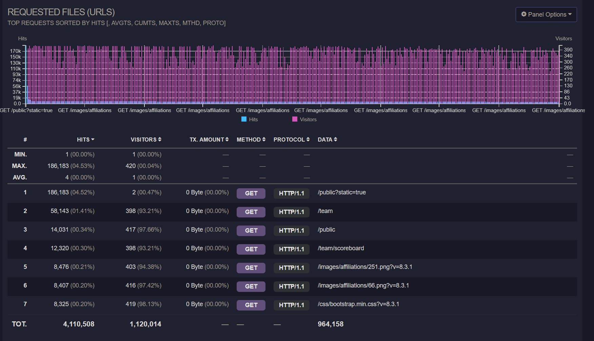
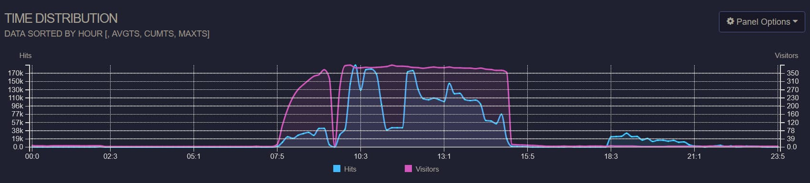
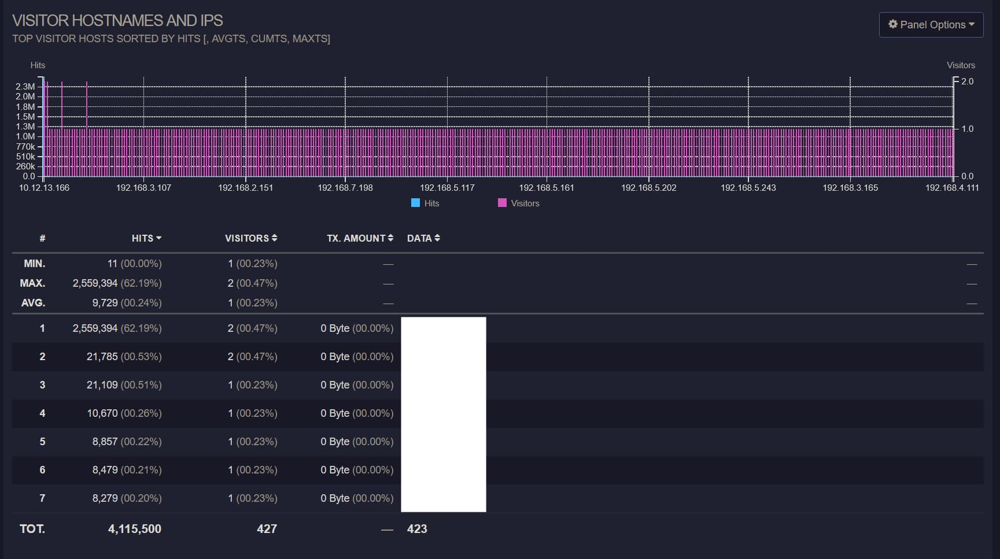
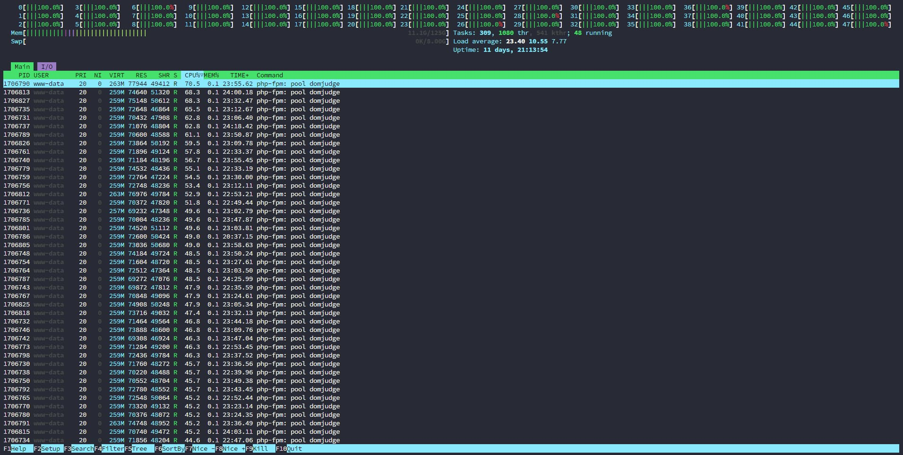

> 这次前期准备基本约等于全自己一个人干的，着实累麻了....  
> 终于解决了几年前就说要做的自动登录，又把上回的EC坑全都填了，然后哈哈，出了一堆新的问题，人麻了

## 问题分析

赛后使用goaccess对5/4的Nginx access日志进行分析，首先是请求的URL地址如下图所示。



可见真正选手需要访问的`/team`，`/public`这些只占了很少的一部分，而静态文件的请求占了95%以上，尤其是外榜竟然达到了`4.52%`
这么高，
而这些所有的请求都穿过了Nginx直接打到了php-fpm上，同时又由于同学把服务器系统装到了服务器的唯一一块机械盘上面.....造成了大量PHP进程等待磁盘IO，
请求时间直接爆炸。

同时观察按时间排列的数据，如下图所示



Visitors中间变少的时候是热身赛和正式赛之间的开幕式，然而正式赛期间的请求数则很不规律，18点开始的部分是我在赛后尝试模拟压测，
也就是说正赛期间的大量请求是不正常的，而这些请求也都穿过了Nginx直接打到了PHP上，因此从14:32开始服务器直接卡死，直到14:
40关闭了外榜，
在14:42直接重启了php-fpm service后，于14:44服务器恢复正常，然而由于没有动Nginx，还是有大量请求流入，一直到最后都处于很卡的状态。

观察请求来源，如下图所示



第一行的是外榜的反代服务器，可见绝大部分的请求都是来源于这里。同时使用k6模拟请求压测后可以实际复现当时的情景，如下htop显示



压测脚本如下

```js
import http from 'k6/http';
import {sleep, check} from 'k6';
import {Trend} from 'k6/metrics';


export const options = {
    vus: 4000,
    // iterations: 500,
    duration: '2m',

    thresholds: {
        http_req_duration: ['p(95)<500'],
    },
    insecureSkipTLSVerify: true
};

const timingBlocked = new Trend('http_blocked');
const timingConnecting = new Trend('http_connecting');
const timingSending = new Trend('http_sending');
const timingWaiting = new Trend('http_waiting');
const timingReceiving = new Trend('http_receiving');

export default function () {
    const res = http.get('http://10.12.13.20', {
        timeout: '60000000s'
    });

    check(res, {
        'status is 200': (r) => r.status === 200,
    });

    timingBlocked.add(res.timings.blocked);
    timingConnecting.add(res.timings.connecting);
    timingSending.add(res.timings.sending);
    timingWaiting.add(res.timings.waiting);
    timingReceiving.add(res.timings.receiving);

    sleep(1);
}
```

由此可确定问题所在，无论是出于什么原因，有大量的请求涌入外榜服务器，由于没能逐级缓存并降低流量，导致PHP服务被直接拖垮。

## 赛前准备备忘

### DomJudge问题

1. 注意DomJudge
   8.3.1版本对于Submission的数据库限制有问题，需要参考[https://github.com/DOMjudge/domjudge/tree/main/webapp/migrations](https://github.com/DOMjudge/domjudge/tree/main/webapp/migrations)
   中的相关migration script进行修改。
2. DomJudge的导入写的实在是无语，要是用JSON的话，所属学校需要分开导入，而使用TSV导入的话又会为同样名字的学校创建多个，同时还不会自动分配External ID，导致只要点进去查看就直接500，真😑了。
3. 导入team的时候，使用TSV无法导入location字段，同时account的JSON导入还有毛病，无法解析，因此只能导入后直接草库，也很麻，这地方之后肯定是要做修改的，可能得写个程序来导入吧，直接解析Excel表格。
4. 为了避免Team001这种登录名和原本ID为1的管理员账户冲突，需要在Configuration中设置Data Source为External，而不能只是local。 
5. 有几个设置需要打开，`Display`中的`Allow team submission download`，`Authentication`中要添加`xheader`。 
6. 需要修改php-fpm配置中的max_child，不然的话服务器处理不了太多的请求。 
7. 打印用的服务器端相关脚本如下所示，但是由于enscript无法处理utf-8字符，因此中文都会是乱码，需要进一步修改，同时有的队伍把编译后的ELF文件提交了.....打了好几百页出来，需要进一步限制前10页，下面的代码仅仅做个备份，之后肯定得改。

### 选手机自动化

提前写了个集成了绝大部分选手机上操作的自动化程序，大部分的流程都可以直接参考README.md，可见[这个GitHub仓库](https://github.com/4o3F/Natsume)，
已经涵盖了自动设置反代，解锁/锁定用户，重置用户数据，绑定座位号，同步账号密码。

**`configure_client.sh`在用于更新`natsume_client`的时候，`parallel-ssh`一定一定要把timeout开到很大，不然的话容易直接在下载publickey的时候就超时，然后就寄了，手动一个个修回来吧**

### 外榜缓存

由于外榜需要由学校信息处映射出去，因此还需要在非DomServer的服务器上配置个反代，去年EC Final的反代虽然能够工作但是会直接把带宽打满，现场也没来得及修，
下面放一个已经修复后的版本，注意这需要Caddy包含有[cache-handler](https://github.com/caddyserver/cache-handler)这个中间件。

注意所有的静态文件均是长时缓存，而榜单则设置3s的缓存时间，同时为了方式缓存击穿设置5s的stale时间。

```Caddyfile
{
    auto_https off
    debug
    cache {
        ttl 0s
    }
}

:80 {
    @staticfile path_regexp allowed_files \.(js|css|png)$
    handle @staticfile {
        cache {
            ttl 604800s
        }
        reverse_proxy http://10.12.13.20 {
            header_down Cache-Control "public, max-age=604800, must-revalidate"
        }
    }

    handle /* {
        cache {
            ttl 3s
            stale 5s
        }
        rewrite * /public?static=true
        reverse_proxy http://10.12.13.20
    }
}
```

这样设置后可以在反代服务器上缓存数据，尤其是带Team Affiliation的话如果完全展示一次请求会产生大约100MB的请求数据，服务器宽带直接爆炸。

### Nginx请求过滤

根据上面的分析，除了使用Caddy缓存并挡下大部分来自外网的请求，还需要防止内网内的大量请求，因此需要配置Nginx进行单IP限流，以及所有静态文件的缓存。

先是定义限制区域，修改`/etc/nginx/nginx.conf`，在http块中添加如下的部分，这会限制每个IP每秒最多5个请求。

```text
limit_req_zone $binary_remote_addr zone=req_limit_per_ip:10m rate=5r/s;
limit_conn_zone $binary_remote_addr zone=conn_limit_per_ip:10m;
```

然后更改外层server配置，修改nginx-conf

```text
server {
        listen 80;
        listen [::]:80;

        # If you are reading from the event feed, make sure this is large enough.
        # If you have a slow event feed reader, nginx needs to keep the connection
        # open long enough between two write operations
        send_timeout 36000s;
        include /opt/domjudge/domserver/etc/nginx-conf-inner;
        
        # 添加下面的部分，优化文件处理
        open_file_cache          max=1000 inactive=20s;
        open_file_cache_valid    30s;
        open_file_cache_min_uses 2;
        open_file_cache_errors   on;
}
```

再之后更改内层location配置，对所有PHP相关的请求进行限流，修改nginx-conf-inner，修改后的如下所示

```text
server_name _default_;
client_max_body_size 0;
set $domjudgeRoot /opt/domjudge/domserver/webapp/public;
set $prefix '';
location / {
        root $domjudgeRoot;
        try_files $uri @domjudgeFront;
        # 配置所有的静态文件进行缓存，缓存时间为2h
        location ~* \.(css|js|jpg|jpeg|png|gif|ico|woff|woff2|ttf|eot|svg)$ {
            access_log off;
            expires 2h;
            add_header Cache-Control "public";
        }
        location /api/ {
                try_files $uri @domjudgeFrontApi;
                error_log /var/log/nginx/domjudge-api.log;
                access_log /var/log/nginx/domjudge-api.log;
        }
}

location @domjudgeFront {
        # 限制WebUI请求速率为每个IP最多10个连接，最多积压10个请求
        limit_req zone=req_limit_per_ip burst=10 nodelay;
        limit_conn conn_limit_per_ip 10;

        fastcgi_split_path_info ^(.+\.php)(/.*)$;
        fastcgi_pass domjudge;
        include fastcgi_params;
        fastcgi_param SERVER_NAME $host;
        fastcgi_param SCRIPT_FILENAME $domjudgeRoot/index.php;
        fastcgi_param SCRIPT_NAME $prefix/index.php;
        fastcgi_param REQUEST_URI $prefix$uri?$args;
        fastcgi_param DOCUMENT_ROOT $domjudgeRoot;
        fastcgi_param HTTPS $fastcgi_param_https_variable;
        internal;
}

location @domjudgeFrontApi {
        # 限制API请求速率为每个IP最多15个连接，最多积压15个请求
        limit_req zone=req_limit_per_ip burst=15 nodelay;
        limit_conn conn_limit_per_ip 15;

        fastcgi_split_path_info ^(.+\.php)(/.*)$;
        fastcgi_pass domjudge;
        include fastcgi_params;
        fastcgi_param SERVER_NAME $host;
        fastcgi_param SCRIPT_FILENAME $domjudgeRoot/index.php;
        fastcgi_param SCRIPT_NAME $prefix/index.php;
        fastcgi_param REQUEST_URI $prefix$uri?$args;
        fastcgi_param DOCUMENT_ROOT $domjudgeRoot;
        fastcgi_param HTTPS $fastcgi_param_https_variable;

        internal;
        error_log /var/log/nginx/domjudge-api.log;
        access_log /var/log/nginx/domjudge-api.log;
}

add_header X-Frame-Options "DENY";
add_header Referrer-Policy "same-origin";
add_header X-Content-Type-Options "nosniff";
add_header X-XSS-Protection "1; mode=block";

error_log /var/log/nginx/domjudge.log;
access_log /var/log/nginx/domjudge.log;
```

### Parallel-SSH命令

SSH会进行public key fingerprint验证，所以需要额外添加参数。IP列表可以从Natsume中下载。

```shell
parallel-ssh -t 6000 -p 1000 -h ips_all.txt -l "root" -x "-i ./privatekey -o 'StrictHostKeyChecking no'"  'natsume_client session terminate'
```

### 打印代码备份
之后改得话应该得把enscript换掉，换一个直接一步出PDF的
```python
import sys
import subprocess
from pathlib import Path
import os
import random
import logging # Import the logging module
from datetime import datetime # Import datetime to get timestamps

# Modify run_command to accept and use a logger
def run_command(cmd_list, step_name, logger):
    """Runs a command, logs details, and returns success status and result."""
    cmd_str = ' '.join(cmd_list)
    logger.info(f"--- Running step: {step_name} ---")
    logger.info(f"Command: {cmd_str}")
    try:
        # Use encoding='utf-8' for text=True for broader compatibility
        result = subprocess.run(cmd_list, check=True, capture_output=True, text=True, encoding='utf-8', errors='replace')
        # Log STDOUT and STDERR if they exist
        stdout = result.stdout.strip()
        stderr = result.stderr.strip()
        if stdout:
            logger.info(f"STDOUT:\n{stdout}")
        if stderr:
            logger.warning(f"STDERR:\n{stderr}") # Log stderr as warning even on success
        logger.info(f"Success: Step '{step_name}' completed.")
        return True, result
    except FileNotFoundError:
        logger.error(f"Error during {step_name}: Command not found: {cmd_list[0]}. Is it installed and in PATH?")
        return False, None
    except subprocess.CalledProcessError as e:
        logger.error(f"Error during {step_name}: Command returned non-zero exit status {e.returncode}.")
        logger.error(f"Command: {cmd_str}") # Log the command string again for context
        # Log captured output from the exception object
        stdout_err = e.stdout.strip() if e.stdout else "N/A"
        stderr_err = e.stderr.strip() if e.stderr else "N/A"
        logger.error(f"STDOUT on error:\n{stdout_err}")
        logger.error(f"STDERR on error:\n{stderr_err}")
        return False, None
    except Exception as e:
        logger.error(f"An unexpected error occurred during {step_name}: {e}", exc_info=True) # exc_info=True adds traceback
        return False, None

def setup_logging(log_dir, user, base_filename):
    """Configures logging to file and console."""
    now = datetime.now()
    timestamp = now.strftime("%Y%m%d_%H%M%S")
    log_filename = f"{user}_{base_filename}_{timestamp}.log"
    log_filepath = Path(log_dir) / log_filename

    # Create logger
    logger = logging.getLogger('script_logger')
    logger.setLevel(logging.INFO) # Set the minimum level to log

    # Prevent propagation to root logger if handlers are added multiple times
    if logger.hasHandlers():
        logger.handlers.clear()

    # Create formatter
    formatter = logging.Formatter('%(asctime)s - %(levelname)s - %(message)s', datefmt='%Y-%m-%d %H:%M:%S')

    # Create File Handler
    try:
        file_handler = logging.FileHandler(log_filepath, encoding='utf-8')
        file_handler.setLevel(logging.INFO)
        file_handler.setFormatter(formatter)
        logger.addHandler(file_handler)
    except Exception as e:
        print(f"T^T")
        # Fallback or exit if logging is critical
        # For now, we'll continue with console logging if possible

    # Create Console Handler
    console_handler = logging.StreamHandler()
    console_handler.setLevel(logging.INFO) # You might want DEBUG for console, INFO for file
    console_handler.setFormatter(formatter)
    logger.addHandler(console_handler)

    logger.info(f"Logging initialized. Log file: {log_filepath}")
    return logger, log_filepath # Return the logger and the log file path

def main():
    if len(sys.argv) < 3: # Updated check for 3 arguments
        print("Usage: python your_script.py <user> <path_to_cpp_file>")
        sys.exit(1)

    user = sys.argv[1]
    input_cpp_path_str = sys.argv[2]
    input_cpp_path = Path(input_cpp_path_str)

    # --- Basic path setup ---
    if not input_cpp_path.is_file():
        # Logging isn't set up yet, so use print for this critical early error
        print(f"Error: Input file not found: {input_cpp_path}")
        sys.exit(1)

    directory = input_cpp_path.parent
    stem = input_cpp_path.stem
    ps_path = directory / f"{stem}.ps"
    pdf_path = directory / f"{stem}.pdf"

    # --- Setup Logging ---
    # Pass directory, user, and file stem to setup_logging
    logger, log_filepath = setup_logging(directory, user, stem)

    logger.info(f"--- Script Start ---")
    logger.info(f"User: {user}")
    logger.info(f"Input C++ file: {input_cpp_path}")
    logger.info(f"Output PS path (intermediate): {ps_path}")
    logger.info(f"Output PDF path: {pdf_path}")

    # --- Enscript Conversion ---
    enscript_cmd = [
        'enscript',
        '-b', user,         # Header text (user name)
        # '-a', '0-10',     # Page range (commented out, process all pages by default)
        '-f', 'Courier9',   # Font
        '-o', str(ps_path), # Output PostScript file path
        str(input_cpp_path) # Input C++ file path
    ]
    # Use the logger in run_command
    success, _ = run_command(enscript_cmd, "enscript conversion to PS", logger)
    if not success:
        logger.error("enscript command failed. Exiting.")
        sys.exit(1)

    # --- ps2pdf Conversion ---
    ps2pdf_cmd = [
        'ps2pdf',
        str(ps_path),
        str(pdf_path)
    ]
    success, _ = run_command(ps2pdf_cmd, "ps2pdf conversion to PDF", logger)
    if not success:
        logger.error("ps2pdf command failed. Exiting.")
        sys.exit(1)

    # --- Cleanup Intermediate File ---
    try:
        logger.info(f"Attempting to clean up intermediate file: {ps_path}")
        ps_path.unlink()
        logger.info("Success: Cleaned up .ps file.")
    except OSError as e:
        logger.warning(f"Could not remove intermediate file {ps_path}: {e}")

    # --- Prepare and Run Curl Upload ---
    # Using the random choice as in your original modification, but currently only one IP
    ip_addresses = ['10.12.13.27',"10.12.13.29","10.12.13.209","10.12.13.107"] # Add more IPs here if needed for real randomness
    chosen_ip = random.choice(ip_addresses)
    curl_url = f'http://{chosen_ip}:12306/'
    logger.info(f"Selected target URL for upload: {curl_url}")

    curl_cmd = [
        'curl',
        '-X', 'POST',
        '-H', 'Content-Type: application/octet-stream',
        '--data-binary', f'@{pdf_path}', # Use @ to read file content
         curl_url
    ]
    success, result = run_command(curl_cmd, "curl PDF upload", logger)
    if not success:
        logger.error("curl command failed. Exiting.")
        sys.exit(1)

    logger.info("--- Process Completed Successfully ---")
    # Log the final server response if available
    if result and result.stdout:
        final_response = result.stdout.strip()
        logger.info(f"Server response from {curl_url}:\n{final_response}")
    else:
         logger.info(f"No specific response body received from server at {curl_url}.")

if __name__ == "__main__":
    main()
```
最后留张此次比赛的壁纸，我还是很喜欢的😝

