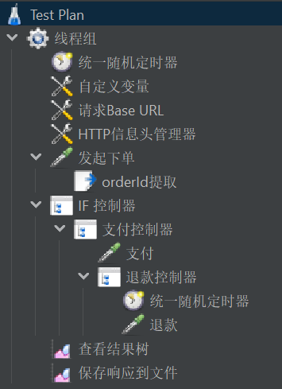
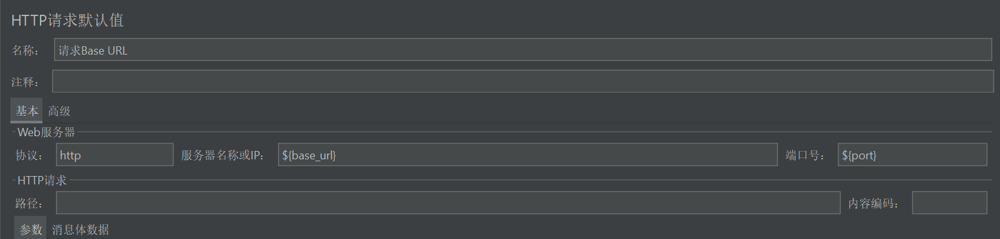
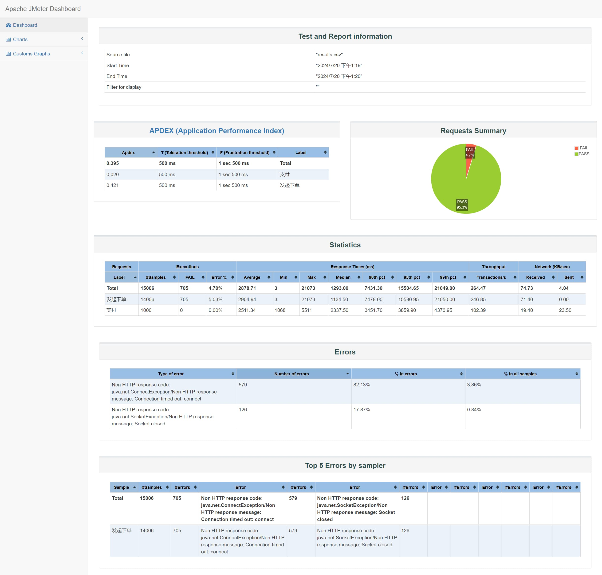

> This article was translated by GPT 5.5.

> Following the previous article where the monitoring system was completed, the next task is to stress test the existing payment flow, then optimize it so it can handle higher concurrency.

## Configuring JMeter

The task needs to decide, according to probability, whether an order should eventually be paid after it is generated. JMeter's native logic controllers cannot achieve this effect. At the same time, to extend JMeter's functionality, install the JMeter
Plugin Manager.
The installation guide is [here](https://jmeter-plugins.org/wiki/PluginsManager/).
It is actually very simple: first download the corresponding [JAR](https://jmeter-plugins.org/get/), then put it under the `lib/ext` folder in the JMeter installation directory.

After that, install the `Parallel Controller & Sampler` plugin. It provides a `Weighted Switch Controller`, which can implement complex multi-branch probability selection schemes.

Because the current requirement is only to choose whether to execute the next payment step in the flow, the built-in Throughput Controller can also meet the requirement. The Throughput Controller limits execution based on random-number probability, which means it cannot control it with complete accuracy.
This needs extra attention when using it.

## Test Task Configuration

First, here is the final configured test flow.



Next, I will explain the function of each component one by one.

### Uniform Random Timer

This is used to control the random waiting time at the start of each request round, to simulate real users' random behavior. It is relatively simple, so I will not describe it further here.

### Custom Variables

This is a **User Defined Variables** component. It contains variables required throughout the whole test flow, such as the domain name and port. Some information passed in the request body can also be written here. For example, I use the following here.
|Name|Value|
|--|--|
|open_id|${__RandomString(15,abcdefghijklmnopqrstuvwxyz1234567890_,)}|
|base_url|Request domain name|
|port|Request port|

`open_id` uses JMeter's built-in function here. Other functions can be found in the official JMeter documentation.

### Request Base URL

This is an **HTTP Request Defaults** component. It contains common configuration. For example, the configuration I use here is shown below.



### HTTP Header Manager

This contains the request header configuration for **all subsequent** HTTP requests. It remains effective until it is overridden by a new request header configuration.

### Initiating Order Placement / Payment / Refund

All three are HTTP requests and can independently configure the protocol and other settings. The only thing to note is that built-in functions or variables can be written directly into the request body. For example, the message body data for initiating order placement is as follows.

```json
{
  "openId": "_pressuretest_${__RandomString(15,abcdefghijklmnopqrstuvwxyz1234567890_,)}",
  "buyCount": 1,
  "someOtherData": ""
}
```

### orderId Extraction

This is a **JSON Extractor**, which is an HTTP request post-processor. It can extract data from JSON according to a JSON Path expression and write it into a variable for later use. The variable name to write is specified in
`Names of created variable`.

### IF Controller

This controls that only requests that successfully obtained an `orderId` from the previous order placement step can proceed to the next step. The recommended usage here is to set a
`Default Values`
field in the previous `orderId` extraction to an absolutely impossible value, then use code similar to the following here for matching.

```shell
${__groovy("${order_id}" != "null")}
```

I tried other methods of getting variable contents and then comparing them, but none of them worked.

### Payment Controller / Refund Controller

Both of these are **Throughput Controllers**. They control a portion of requests so they do not enter the next step, achieving the effect of exiting midway.

### View Results Tree / Save Responses to a File

Both are final data-saving components and can be changed according to your needs.

## Stress Testing

When running the stress test, you should follow the warning JMeter gives at startup: only use the CLI rather than the GUI, otherwise the data may become inaccurate. Use the command below.

```shell
jmeter -n -t [jmx file] -l [results file] -e -o [Path to web report folder]
```

Note that `results file` and `web report folder` must be empty, otherwise startup will fail.

If no report folder is specified, you can also use the report file to generate an HTML report under `Tools=>Generate HTML report`. The final report looks similar to the image below.


