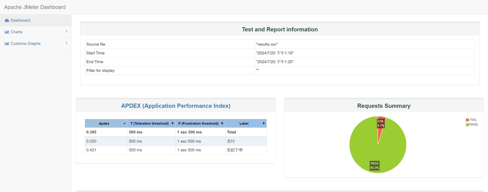

> 接前文监控系统构建完成后，下一个任务是对现有支付链路进行压力测试，然后优化使其能承载更高的并发量。

## 配置JMeter

由于任务中需要按照概率来选择生成订单后是否最终支付，而JMeter原生提供的逻辑控制器并不能达到这个效果，同时为了扩展JMeter的功能，装一个JMeter
Plugin Manager，
安装指南在[这里](https://jmeter-plugins.org/wiki/PluginsManager/)
，其实很简单就是先下载对应的[JAR](https://jmeter-plugins.org/get/)然后扔到JMeter安装目录下的`lib/ext`文件夹下。

之后安装`Parallel Controller & Sampler`这个插件，其中会提供一个`Weighted Switch Controller`可以实现复杂的多路概率选择方案。

由于目前只是选择是否执行链路中的下一步支付，因此内置的吞吐量控制器也能满足需求，吞吐量控制器是按照随机数概率来限制，也就是说他不能完全准确的控制，
这点在使用的时候需要额外注意。

## 测试任务配置

先放一下最终配置完成的测试链路


接下来逐个解释每个组件的功能

### 统一随机定时器

是用来控制每一轮请求起始的时候随机等待的时间，来模拟真实用户的随即行为，比较简单，在此不再过多叙述。

### 自定义变量

这是一个**用户定义的变量**组件，里面是一些在整个测试链路中需要的变量，比如域名、端口等等，还有一些请求体中传递的信息也可以在这里写入，比如我这里使用的是
|名称|值|
|--|--|
|open_id|${__RandomString(15,abcdefghijklmnopqrstuvwxyz1234567890_,)}|
|base_url|请求的域名|
|port|请求的端口|

`open_id`这里使用的是JMeter的内置函数，其他的函数可以查询JMeter官方文档。

### 请求Base URL

这是一个**HTTP请求默认值**组件，里面是一些通用配置，比如我在这里使用的配置如下


### HTTP信息头管理器

这里面是**后续所有**HTTP请求的请求头配置，其将一直生效直到被新的请求头配置所覆盖。

### 发起下单/支付/退款

这三个都是HTTP请求，可以独立配置协议等，唯一需要注意的是在请求体中可以直接将内置函数或变量写入，比如发起下单消息体数据如下

```json
{
  "openId": "_pressuretest_${__RandomString(15,abcdefghijklmnopqrstuvwxyz1234567890_,)}",
  "buyCount": 1,
  "someOtherData": ""
}
```

### orderId提取

这是一个**JSON提取器**，是一个HTTP请求后置处理器，可以根据JSON Path表达式来提取JSON内数据，写入变量中供后续使用，写入的变量名在
`Names of created variable`中。

### IF控制器

这里是控制只有从前面下单步骤中成功获取到`orderId`的才可以进行下一步，这里的建议用法是，在前一步的`orderId`提取中设置一个
`Default Values`，
将其设置为一个绝对不可能的值，然后在这里用类似下面的代码进行匹配

```shell
${__groovy("${order_id}" != "null")}
```

其他的获取变量内容然后再比对的方法我尝试了但均未能成功。

### 支付控制器/退款控制器

这两者都是**吞吐量控制器**，控制部分不进入下一步，来达到中途退出的效果。

### 查看结果树/保存响应到文件

两者均为最终的数据保存部分，可以根据自己的需要更改。

## 压测

执行压测的时候应当遵守启动时JMeter给的警告，只用CLI而非GUI执行，不然会导致数据不准确等问题，使用指令

```shell
jmeter -n -t [jmx file] -l [results file] -e -o [Path to web report folder]
```

需要注意保证`results file`和`web report folder`是空的，不然会启动失败。

如果未指定报告文件夹也可以使用报告文件来生成HTML报告，在`Tools=>Generate HTML report`里，最终的报告类似下图所示


