> This article was translated by GPT 5.5.

> The stress test results were not ideal. The existing transaction flow had many problems, including many designs that did not consider high concurrency and extremely old middleware. Before I came to the internship, colleagues had already solved part of the high-concurrency data issues,
> but there were still many hidden problems.  
> Beyond that, the performance issues were even more serious. A single machine could not even handle 500 concurrent users grabbing flash-sale orders, so performance optimization was urgent.

## JProfiler Configuration

First configure the server's Tomcat to use JProfiler. This article uses **JProfiler 14**. First open the startup center and choose a new session, then new server integration.

Then choose Tomcat => choose remote server => choose the corresponding JVM => choose the startup mode as needed => configure the SSH tunnel connection.

Next, specify the JProfiler installation path on the remote server. Note that in mainland China you need to download it yourself and upload it to the server, because the official website is blocked.

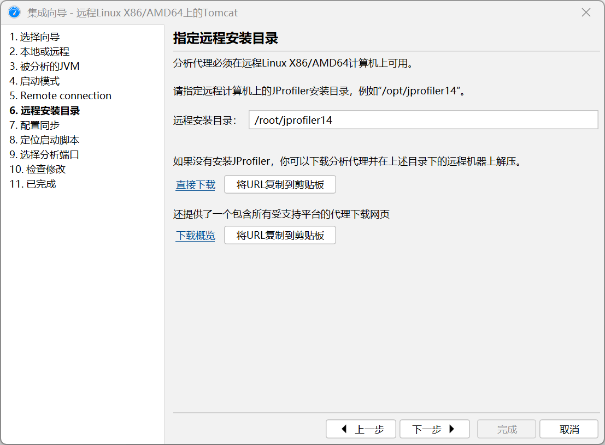

Then choose the application configuration used when connecting to the JProfiler GUI => locate the startup script.  
Note that **the startup script located here is not the one on the remote server**. You need to pull `tomcat/bin/startup.sh` from the server to the local machine and select it. JProfiler will then modify it and generate a
`startup_jprofiler.sh` file. After that, upload it to the same directory as `startup.sh`, and use this file to start Tomcat.  
The main pitfalls are roughly the ones above; the other parts are relatively easy.

## Analysis and Optimization 1: Insufficient Tomcat Threads

During the first analysis, I found that the hot spot time in the HTTP server tracker followed a trend similar to the image below.

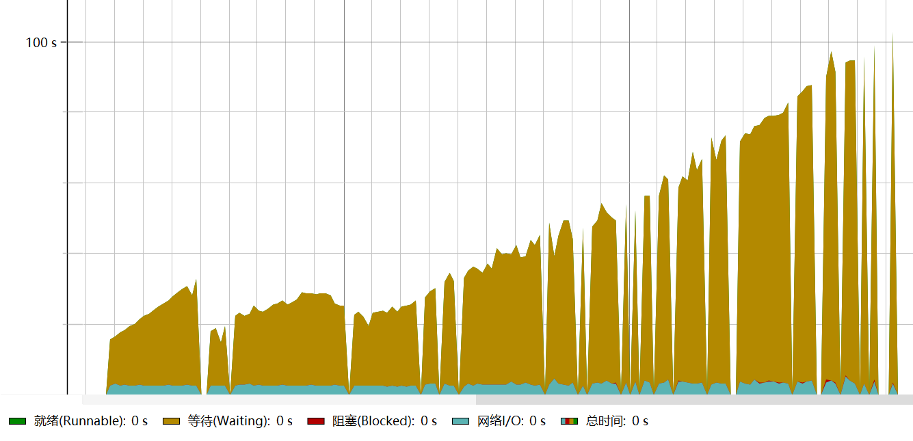

For the following analysis sections, because I had little experience at the beginning, the original tests and profiling snapshots were not preserved, so I cannot include images here.
This taught me the importance of leaving work traces. Even if only to make later blog writing easier, it is still necessary to keep some records, or write while experimenting.

I noticed that:

1. In the database connections, the Statement execution time and idle time in each connection were each basically around 50%, which means the database was not the bottleneck.
2. Looking at the thread history, I found that there were only about 150 `http-nio` threads, and most of their time was spent in network I/O or blocked states.
3. Looking further at the invocation counts in the CPU view, I found that the time spent by the HTTP APIs was basically consistent with what the HTTP server probe recorded, but far lower than the response time in the report produced by JMeter.
4. Looking at the telemetry overview data, I found that during the stress test, the process load and system load changed in sync within the CPU load data, but the process load increased far less than the system load. The process load would also stop after reaching a peak, while the system load continued to increase.

Based on this, I guessed that the actual requests did not enter Tomcat. Instead, after the total number of processing threads was reached, the operating system held the remaining connections. Looking up the documentation for the corresponding Tomcat version showed that the
`maxThreads` setting in the `HTTP Connector` corresponds to the maximum number of available processing threads. Checking the configuration file showed that it was set to 150, so I changed it and optimized the Tomcat configuration as follows.

```xml

<Connector port="7070" protocol="HTTP/1.1"
           connectionTimeout="20000"
           maxThreads="1000"
           minSpareThreads="100"
           acceptCount="1000"
           redirectPort="8443"/>
```

A new stress test showed that the number of threads increased, and a single thread spent most of its time waiting.

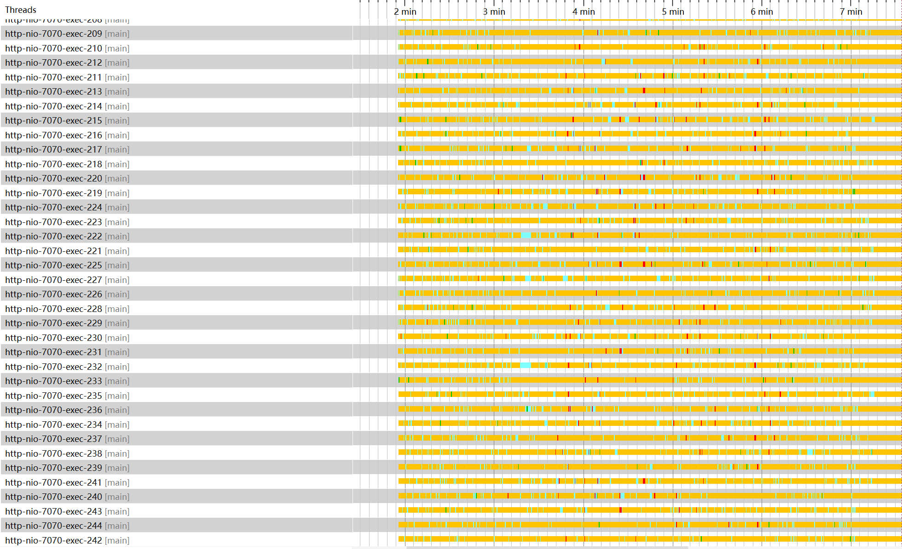

At the same time, while the CPU load maintained the same trend, the gap became smaller.

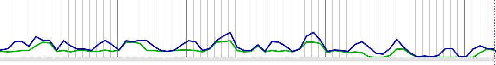

However, the response time was still too long, so I analyzed it further.

## Analysis and Optimization 2: Poor Mybatis Deserialization Performance

In the second test, I noticed the following phenomena.

1. Database connection utilization increased, but it was still only around 50%, not enough to become the bottleneck.
2. In the CPU analysis, each request's processing time was still too long, meaning the business code itself had become the bottleneck.
3. Combined with server monitoring, I found that the network transfer volume was abnormally high. Further investigation showed that there was a huge amount of data exchange with the database.
4. `org.apache.ibatis.binding.MapperProxy invoke` occupied the vast majority of the time.
5. The average time in the hot spots of the database probe was very long, far greater than the ideal case of 100ms.

Looking at the trace data in UpTrace configured in the previous article, only the first tens of milliseconds of the part handled by the `MapperProxy invoke` function were spent querying the database.
The remaining time was all Mybatis processing time. Looking further at one function, `GetDetail`, it occupied a huge amount of time. Checking the code showed that the `Order`
object returned by `GetDetail` had 117 properties,
but the actual interface business logic only used two fields. The core problem was that the business code was written too poorly, causing Mybatis to deserialize many completely unnecessary fields.
This also caused a large amount of useless database network transfer and indirectly increased database pressure.

Once the problem was located, the optimization plan was also simple: optimize the SQL on the hot path so it only fetches the required fields, and put some simple logical checks into SQL as much as possible. The image below shows the CPU time of one optimized interface.

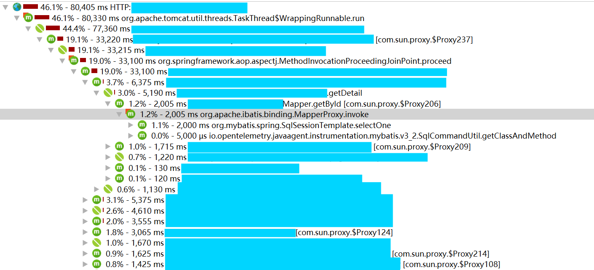

As shown, the execution time was already approximately equal to Mybatis's total processing time, so this issue was solved.

## Analysis and Optimization 3: Insufficient Database Connections

The problem encountered this time was quite obvious: database connections were basically fully used, as shown below.

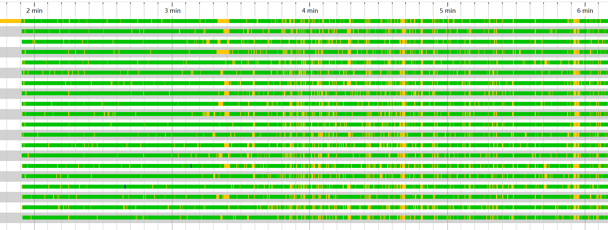

At the same time, considering that:

1. Looking at the hot spots in the database probe, basically all SQL execution times were below 100ms.
2. Although the cloud database CPU increased, it had not reached a crash state.

The only thing needed was to raise the maximum number of database connections, so this problem was the easiest one to solve.

> A problem appeared here again later. One hot method used a distributed database. Because the cloud database was PolarDB
> 1.0 based on MySQL 5.6, distributed transaction performance was poor and timeouts occurred.  
> Because the timeout value was hardcoded in PolarDB's code, Alibaba Cloud technical support could not provide much useful help, so the final change was still made at the code level.

## Summary

After about a week of SQL optimization and business logic optimization, the following results were successfully achieved.

The sample counts in the two stress tests were:

+ Before optimization: 29925 requests
+ After optimization: 15006 requests

All other settings were the same. Only the number of requests changed; the thread count was the same and only the loop count differed, so the impact on result comparison was not large.

**Request completion time overview**

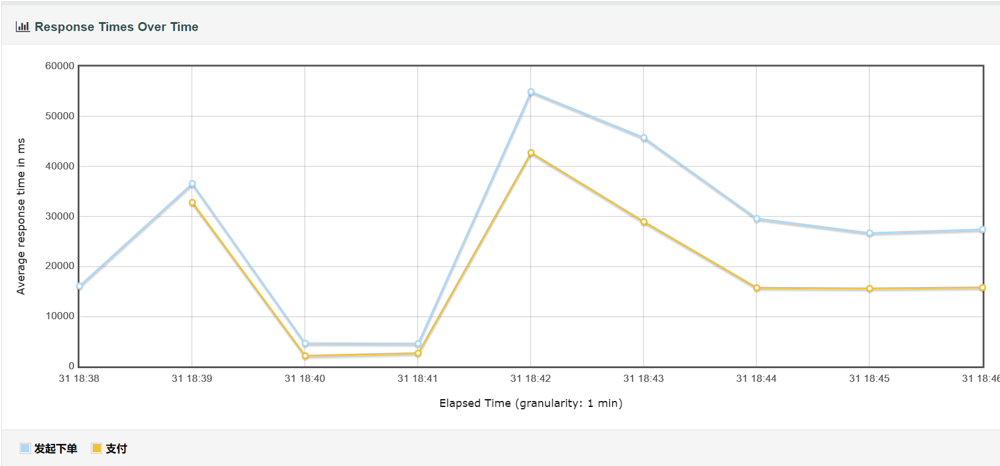

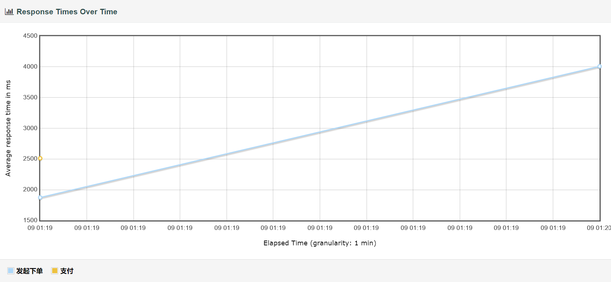

**Request completion time details**

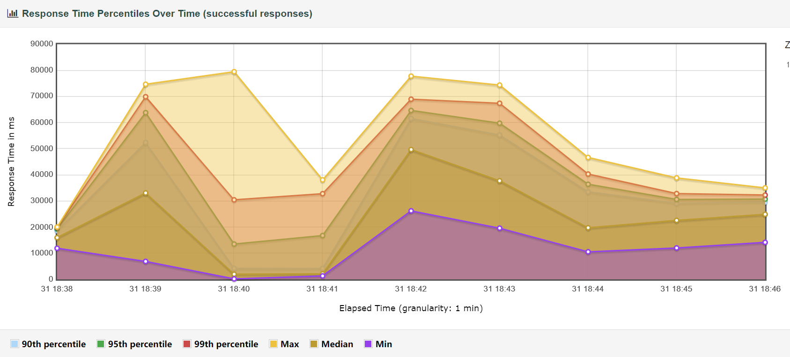

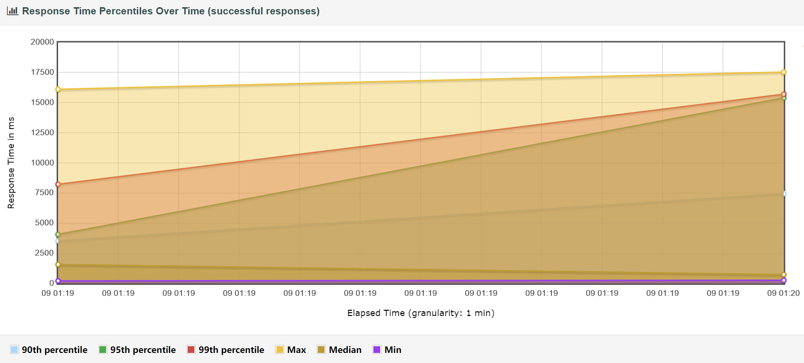

**Latency and requests**

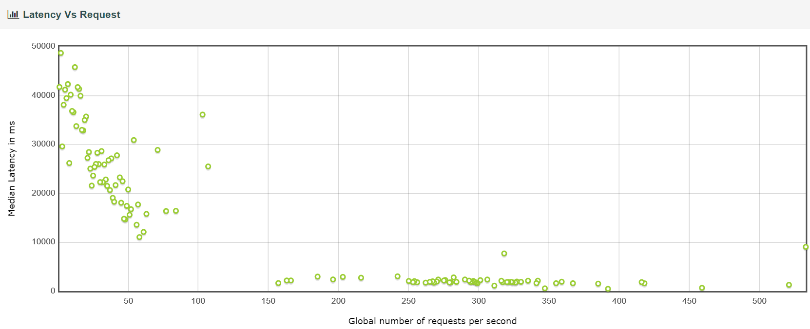

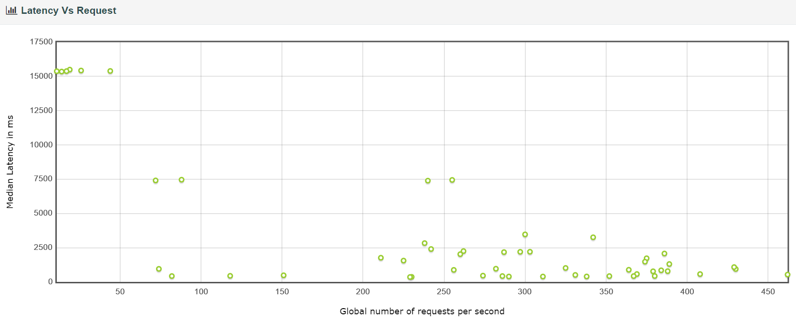

**Response time**

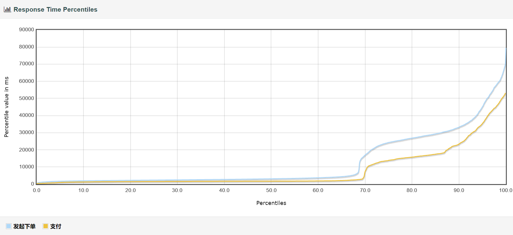

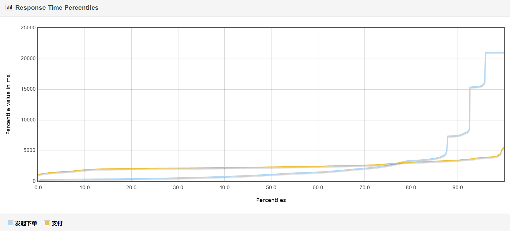

**Response time distribution**

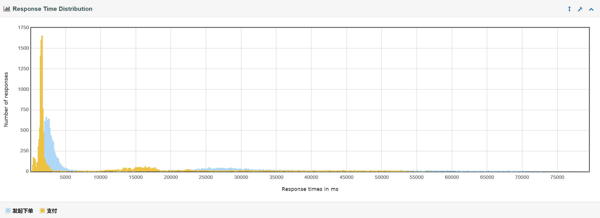

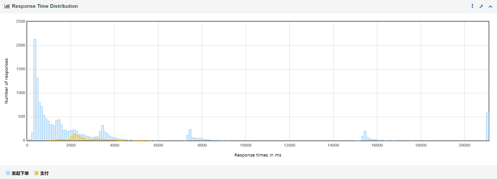

From this, it can be seen that the improvement brought by the optimization was still very large.
