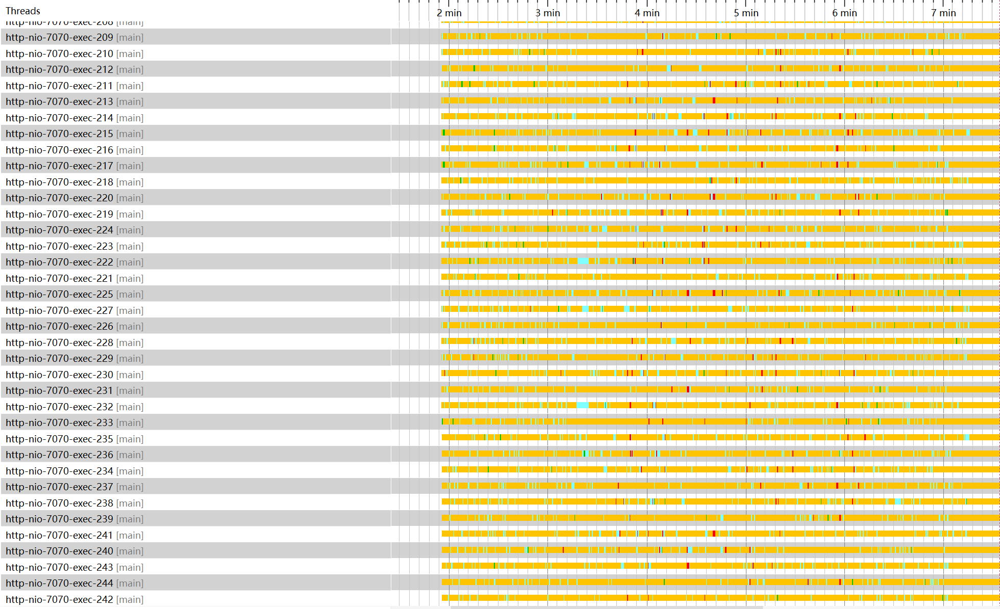

> 压力测试的结果不甚理想，现有的交易链路问题不少，包括大量设计未考虑高并发问题，超古老的中间件等等，在我前来实习前同事已经解决了一部分的高并发数据问题，
> 但仍然有不少隐性问题。  
> 除此之外性能问题更为严重，单机甚至无法承受秒杀抢单的500用户并发，优化性能刻不容缓。

## JProfiler配置

首先配置服务器上的Tomcat使用JProfiler，本文使用**JProfiler 14**，首先打开启动中心，选择新会话，新服务器集成。

然后选择Tomcat=>选择远程服务器=>选择对应的JVM=>然后根据需要选择启动模式=>配置SSH隧道连接

接下来要指定远程服务器上的JProfiler安装路径，需要注意国内需要自主下载后传到服务器上，官网被屏蔽了。


接着选择与JProfiler GUI连接时应用配置=>定位启动脚本。  
注意**这里定位的不是远程服务器上的启动脚本**，需要将服务器上的`tomcat/bin/startup.sh`拉下来到本地再选择，接着JProfiler会对其进行更改，生成
`startup_jprofiler.sh`文件，而后将其上传到和`startup.sh`一个目录下，启动的时候通过这个来启动。  
坑大致只有上述的这几个地方，其他地方都比较好搞。

## 分析优化1: Tomcat线程数不足

首次分析的时候，发现HTTP服务器追踪器中的热点时间呈类似下图的趋势


下述的分析部分由于本人没啥经验最开始的测试和Profile等等都没有留存快照因此没法放图了(
从此知道了工作留痕的重要性，即使为了后期写博客好写也得留下些，或者是边折腾边写)。

注意到

1. 数据库链接中可发现每个链接中Statement执行时间和空闲时间基本占比50%，即数据库并非瓶颈问题。
2. 查看线程历史中，发现`http-nio`线程只有约150个，同时其绝大多数时间都处于网络I/O或阻塞状态。
3. 进一步查看CPU视图中的调用数，发现HTTP接口的用时与HTTP服务器探针记录的基本一致，却远小于JMeter给出的报告中的响应时间。
4. 查看遥测概览中的数据，可发现在压测期间CPU负载中，进程负载与系统负载同步变化，但是进程负载升高幅度远低于系统负载，同时进程负载会达到一个峰值后停止，与此同时系统负载继续升高。

据此推测实际请求并没有走到Tomcat中，而是达到了处理线程总数后由操作系统代持剩余的连接。据此查阅Tomcat对应版本文档可见
`HTTP Connector`中的`maxThreads`配置对应了最大可用的处理线程数，查看配置文件中发现其被设置成了150，将其更改并优化Tomcat配置如下。

```xml

<Connector port="7070" protocol="HTTP/1.1"
           connectionTimeout="20000"
           maxThreads="1000"
           minSpareThreads="100"
           acceptCount="1000"
           redirectPort="8443"/>
```

重新压力测试发现线程数增多，且单个线程大部分时间处于等待时间



同时CPU负载保持同趋势的状态下，差值缩小


但与此同时响应时间仍然偏长，进一步分析。

## 分析优化2: Mybatis反序列化性能差

进行第二次测试，注意到如下现象

1. 数据库连接利用率升高，但仍然只在50%左右，不至于成为瓶颈。
2. 注意到CPU分析中，每个请求的处理时间仍然过长，即业务代码本身成为瓶颈。
3. 配合服务器监控，发现网络传输量异常的高，进一步定位后发现与数据库产生了巨大量的数据交换。
4. `org.apache.ibatis.binding.MapperProxy invoke`占用了绝大多数的时间。
5. 数据库探针中的热点部分平均时间很长，远大于100ms这种理想情况。

结合上一文中配置的UpTrace中的追踪数据来看，`MapperProxy invoke`函数处理的部分其中只有处理开头的几十毫秒是在查询数据库，
剩余的时间均为MyBatis的处理时间，进一步查看其中一个函数`GetDetail`占据了巨量的时间，查看代码可发现`GetDetail`返回的`Order`
对象本身有117个属性，
而实际在接口业务逻辑中使用的只有两个字段，其核心问题是业务代码写的太烂，导致Mybatis需要反序列化很多完全没必要的字段，
同时也导致了数据库的大量无用网络传输，也间接增大了数据库的压力。

既然定位了问题，优化方案也很简单，将热点路径中的SQL优化成为只取需要的字段，同时尽量将一些简单的逻辑判断写入SQL中，下图为优化后的一个接口CPU时间


可见其中执行时间已经约等于Mybatis的总处理时间了，至此这个问题也解决了。

## 分析优化3: 数据库连接不足

此次遇到的问题比较明显，数据库连接基本全满，如下图所示


同时考虑到

1. 查看数据库探针的热点中，可发现基本所有SQL的执行时间都在100ms以下。
2. 云数据库CPU虽然有升高但并未达到宕机状态。

需要做的只是提高数据库最大连接数即可，这问题算是最好解决的了。

> 这地方后面又出现了问题，有一个热点方法使用了分布式数据库，由于云数据库是基于MySQL 5.6的PolarDB
> 1.0版本，导致分布式事务性能差，会出现超时现象。  
> 由于超时时间是写死在PolarDB的代码中的，因此阿里云技术支持也没法提供什么有用的帮助，最终还是从代码层面做的修改。

## 总结

最终经过一周左右的SQL优化、业务逻辑优化，成功地达到了以下成果。

两次压力测试的样本数分别为：

+ 优化前: 29925个请求
+ 优化后: 15006个请求

其他设置均一致，只有请求数有变化，线程数相同仅循环数不同，对结果对比影响并不大。

**请求完成时间总览**


**请求完成时间详细**


**延迟与请求**


**响应时间**


**响应时间分布**


由此可见优化所带来的提升还是很大的。