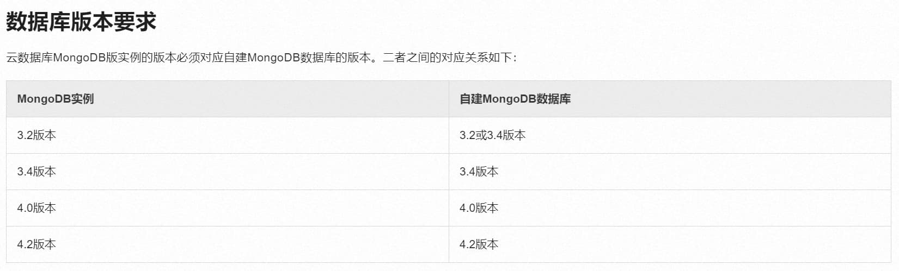
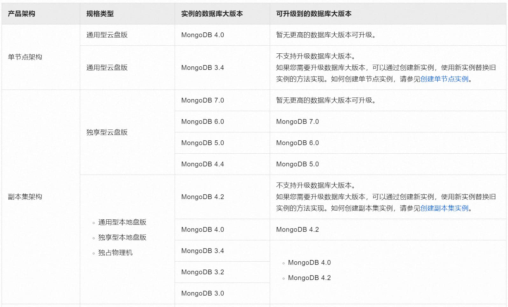

> This article was translated by GPT 5.5.

**Halfway through the dump, I needed the root password with access to all databases to process oplogs, but since I could not get it approved and my internship was about to end, I had to shelve this.**  
> The company where I interned originally used MongoDB on Alibaba Cloud. It cost around 2k per month, but the business carried by Mongo itself was not that important, so self-hosting one would be more cost-effective. That is why this article exists.

## Preliminary Investigation
First, I checked Alibaba Cloud's official migration documentation [Restore MongoDB physical backup files to a self-managed database
](https://help.aliyun.com/zh/mongodb/user-guide/restore-data-of-an-apsaradb-for-mongodb-instance-to-a-self-managed-mongodb-database-by-using-physical-backups#section-kdp-sxp-5fb)

It can only restore cloud instances to the same version. However, MongoDB 4.0 is already too old and has long been EOL, so I looked for an upgrade method.

I also found this article in Alibaba Cloud docs: [Upgrade the database major version](https://help.aliyun.com/zh/mongodb/user-guide/upgrade-the-major-version-of-an-apsaradb-for-mongodb-instance)

After checking, it also does not support major-version upgrades beyond 4.2, so upgrading on Alibaba Cloud first and then migrating is not feasible either.

I searched the MongoDB community for similar cases and found a post about [trying to upgrade from 4.2 to 7](https://www.mongodb.com/community/forums/t/restore-backup-from-mongo-4-2-to-7/242906),
but the official recommendation is to follow the 4.2 → 4.4 → 5.0 → 6.0 → 7.0 path. Therefore, without exporting to a general-purpose data format and importing again, it currently seems rather difficult.

## Try Exporting Data with mongodump
Because the original Alibaba Cloud instance was a replica set instance, the export command was constructed as follows
```shell
mongodump \
   --host=dds-******.mongodb.rds.aliyuncs.com:3717, \
   --username="<username>" \
   --password="<password>" \
   --authenticationDatabase="<database>" \
   --oplog \
   --out=./backup_test \
   --verbose
```

> Unfinished