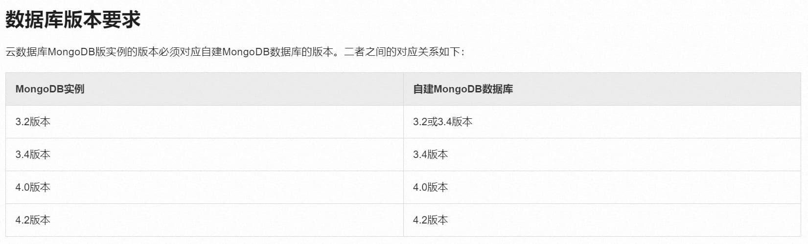
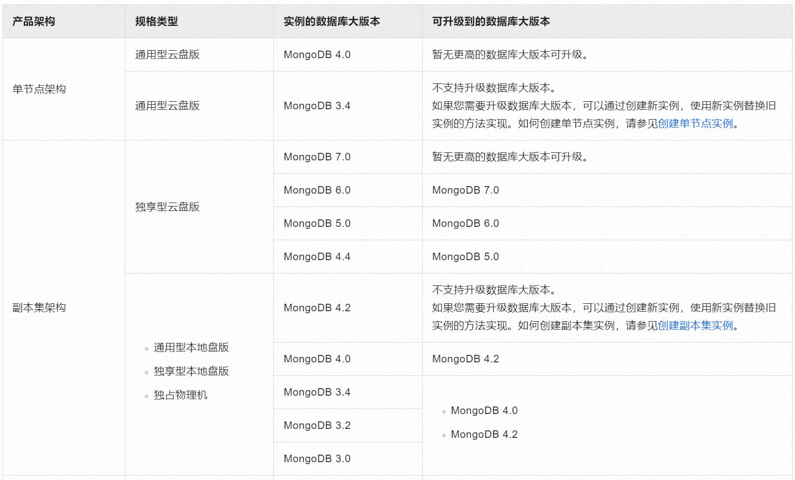

**到一半dump的时候需要能访问所有数据库的root密码来处理oplogs，但由于申请不下来，同时我的实习期即将结束，只能就此搁置**  
> 实习在的公司原MongoDB是阿里云上的，每个月要2k左右，但是Mongo本身承载的业务不算重要，不如自建一台来的划算，因此有了此文。

## 前期调查
首先查看阿里云官方的迁移文档[将MongoDB物理备份文件恢复至自建数据库
](https://help.aliyun.com/zh/mongodb/user-guide/restore-data-of-an-apsaradb-for-mongodb-instance-to-a-self-managed-mongodb-database-by-using-physical-backups#section-kdp-sxp-5fb)

只能是云上什么版本也恢复成什么版本，但由于MongoDB 4.0已经太老了早就已经EOL了，因此寻找升级的办法。

同样是在阿里云文档中找到这一篇[升级数据库大版本](https://help.aliyun.com/zh/mongodb/user-guide/upgrade-the-major-version-of-an-apsaradb-for-mongodb-instance)

看了下也不支持从4.2再向上的大版本升级了，先在阿里云升级后再迁移这条路也走不通。

查询MongoDB社区内有无类似的，找到篇[从4.2尝试升级到7的](https://www.mongodb.com/community/forums/t/restore-backup-from-mongo-4-2-to-7/242906)，
但是官方建议是按照4.2 → 4.4 → 5.0 → 6.0 → 7.0的路径来走，因此在不导出为通用格式的数据并再次导入目前看来是比较困难的。

## 尝试使用mongodump导出数据
由于原来阿里云上的是副本集实例，因此构建导出命令如下
```shell
mongodump \
   --host=dds-******.mongodb.rds.aliyuncs.com:3717, \
   --username="<用户名>" \
   --password="<密码>" \
   --authenticationDatabase="<数据库>" \
   --oplog \
   --out=./backup_test \
   --verbose
```

> 未完成