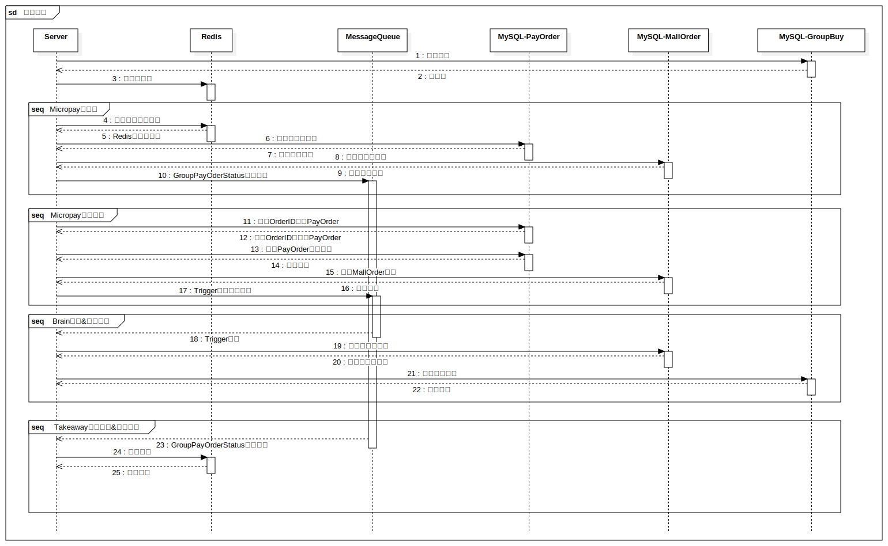

> This article was translated by GPT 5.5.

> The figure below is a partially simplified flowchart of the flash sale and payment system. Since the original codebase is quite old and contains a lot of legacy module code, I simplified it heavily.  
> This design ensures that inventory stays consistent under flash-sale traffic, while MQ can be used for peak shaving to keep the overall system load within an acceptable range.  
> Currently, the pre-order part is also integrated into the main system, but I think it could be extracted completely and implemented as a high-performance pre-processing layer in Golang or Rust, with the remaining logic moved into subsequent operations,
> further improving the reliability of the flash-sale part.  
> The flowchart was drawn with StarUML. The original file is [here](seckill-diagram.mdj)

