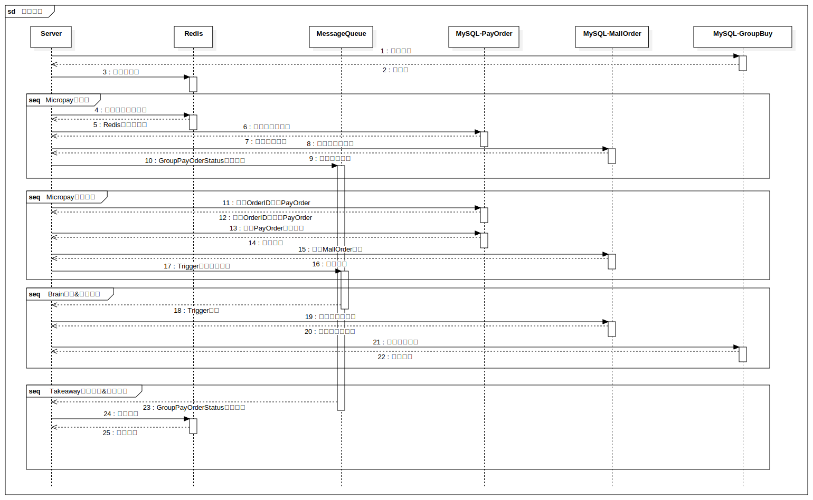

> 下图为经过部分精简后的秒杀与支付系统流程图，由于原始代码库年代久远，其中包含了很多遗留模块的代码，故做了大幅度精简。  
> 这样的设计可以保证秒杀状态下库存不会出现问题，同时可以用MQ进行削峰，来保证系统整体负载在可接受范围内。  
> 目前是将预下单的部分也接入在主系统里面，但我认为完全可以将其提取出来，用Golang或者Rust等写一个高性能的前置处理，将其余逻辑全部抽离到后续操作中，
> 进一步提升秒杀部分的可靠性。  
> 流程图使用StarUML绘制，原始文件[在此处](seckill-diagram.mdj)

