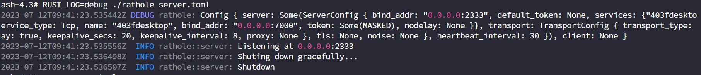
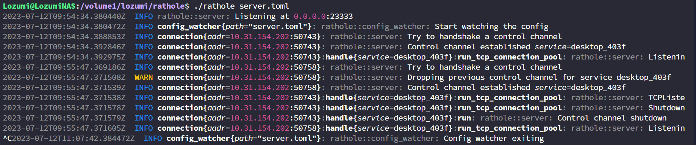

> This article was translated by GPT 5.5.

> At the time this article was written, the program versions were:  
> [RatHole](https://github.com/rapiz1/rathole/): v0.4.8  
> [WinSW](https://github.com/winsw/winsw/): v3.0.0-alpha.11  

## Preface
Two days ago I reinstalled my system. On the new system, I wanted to try using Windows' native RDP for remote desktop.
When I used Sunlogin before, it would also show on the screen, and anyone standing in front of the screen could see it clearly. It felt strange,
so this article came about.

## Early Attempts
First, I tried using Cloudflare Channel to map the local RDP outward, but `cloudflared` needs to keep a `cloudflare access`
running under user privileges, otherwise it disconnects, so this solution was ruled out.

After that, I tried using DDNS to point to the local computer. However, because this is a campus network, there are multiple layers of NAT and also network isolation. At the same time, different external IP probes
return completely different IP addresses, so this solution was also abandoned.

## Feasible Solution
Our school's network is rather strange. WLAN devices are isolated from each other, while devices connected through LAN can be accessed without restriction. Therefore, I used a router flashed with OpenWRT as a LAN access point,
borrowed a classmate's NAS to set up a relay, and then ran a port-mapping program on the laptop.

The above is the rough idea. Overall, it is not complicated. Just note that the RatHole server cannot be run with root privileges, otherwise it will automatically close. The documentation did not mention this, which made me debug it for quite a while, as shown below.


Below are my RatHole server and client configurations.
```toml
# server.toml
[server]
bind_addr = "0.0.0.0:23333"

[server.services.desktop_403f]
token = "***" # hidden here
bind_addr = "0.0.0.0:7000"
nodelay = true
```

```toml
# client.toml
[client]
remote_addr = "10.60.50.102:23333"

[client.services.desktop_403f]
token = "***" # hidden here
local_addr = "localhost:3389"
```



The main issue is that RatHole itself does not provide a Windows service installation version, so this requires keeping a CLI window open all the time. After looking around, I found NSSM.
But well, at a glance, even its latest stable version was updated in 2014. I prefer projects that are continuously maintained, so I turned to WinSW.

WinSW can turn any program into a Windows service, so it can run in the background and start automatically on boot. Below is the WinSW configuration I use.
```xml
<service>
  <id>rathole</id>
  <name>Rathole</name>
  <description>Rathole proxy service</description>
  <executable>"D:\SOFTWARE\Rathole\rathole.exe"</executable>
  <arguments>"D:\SOFTWARE\Rathole\client.toml"</arguments>
  <log mode="reset"></log>
</service>
```
Note that the `arguments` here cannot use a relative path (or maybe I did not get it right). To avoid trouble, use absolute paths as much as possible.
After that, just `install` and then `start`. For detailed commands, refer to WinSW's GitHub Readme.
