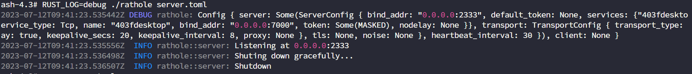
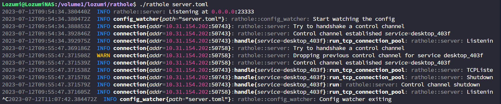

> 该文写作时各程序版本分别为:  
> [RatHole](https://github.com/rapiz1/rathole/): v0.4.8  
> [WinSW](https://github.com/winsw/winsw/): v3.0.0-alpha.11  

## 前言
前两日重装了一下系统，新系统想尝试下用Windows原生的RDP来做远程桌面，
向日葵之前用的时候屏幕上也会显示出来，谁站在屏幕前看的一清二楚，感觉怪怪的，
因而有了此文。

## 前期尝试
首先，我尝试了使用Cloudflare Channel把本地的RDP映射出去，然而`cloudflared`需要一直启动一个`cloudflare access`
来以用户权限运行，否则会断开，因而该方案被排除

之后，我尝试了用DDNS来指向本地计算机，然而由于是校园网，存在多层NAT而且还有网络隔离，同时不同的外网IP探针
会返回完全不同的IP地址，因而这个方案也被放弃

## 可行方案
我们学校的网络比较奇怪，WLAN的设备相互隔离，而LAN接入的则可以无限制访问，因而用一台刷了OpenWRT的路由器作为LAN接入点
借用了下同学的NAS搭建了个中续，而后在笔记本上在运行个端口映射程序

上述为大致思路，整体也不复杂，就注意RatHole服务端不能使用root权限，不然会自动关闭，文档里没提搞得我调了半天，如下图


下面贴上我的RatHole服务端和客户端配置
```toml
# server.toml
[server]
bind_addr = "0.0.0.0:23333"

[server.services.desktop_403f]
token = "***" # 这里我隐去了
bind_addr = "0.0.0.0:7000"
nodelay = true
```

```toml
# client.toml
[client]
remote_addr = "10.60.50.102:23333"

[client.services.desktop_403f]
token = "***" # 这里我隐去了
local_addr = "localhost:3389"
```



主要问题在于，RatHole本身没有做Windows端的服务安装版本，这样就需要一直开着一个CLI窗口，查询了下找到了NSSM
但是吧，一眼看过去稳定版最新也2014年更新的了，我比较喜欢持续维护的，因而转向了WinSW

WinSW可以把任何程序转变为Windows服务，因而可让其在后台运行并开机自启动，下面贴一下我用的WinSW的配置
```xml
<service>
  <id>rathole</id>
  <name>Rathole</name>
  <description>Rathole proxy service</description>
  <executable>"D:\SOFTWARE\Rathole\rathole.exe"</executable>
  <arguments>"D:\SOFTWARE\Rathole\client.toml"</arguments>
  <log mode="reset"></log>
</service>
```
注意此处的`arguments`无法使用相对路径(或者是我没搞对)，避免麻烦尽量使用绝对路径，
之后就`install`后`start`就可以了，详细的命令可以参考WinSW的GitHub Readme