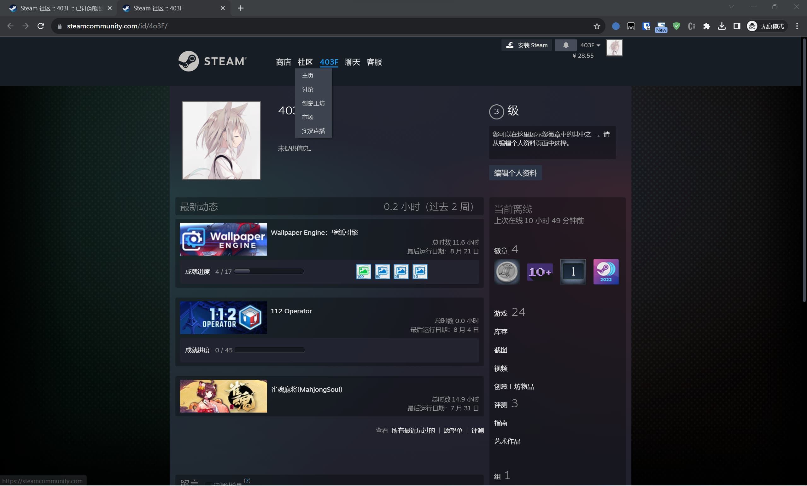

> This article was translated by GPT 5.5.

> Preface:  
> There was news these days that Wallpaper Engine had been region-locked in China. To prevent my wallpapers from disappearing, I wanted to buy another copy of WE on an Argentina-region account and migrate the subscriptions over.
> Unfortunately, after searching for a while, I could not find a ready-made tool, so I wrote one temporarily.  
> I have been busy these days, so the rushed version is not especially polished. At first, getting File IDs can only be done manually for now; I may add a crawler later.

# Get All Subscription IDs
## Enter the Subscriptions List Page
First, log in to Steam and open your profile page, similar to mine below

Then append this to the URL
```text
myworkshopfiles/?appid=431960&browsefilter=mysubscriptions&p=1&numperpage=30
```
to form a URL like the following
```text
https://steamcommunity.com/id/4o3F/myworkshopfiles/?appid=431960&browsefilter=mysubscriptions&p=1&numperpage=30
```

## Get All IDs 
Then open Developer Tools, switch to Console, and enter the following code
```javascript
console.log(JSON.stringify(Array.from(document.querySelectorAll('div[id^="Subscription"]')).map(div => div.id.substring(12))))
```
This gets all subscription IDs on the current page. Since Steam does not provide an API for retrieving all subscriptions of the current user, and each page can contain at most 30 items, you may need to process multiple pages and merge the results to get all subscription IDs.


# Subscribe in Bulk
## Get a Steam Web API Key
Apply for one at [https://steamcommunity.com/dev/apikey](https://steamcommunity.com/dev/apikey)
## Subscribe in Bulk
I wrote a small tool here  
[https://github.com/4o3F/SteamBulkSubscribe/releases](https://github.com/4o3F/SteamBulkSubscribe/releases)  
Just input all the File IDs obtained above and it can subscribe automatically for a quick migration.
