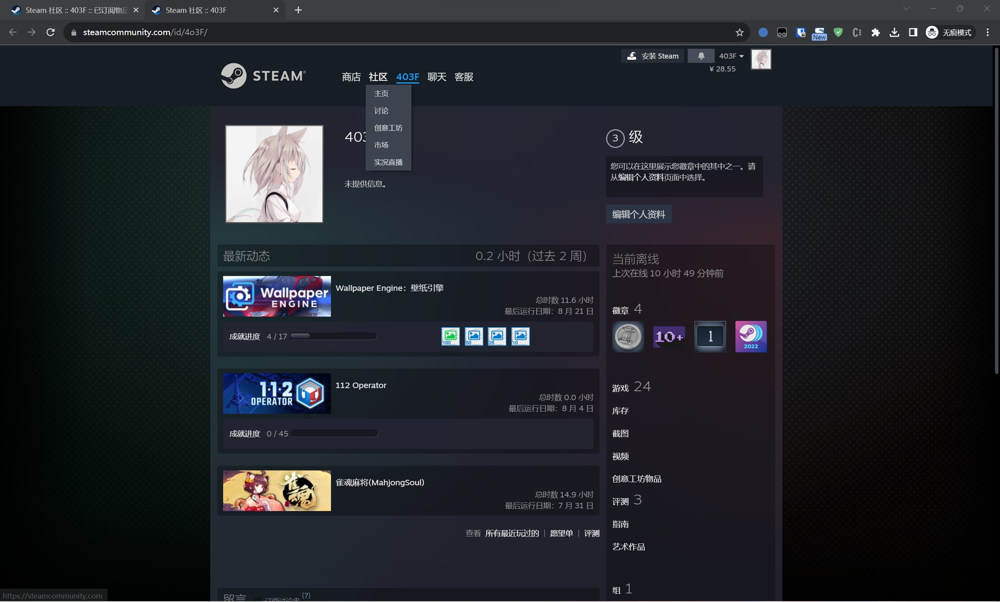

> 前言:  
> 这几天有消息称Wallpaper Engine被锁国区了，为了不让壁纸消失想在阿区账号上再买一个WE然后把订阅迁移过去
> 可惜找了半天没有现成的工具，临时写了一个  
> 这几天忙，匆忙写出来的不算特别完善，最开始获取File IDs暂时只能手动，之后可能会加个爬虫

# 获取所有订阅ID
## 进入订阅列表页面
首先是登录Steam，进入个人资料页面，类似下图我的

然后在URL后面加上
```text
myworkshopfiles/?appid=431960&browsefilter=mysubscriptions&p=1&numperpage=30
```
形成类似下面的URL
```text
https://steamcommunity.com/id/4o3F/myworkshopfiles/?appid=431960&browsefilter=mysubscriptions&p=1&numperpage=30
```

## 获取所有ID 
而后打开开发者工具，切换到控制台，输入以下代码
```javascript
console.log(JSON.stringify(Array.from(document.querySelectorAll('div[id^="Subscription"]')).map(div => div.id.substring(12))))
```
获取当前页面所有的订阅ID，由于Steam没有提供API获取当前用户的所有订阅，且一页最多只能有30个，或许需要多次处理整合才能获取所有的订阅ID


# 批量订阅
## 获取Steam Web API Key
从[https://steamcommunity.com/dev/apikey](https://steamcommunity.com/dev/apikey)处申请获得
## 批量订阅
写了一个小工具在这里  
[https://github.com/4o3F/SteamBulkSubscribe/releases](https://github.com/4o3F/SteamBulkSubscribe/releases)  
只要把上面获取到的File IDs全都输入进去就可以自动订阅，快速迁移
