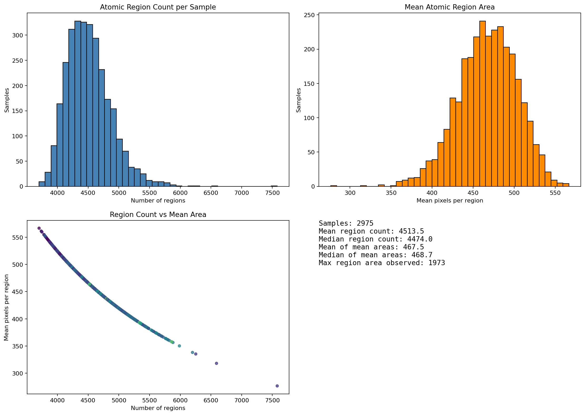
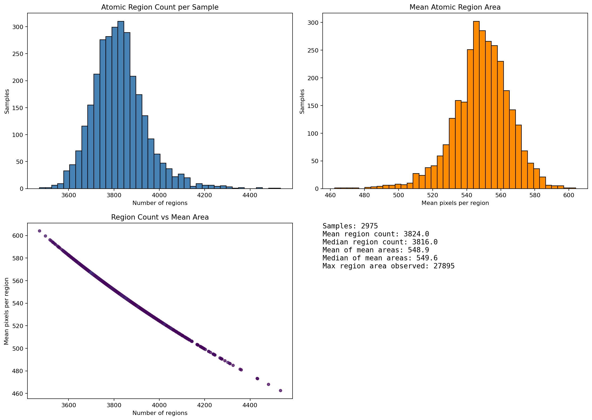
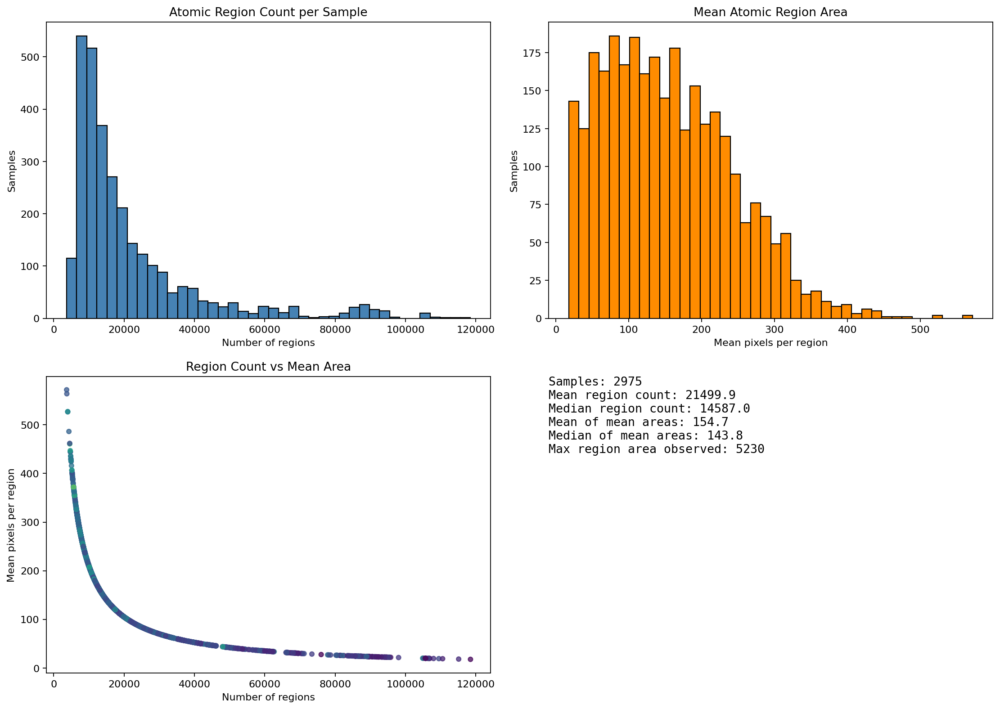
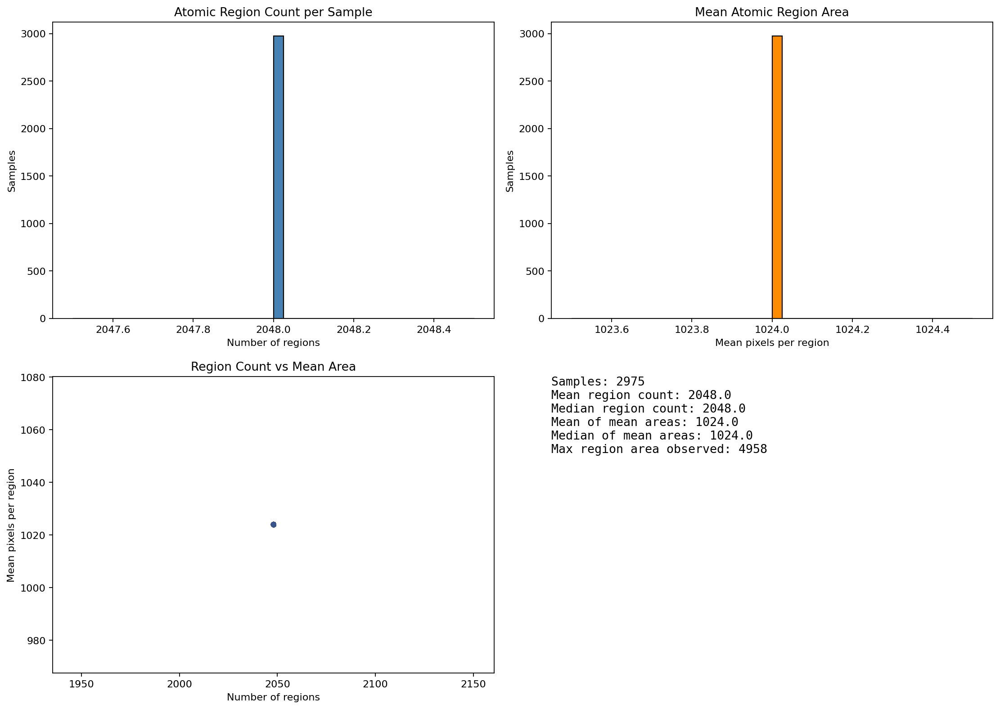

> 本文由GPT 5.5辅助整理得出

## 1. 什么是超像素

超像素（superpixel）是一种图像预分割方法。它会把一张图像中空间相邻、颜色或纹理相似的像素聚合成若干小区域。相比直接处理单个像素，超像素把图像从**像素级表示**转换为**区域级表示**。

一个理想的超像素结果通常具有以下特点：

- **区域内部尽量一致**：同一个超像素内部应尽量属于同一物体、同一表面或同一语义类别。
- **区域边界尽量贴合真实图像边界**：超像素边界应尽量覆盖物体边界、语义边界或显著外观边界。
- **区域数量适中**：区域太少会过粗，容易跨越真实边界；区域太多会增加后续计算成本。

超像素的主要作用不是直接完成语义分割，而是为后续图像分析提供更稳定、更紧凑的中间表示。常见用途包括：

- 图像分割预处理。
- 区域级特征聚合。
- 目标边界分析。
- 图像标注传播。
- 区域图构建。
- 弱监督或交互式分割中的候选区域生成。

在这些场景中，超像素质量会影响后续算法的可靠性。如果一个超像素横跨真实语义边界，例如同时包含道路和车辆，那么后续对该区域提取的特征或标签都会被混合污染。相反，如果超像素能够较好地贴合真实边界，那么后续算法更容易在区域级别区分不同物体或不同语义类别。

因此，评价超像素算法时不能只看区域数量，也不能只看视觉效果，而应同时关注：

- **边界贴合度**：真实语义边界是否被超像素边界覆盖。
- **区域纯度**：单个超像素内部是否尽量不混合多个真实类别。
- **计算成本**：每张图产生多少超像素区域。

## 2. 实验数据集与参与比较的算法

### 2.1 数据集

本次比较使用 Cityscapes 数据集的完整训练集：

- **Dataset**：Cityscapes
- **Split**：train
- **Processed samples**：2975 / 2975
- **Failures**：0

Cityscapes 是自动驾驶和街景理解中常用的数据集，包含道路、车辆、行人、建筑、交通设施等复杂城市街景。它适合用于测试超像素算法对真实语义边界的贴合能力，因为图像中存在大量细长物体、小目标、遮挡关系和复杂边界。

### 2.2 诊断范围

本次实验只比较超像素算法本身，评估内容包括：

- 超像素边界与 Cityscapes 真实语义边界的重合程度。
- 超像素区域内部的语义纯度。
- 每张图产生的超像素数量及区域大小分布。
- 样例图上的超像素边界可视化。

本次实验不评估任何下游任务，例如语义分割模型精度、区域合并效果或特征分类性能。因此，本文结论只说明这些算法在超像素层面的表现，不直接等价于下游任务的最终收益。

### 2.3 实验配置

本次实验的主要配置如下：

- **comparison_name**：`superpixel_full`
- **split**：`train`
- **samples**：2975 / 2975
- **failures**：0
- **tolerance_px**：2
- **purity_threshold**：0.95

其中：

- **tolerance_px = 2**：表示在评价边界重合时，允许超像素边界和真实语义边界之间存在 2 个像素以内的偏移。
- **purity_threshold = 0.95**：表示如果一个超像素区域中主类别像素占比低于 95%，该区域会被视为混合区域。

### 2.4 参与比较的算法

本次比较了 6 种超像素方法：

| 方法 ID | Backend | 说明 |
|---|---|---|
| `rust_slic_r24_c10` | `rust_slic` | Rust 实现的 SLIC，作为 baseline |
| `opencv_slic_r24_c10` | `opencv_slic` | OpenCV SLIC |
| `opencv_slico_r24` | `opencv_slico` | OpenCV SLICO |
| `opencv_mslic_r24_c10` | `opencv_mslic` | OpenCV MSLIC |
| `opencv_lsc_r24` | `opencv_lsc` | OpenCV LSC |
| `opencv_seeds_target_r24` | `opencv_seeds` | OpenCV SEEDS |

这些方法覆盖了常见的基于聚类、局部搜索或种子扩展的超像素算法。比较重点不是证明某个算法在所有场景中绝对最好，而是在 Cityscapes 街景图像上观察它们的边界贴合、区域纯度和成本差异。

## 3. 评价指标

本次比较使用以下指标：

| 指标 | 含义 | 趋势 |
|---|---|---:|
| `recall_t` | 在 `tolerance_px=2` 容差内，真实语义边界被超像素边界覆盖的比例 | 越高越好 |
| `precision_t` | 超像素边界中有多少比例对齐真实语义边界 | 越高越好 |
| `f1_t` | tolerant precision 与 tolerant recall 的调和平均 | 越高越好 |
| `missed_gt_boundary_rate_t` | 未被超像素边界覆盖的真实语义边界比例，即 `1 - recall` | 越低越好 |
| `pixel_impurity` | 被选中像素中不属于所在区域主类别的比例 | 越低越好 |
| `mixed_region_pixel_rate` | 落在混合区域中的像素比例 | 越低越好 |
| `mean_num_regions` | 每张图平均超像素区域数量 | 越低计算成本越低 |

这些指标可以分成三类：

- **边界覆盖指标**：`recall_t`、`missed_gt_boundary_rate_t`。
- **区域纯度指标**：`pixel_impurity`、`mixed_region_pixel_rate`。
- **成本指标**：`mean_num_regions`。

需要注意，所有方法的 `precision_t` 都较低。这是超像素任务中的常见现象：超像素算法通常会在图像内部产生大量区域边界，而这些边界并不一定对应真实语义边界。因此，precision 偏低并不必然说明算法失败，而是说明该方法产生了较多内部切分。

在本次分析中，更重要的是综合判断：

- 是否覆盖了足够多的真实语义边界。
- 是否减少了跨类别混合区域。
- 是否以可接受的区域数量完成这些目标。

## 4. 总体结果

### 4.1 边界贴合度

| 方法 | Recall@t | Missed boundary | Precision@t | F1@t |
|---|---:|---:|---:|---:|
| `rust_slic_r24_c10` | 76.10% | 23.90% | 8.09% | 14.63% |
| `opencv_slic_r24_c10` | 80.50% | 19.50% | 7.15% | 13.13% |
| `opencv_slico_r24` | 56.06% | 43.94% | 5.68% | 10.31% |
| `opencv_mslic_r24_c10` | 92.91% | 7.09% | 6.19% | 11.60% |
| `opencv_lsc_r24` | 68.84% | 31.16% | 7.78% | 13.98% |
| `opencv_seeds_target_r24` | 65.38% | 34.62% | 7.04% | 12.72% |

### 4.2 区域纯度与计算成本

| 方法 | Backend | 平均 region 数 | Pixel impurity | Mixed-region pixel rate |
|---|---|---:|---:|---:|
| `rust_slic_r24_c10` | `rust_slic` | 4,513.5 | 2.59% | 10.66% |
| `opencv_slic_r24_c10` | `opencv_slic` | 3,824.0 | 2.78% | 11.41% |
| `opencv_slico_r24` | `opencv_slico` | 3,654.8 | 3.27% | 12.45% |
| `opencv_mslic_r24_c10` | `opencv_mslic` | 21,499.9 | 1.76% | 7.15% |
| `opencv_lsc_r24` | `opencv_lsc` | 3,608.2 | 2.96% | 11.63% |
| `opencv_seeds_target_r24` | `opencv_seeds` | 2,048.0 | 3.72% | 14.27% |

总体结果可以概括为：

- **MSLIC 的边界覆盖率和区域纯度最强，但区域数量显著增加。**
- **Rust SLIC 的综合 F1 最好，区域数量适中，是最均衡的 baseline。**
- **OpenCV SLIC 在较低区域数量下提升了 boundary recall，但区域纯度略差。**
- **LSC、SEEDS、SLICO 在当前配置下没有表现出明显优势。**

## 5. 具体算法比较

### 5.1 MSLIC：最高边界覆盖与最低污染，但成本最高

`opencv_mslic_r24_c10` 是本次比较中边界覆盖和区域纯度表现最强的方法：

- **Recall@t**：92.91%，最优。
- **Missed GT boundary rate**：7.09%，最优。
- **Pixel impurity**：1.76%，最优。
- **Mixed-region pixel rate**：7.15%，最优。

相对于 `rust_slic_r24_c10`：

- **Boundary recall 提升**：+16.72 percentage points。
- **Missed boundary 降低**：-16.81 percentage points。
- **Pixel impurity 降低**：-0.84 percentage points。
- **Mixed-region pixel rate 降低**：-3.51 percentage points。

样本级比较也显示 MSLIC 的优势非常稳定：

- 在 2974 / 2975 个样本上，MSLIC 的 boundary recall 高于 Rust SLIC。
- 在 2955 / 2975 个样本上，MSLIC 的 pixel impurity 低于 Rust SLIC。

这说明 MSLIC 的优势不是少数样本造成的，而是在完整 Cityscapes train split 上具有一致性。

但 MSLIC 的缺点同样明显：它产生的区域数量远高于其他方法。

- **Rust SLIC 平均 region 数**：4,513.5。
- **MSLIC 平均 region 数**：21,499.9。
- **相对 Rust SLIC 比例**：约 4.63x。
- **MSLIC region 数中位数**：14,587。
- **MSLIC region 数 P90**：43,823。
- **MSLIC region 数最大值**：118,470。

因此，MSLIC 可以被视为高质量、高成本的方案。它适合用于追求边界覆盖和区域纯度的场景，但如果后续处理对区域数量敏感，则需要谨慎使用。

结论：**MSLIC 是本次实验中边界贴合和区域纯度最强的方法，但其计算成本最高，不适合作为无条件默认选择。**

### 5.2 Rust SLIC：最均衡的 baseline

`rust_slic_r24_c10` 虽然不是 recall 最高的方法，但它在整体折中上表现最好：

- **F1@t**：14.63%，六种方法中最高。
- **Mean regions**：4,513.5。
- **Pixel impurity**：2.59%，仅次于 MSLIC。
- **Mixed-region pixel rate**：10.66%，仅次于 MSLIC。

样本级 F1 胜出情况为：

- `rust_slic_r24_c10` 在 2333 / 2975 个样本上取得 F1 最优。

这说明 Rust SLIC 的优势在于平衡：它不会像 MSLIC 那样大幅增加区域数量，同时保持了较好的边界覆盖和区域纯度。

结论：**Rust SLIC 是本次比较中最均衡的 baseline，适合需要兼顾质量和计算成本的场景。**

### 5.3 OpenCV SLIC：低成本提高 boundary recall，但纯度略差

`opencv_slic_r24_c10` 的主要特点是区域数量比 Rust SLIC 更少，但 boundary recall 更高：

- **Recall@t**：80.50%，相比 Rust SLIC 的 76.10%，提升 +4.40 percentage points。
- **Mean regions**：3,824.0，相比 Rust SLIC 的 4,513.5，减少约 15%。

它的缺点是区域纯度略差：

- **Pixel impurity**：2.78%，高于 Rust SLIC 的 2.59%。
- **Mixed-region pixel rate**：11.41%，高于 Rust SLIC 的 10.66%。
- **F1@t**：13.13%，低于 Rust SLIC 的 14.63%。

样本级比较显示：

- **Recall 高于 Rust SLIC**：2609 / 2975 samples。
- **F1 高于 Rust SLIC**：232 / 2975 samples。
- **Pixel impurity 低于 Rust SLIC**：490 / 2975 samples。

结论：**OpenCV SLIC 是一个有价值的低成本 recall 提升方案。它不一定比 Rust SLIC 更均衡，但适合测试较少区域数量下是否仍能提高语义边界覆盖。**

### 5.4 LSC：当前配置下没有达到预期

`opencv_lsc_r24` 在当前 Cityscapes 设置下没有优于 Rust SLIC：

- **LSC recall**：68.84%，低于 Rust SLIC 的 76.10%，差值为 -7.26 percentage points。
- **LSC F1**：13.98%，低于 Rust SLIC 的 14.63%。
- **LSC impurity**：2.96%，高于 Rust SLIC 的 2.59%。
- **LSC mixed rate**：11.63%，高于 Rust SLIC 的 10.66%。

样本级比较也较弱：

- **Recall 高于 Rust SLIC**：3 / 2975 samples。
- **F1 高于 Rust SLIC**：355 / 2975 samples。
- **Pixel impurity 低于 Rust SLIC**：12 / 2975 samples。

结论：**在当前 `region_size=24` 和默认 LSC ratio 配置下，LSC 不具备明显优势。**

这不代表 LSC 在所有参数下都不可用，但当前配置不应作为优先选择。

### 5.5 SEEDS：当前配置过粗，漏边界较多

`opencv_seeds_target_r24` 的平均区域数量明显低于其他方法：

- **Mean regions**：2048.0。

这种较低区域数量带来了较低成本，但也导致边界覆盖不足：

- **Recall@t**：65.38%。
- **Missed boundary rate**：34.62%。
- **Pixel impurity**：3.72%。
- **Mixed-region pixel rate**：14.27%。

相对于 Rust SLIC：

- **Recall 降低**：-10.72 percentage points。
- **Pixel impurity 增加**：+1.13 percentage points。
- **Mixed-region rate 增加**：+3.61 percentage points。
- **Region 数约为 Rust SLIC 的 0.45x**。

结论：**当前 SEEDS 配置过粗，容易漏掉真实语义边界。如果继续评估 SEEDS，应提高目标 region 数进行 sweep。**

可以考虑的后续配置包括：

- `opencv_seeds_n3600`
- `opencv_seeds_n4500`
- `opencv_seeds_n6000`

### 5.6 SLICO：当前表现最弱

`opencv_slico_r24` 是本次比较中表现最弱的方法：

- **Recall@t**：56.06%。
- **Missed boundary rate**：43.94%。
- **F1@t**：10.31%。
- **Pixel impurity**：3.27%。
- **Mixed-region pixel rate**：12.45%。

相对于 Rust SLIC，样本级比较几乎没有优势：

- **Recall 高于 Rust SLIC**：4 / 2975 samples。
- **F1 高于 Rust SLIC**：4 / 2975 samples。
- **Pixel impurity 低于 Rust SLIC**：4 / 2975 samples。

结论：**SLICO 在当前配置下不适合作为优先候选。**

## 6. 样本级稳定性分析

为了避免均值掩盖样本级差异，本次还统计了每张图上的最优方法。

### 6.1 Boundary recall winner

| 方法 | 胜出样本数 |
|---|---:|
| `opencv_mslic_r24_c10` | 2972 |
| `opencv_slic_r24_c10` | 2 |
| `rust_slic_r24_c10` | 1 |

解释：**MSLIC 在 boundary recall 上几乎完全支配其他方法。**

### 6.2 Boundary F1 winner

| 方法 | 胜出样本数 |
|---|---:|
| `rust_slic_r24_c10` | 2333 |
| `opencv_lsc_r24` | 338 |
| `opencv_slic_r24_c10` | 149 |
| `opencv_mslic_r24_c10` | 124 |
| `opencv_seeds_target_r24` | 31 |
| `opencv_slico_r24` | 0 |

解释：**Rust SLIC 在 F1 上明显占优，说明它在边界覆盖和过度切分之间更均衡。**

### 6.3 Pixel impurity winner

| 方法 | 胜出样本数 |
|---|---:|
| `opencv_mslic_r24_c10` | 2949 |
| `rust_slic_r24_c10` | 19 |
| `opencv_slic_r24_c10` | 7 |

解释：**MSLIC 在降低 mixed-label region contamination 上具有强一致性优势。**

## 7. 可视化结果

### 7.1 可视化文件位置

为了让文章源码中不出现实验内部前缀，代表性可视化图已经复制到报告同目录下的 `figures/` 文件夹。

每个方法包含两类图片：

- **contact sheet**：样例图上的超像素边界叠加可视化。
- **region report**：region 数量与平均 region 面积分布统计。

### 7.2 代表性图片引用

#### Rust SLIC baseline

#### OpenCV SLIC

#### OpenCV MSLIC

#### OpenCV SEEDS

### 7.3 可视化解读

从 contact sheet 可以看到，不同算法使用同一批 Cityscapes 样例图，因此可以直接比较边界密度和覆盖风格。

结合 `train_report.png` 和数值结果，可以得到以下观察：

- **MSLIC 的边界最密集，对细小物体和复杂边界的覆盖更充分。** 这与它 92.91% 的 boundary recall 和 1.76% 的 pixel impurity 一致。但它的 region 数分布长尾明显，最大 region 数达到 118,470。
- **Rust SLIC 的边界密度适中，region 数集中在约 4.5k/image。** 它没有 MSLIC 那样极高的边界覆盖率，但保持了较好的区域纯度和最优 F1。
- **OpenCV SLIC 的 region 数低于 Rust SLIC，但 recall 更高。** 它可以作为低成本提高边界覆盖的候选方法。
- **SEEDS 当前配置明显更粗，平均 region 数只有 2048。** 这与其较低 recall 和较高 impurity 一致，说明当前配置容易漏掉真实语义边界。
- **LSC 和 SLICO 在当前参数下没有体现出优于 Rust SLIC 的视觉或统计优势。**

可视化结果与指标结论一致：

- **MSLIC 提供最高边界覆盖和最低污染，但代价是明显过度切分和计算成本。**
- **Rust SLIC 是更均衡的 baseline。**
- **OpenCV SLIC 是值得进一步验证的低成本候选。**
- **SEEDS、LSC、SLICO 当前配置不应优先推进。**

## 8. 最终结论

本次 Cityscapes train split 上的超像素算法比较显示：

- **MSLIC 是边界覆盖和区域纯度最强的方法。**
- **Rust SLIC 是质量与成本最均衡的 baseline。**
- **OpenCV SLIC 是有价值的低成本 recall 提升候选。**
- **LSC、SEEDS、SLICO 在当前配置下没有明显优势。**

最关键的数值结果是：

- **MSLIC 将 missed GT boundary rate 从 23.90% 降到 7.09%。**
- **MSLIC 将 pixel impurity 从 2.59% 降到 1.76%。**
- **MSLIC 将 mixed-region pixel rate 从 10.66% 降到 7.15%。**
- **MSLIC 将平均 region 数从约 4.5k 增加到约 21.5k / image。**

因此，综合推荐为：

- **如果目标是最高边界覆盖和最低区域污染，优先考虑 MSLIC。**
- **如果目标是质量与计算成本平衡，Rust SLIC 仍是更稳妥的选择。**
- **如果目标是在较低成本下提升 boundary recall，OpenCV SLIC 值得继续评估。**
- **当前配置下不建议优先使用 LSC、SLICO 或 SEEDS。**

本报告的结论置信度为：

- **超像素层面结论**：High。
- **跨数据集泛化结论**：Medium，需要其他数据集验证。
- **下游任务收益推断**：Medium，需要具体任务验证。
