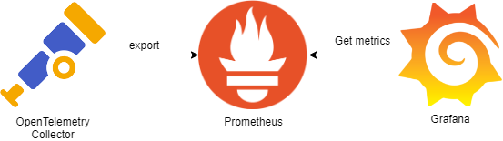

> This article was translated by GPT 5.5.

> This article records the first task at the beginning of my internship.  
> Add a unified monitoring system to the existing semi-distributed system for unified monitoring and alerting.

## Current-State Investigation

I had long heard about the popularity of Prometheus, Grafana, and OpenTelemetry in observability. The combination path is roughly to use OpenTelemetry's powerful general-purpose protocol to collect data and pass it to Prometheus,
then use Prometheus's query capabilities to provide filtered data for Grafana visualization, as shown below.



However, Prometheus and Grafana are too heavy for a business with fewer than three digits of servers. Also, because of my obsession with lightweight solutions, I chose UpTrace, a lightweight all-in-one monitoring, visualization, and log collection service written in Golang.

## UpTrace Deployment

According to UpTrace's official documentation, the whole system consists of ClickHouse, which stores detailed logs and monitoring data; a PostgreSQL database, which stores alert information and monitoring names; and the UpTrace binary program.
Considering the current pursuit of quick deployment, and also considering that the existing business system is too large and its code quality varies, many places continuously write all kinds of logs. In the future, the database data may need to be cleaned frequently, so I decided to use Docker virtual mounted disks.
In this way, because UpTrace's main configuration depends on the mapped configuration files, the database can be cleared simply by removing the virtual disk.

The UpTrace repository provides a [docker-compose file](https://github.com/uptrace/uptrace/blob/master/example/docker/docker-compose.yml) that can be used as a base.
Note that it uses some other files from the repository, such as:

```text
../../config/grafana/datasource.yml
```

Therefore, the entire repository needs to be pulled down here before starting it through Docker Compose.

## OpenTelemetry Integration

Because the current business was originally written in 2018 and overall uses relatively low-level Spring Core, it is started by Tomcat after packaging. Therefore, the Spring
Starter integration method cannot be used; only Java Agent integration can be used.

### Receiver Side

First configure two environments, test and production, in `uptrace.yml`. Add the following under `projects`.

```yaml
- id: 2
  name: Dev
  token: <Generated Token>
  pinned_attrs:
    - service
    - host_name
    - deployment_environment
  group_by_env: false
  group_funcs_by_service: false
  prom_compat: true
```

Note that the Token here should preferably not contain special characters. Otherwise, during later configuration, the Token needs to be URL-encoded to avoid problems.
After restarting Docker Compose, you can see the collection URL in UpTrace Project=>DSN. Record it for later use. The receiver-side configuration is temporarily complete.

### Collector Side

First download the latest Java
Agent from the OpenTelemetry Java
Agent [GitHub release page](https://github.com/open-telemetry/opentelemetry-java-instrumentation/releases).

Next, add a `setenv.sh` file under Tomcat's `bin` directory. This file does not exist by default, but `startup.sh` will try to load environment variables from it during startup.

Add the following code to it.

```shell
export CATALINA_OPTS="$CATALINA_OPTS -javaagent:/path/to/opentelemetry-javaagent.jar"

export OTEL_RESOURCE_ATTRIBUTES=service.name=myservice,service.version=1.0.0
export OTEL_TRACES_EXPORTER=otlp
export OTEL_METRICS_EXPORTER=otlp
export OTEL_LOGS_EXPORTER=otlp
export OTEL_EXPORTER_OTLP_COMPRESSION=gzip
export OTEL_EXPORTER_OTLP_ENDPOINT=http://localhost:14317
export OTEL_EXPORTER_OTLP_HEADERS="uptrace-dsn=http://project2_secret_token@localhost:14318?grpc=14317"
export OTEL_EXPORTER_OTLP_METRICS_TEMPORALITY_PREFERENCE=DELTA
export OTEL_EXPORTER_OTLP_METRICS_DEFAULT_HISTOGRAM_AGGREGATION=BASE2_EXPONENTIAL_BUCKET_HISTOGRAM
```

The three variables `OTEL_TRACES_EXPORTER`, `OTEL_METRICS_EXPORTER`, and `OTEL_LOGS_EXPORTER` have three values: `none`, `console`, and `otel`.
They respectively indicate outputting trace, monitoring, and log data to the console or to the remote collector.

After restarting Tomcat, the collected data will be automatically sent to UpTrace. Because this solution supports very old Spring versions and does not require inserting new code, it can achieve non-intrusive integration. For the Log4j
Appender log collection issue, there is a follow-up solution.

## Inaccurate Trace Data Issue

When tracing where a slow HTTP API was slow, I found blank sections in the Timeline provided by UpTrace, as shown below.


Each colored band in the image above represents one database query, but each query is basically under 10ms, while the total time is much greater than the pure database time.

Further investigation found that the [documentation](https://github.com/open-telemetry/opentelemetry-java-instrumentation/blob/main/docs/supported-libraries.md)
mentions that OpenTelemetry Java Agent supports Mybatis 3.2+, but none of the trace data contained anything about Mybatis. I originally thought there was a problem with my integration, but later found that the documentation has a section called
**Disabled instrumentations**, which only lists `jdbc-datasource` and `dropwizard-metrics`.
In fact, when reading the Mybatis Agent code, I found that Mybatis is also disabled by default. Therefore, a parameter needs to be added to enable it. Change the first line of `setenv.sh` to:

```shell
export CATALINA_OPTS="$CATALINA_OPTS -javaagent:/path/to/opentelemetry-javaagent.jar -Dotel.instrumentation.mybatis.enabled=true"
```

After that, I found that Mybatis deserialization consumed a large amount of time. The detailed optimization part will be recorded in the later article [Analyzing Program Bottlenecks with JProfiler](/p/jprofiler-investigate/).

## Log4j Appender Integration

Because logs need to be filtered, the existing old system's logs first have no unified format, and second contain a pile of earlier debug logs. Therefore, some advanced interception operations are needed. These cannot be done with simple Log4j injection, so
`opentelemetry-log4j-appender` is needed for further filtering. This requires at least Log4j 2.17+, and one new dependency needs to be added.

```xml

<dependency>
    <groupId>io.opentelemetry.instrumentation</groupId>
    <artifactId>opentelemetry-log4j-appender-2.17</artifactId>
    <version>2.6.0-alpha</version>
    <scope>runtime</scope>
</dependency>
```

Then make a modification in `log4j2.xml`.

```xml

<Configuration
        packages="io.opentelemetry.instrumentation.log4j.appender.v2_17">
</Configuration>
```

After that, `Appenders` can be added normally according to the official documentation.

```xml

<Appenders>
    <OpenTelemetry name="OpenTelemetryAppender"/>
</Appenders>
```

And add `AppenderRef`.

```xml

<Loggers>
    <Root>
        <AppenderRef ref="OpenTelemetryAppender" level="ERROR"/>
    </Root>
</Loggers>
```

There is no need to add registration in the main function as written in the documentation. After that, logs can be filtered by adjusting `level`.

## Monitoring Alert Notifications

UpTrace natively supports four notification channels: Slack, Telegram, WebHook, and AlertManager. However, Slack and Telegram are basically not used in mainland China, AlertManager is too heavy, and WebHook does not support custom notification formats.
Therefore, I needed to write a converter myself for notifications. Since operations staff all use iPhones, using Bark for notifications is simple and quick.

I wrote a simple conversion tool to assist with notifications. The [source code is here](https://github.com/4o3F/uptrace_webhook_convert). It is especially important to note that the example given when adding an UpTrace
WebHook is incorrect. The actual payload should be as follows.
```json
{
  "id": "1676471814931265794",
  "eventName": "created",
  "payload": {
    "custom_key": "custom_value"
  },
  "createdAt": "2023-02-15T14:36:54.931265914Z",
  "alert": {
    "id": "123",
    "url": "https://app.uptrace.dev/alerting/1/alerts/123",
    "name": "Test message",
    "type": "metric",
    "status": "open",
    "createdAt": "2023-02-15T14:36:54.931265914Z"
  }
}
```
The main point is `alert.status`, not `alert.state`, and the value should be `status-changed`, not `state-changed`.

Monitors can be added on UpTrace's Monitor page. For now, I have only added the following two.
1. Per-minute error rate, to prevent major issues in newly released versions or malicious attacks.  
The monitoring data used here should be `per_min(count($spans{_status_code="error"}))`, which represents the number of errors per minute.
2. HTTP request latency P90 monitoring, to prevent CC attacks and sudden traffic spikes.  
The monitoring data used here should be `p90($spans)`.  

At the same time, I recommend configuring both a minimum alert value and a change alert value for these. The former prevents small occasional bugs from continuously pushing notifications, and the latter prevents the monitoring system from sending status-change notifications every minute.
