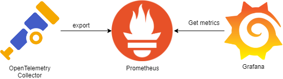

> 此文用于记录实习刚开始的第一项任务  
> 给现有的这个半分布式系统加个统一的监控系统来统一监控与预警

## 现状调查

很早之前就听说过在可观测领域，Prometheus、Grafana、OpenTelemetry的流行，其组合路径大致为使用OpenTelemetry强大的通用协议收集数据并传递到Prometheus，
再借助Prometheus的检索功能为Grafana可视化提供筛选后的数据，如下图所示。



但Prometheus和Grafana对于服务器总数不到三位数的业务来说过重了，而且由于本人对于轻量化的痴迷选择了UpTrace这款由Golang编写的轻量化，监控、可视化、日志收集All
in one服务。

## UpTrace部署

根据UpTrace官方的文档来看，整个系统由负责储存详细日志、监控数据等的ClickHouse，负责储存警告信息、监控名称等的PostgreSQL数据库，以及UpTrace二进制程序组成，
考虑到目前追求快捷部署，也考虑到现有的业务系统过于庞大，代码质量参差不齐，其中很多地方都会不断地写各种日志，未来可能需要频繁的清理掉数据库中的数据，决定采用Docker虚拟挂载磁盘
这样的话由于UpTrace的主要配置都依赖于映射后的配置文件，可以直接将虚拟磁盘下掉便可以清空数据库。

UpTrace仓库中提供了一份可以作为基础的[docker-compose文件](https://github.com/uptrace/uptrace/blob/master/example/docker/docker-compose.yml)
注意其中使用了一些仓库中的其他文件，比如

```text
../../config/grafana/datasource.yml
```

因此此处需要将整个仓库拉下来再通过Docker Compose启动。

## OpenTelemetry接入

由于现在的业务最开始是在2018年编写的，整体使用的是比较底层的Spring Core，打包后由Tomcat启动，因此无法采用Spring
Starter接入方式，只能采用Java Agent接入模式。

### 接收端

首先在`uptrace.yml`中配置测试、生产两套环境，在`projects`中添加

```yaml
- id: 2
  name: Dev
  token: <Generated Token>
  pinned_attrs:
    - service
    - host_name
    - deployment_environment
  group_by_env: false
  group_funcs_by_service: false
  prom_compat: true
```

注意此处的Token中尽量不要包含有特殊字符，不然的话在后续配置的过程中需要将Token进行URL编码来避免出现问题。
而后重启Docker Compose后可以在UpTrace Project=>DSN中看到收集用URL，记录下来以备后续使用，接收端的配置暂时告一段落。

### 收集端

首先从OpenTelemetry Java
Agent的[GitHub发布页](https://github.com/open-telemetry/opentelemetry-java-instrumentation/releases)下载最新版本的Java
Agent

接下来在Tomcat `bin`目录下新增一个`setenv.sh`文件，这个文件默认不存在，但在`startup.sh`启动的时候会尝试从其中加载环境变量。

在其中加入如下代码

```shell
export CATALINA_OPTS="$CATALINA_OPTS -javaagent:/path/to/opentelemetry-javaagent.jar"

export OTEL_RESOURCE_ATTRIBUTES=service.name=myservice,service.version=1.0.0
export OTEL_TRACES_EXPORTER=otlp
export OTEL_METRICS_EXPORTER=otlp
export OTEL_LOGS_EXPORTER=otlp
export OTEL_EXPORTER_OTLP_COMPRESSION=gzip
export OTEL_EXPORTER_OTLP_ENDPOINT=http://localhost:14317
export OTEL_EXPORTER_OTLP_HEADERS="uptrace-dsn=http://project2_secret_token@localhost:14318?grpc=14317"
export OTEL_EXPORTER_OTLP_METRICS_TEMPORALITY_PREFERENCE=DELTA
export OTEL_EXPORTER_OTLP_METRICS_DEFAULT_HISTOGRAM_AGGREGATION=BASE2_EXPONENTIAL_BUCKET_HISTOGRAM
```

`OTEL_TRACES_EXPORTER` `OTEL_METRICS_EXPORTER` `OTEL_LOGS_EXPORTER`这三个变量有三个值`none` `console` `otel`
分别代表将追踪、监控、日志数据输出到控制台或者是远程的收集端。

重启Tomcat后便会自动将收集数据发送到UpTrace，由于该方案支持的Spring版本可以很低，同时不需要插入新的代码等，可以做到非侵入式接入，对于Log4j
Appender日志收集问题，后续有解决方案。

## 追踪数据不准确问题

在追踪一个缓慢HTTP接口到底慢在哪里的时候，发现UpTrace提供的Timeline中有空白部分，如下图所示


上图中每一条色带代表一次数据库查询，但每一次查询基本都在10ms下，而总时间则远大于纯数据库时间。

进一步调查发现，[文档](https://github.com/open-telemetry/opentelemetry-java-instrumentation/blob/main/docs/supported-libraries.md)
中提及OpenTelemetry Java Agent支持3.2+的Mybatis而所有追踪数据中都没有出现关于Mybatis的。原本以为是我的接入有问题，后来发现文档中有一栏
**Disabled instrumentations**但其中只有`jdbc-datasource`和`dropwizard-metrics`
两个，实际上翻阅Mybatis的Agent代码的时候发现Mybatis也是默认关闭的，因此需要添加一个参数将其开启，将`setenv.sh`第一行改为

```shell
export CATALINA_OPTS="$CATALINA_OPTS -javaagent:/path/to/opentelemetry-javaagent.jar -Dotel.instrumentation.mybatis.enabled=true"
```

而后发现是Mybatis的反序列化耗费了大量的时间，详细的优化部分将在后面的[使用JProfiler分析程序瓶颈](/p/jprofiler-investigate/)
一文中记录。

## Log4j Appender接入

由于需要对日志进行过滤，现有的陈年旧系统里面日志一是没有统一的格式，二是还包含了一堆之前debug用的日志，所以需要一些高级拦截用操作，而这些使用简单的Log4j注入做不到，需要用
`opentelemetry-log4j-appender`来进行进一步的过滤，这需要至少2.17+的Log4j版本，同时需要新增一项依赖

```xml

<dependency>
    <groupId>io.opentelemetry.instrumentation</groupId>
    <artifactId>opentelemetry-log4j-appender-2.17</artifactId>
    <version>2.6.0-alpha</version>
    <scope>runtime</scope>
</dependency>
```

然后在`log4j2.xml`中进行一下修改

```xml

<Configuration
        packages="io.opentelemetry.instrumentation.log4j.appender.v2_17">
</Configuration>
```

这样后便可以按照官方文档正常添加`Appenders`

```xml

<Appenders>
    <OpenTelemetry name="OpenTelemetryAppender"/>
</Appenders>
```

以及添加`AppenderRef`

```xml

<Loggers>
    <Root>
        <AppenderRef ref="OpenTelemetryAppender" level="ERROR"/>
    </Root>
</Loggers>
```

无需按照文档中所写在main函数中添加注册，之后便可以通过调整`level`来过滤日志。

## 监控告警通知

UpTrace原生支持Slack、Telegram、WebHook、AlertManager这四种通知通道，然而Slack和Telegram在国内基本不用，而AlertManager又太重，
WebHook又不支持自定义通知格式，因此需要自己写个转换器来通知，鉴于运维都用的iPhone，因此直接用Bark来进行通知简单快捷。

简单的编写了一个转换工具来辅助通知，[源码地址在这里](https://github.com/4o3F/uptrace_webhook_convert)，需要格外注意的是，UpTrace
WebHook添加中给的例子并不正确，实际的应当如下
```json
{
  "id": "1676471814931265794",
  "eventName": "created",
  "payload": {
    "custom_key": "custom_value"
  },
  "createdAt": "2023-02-15T14:36:54.931265914Z",
  "alert": {
    "id": "123",
    "url": "https://app.uptrace.dev/alerting/1/alerts/123",
    "name": "Test message",
    "type": "metric",
    "status": "open",
    "createdAt": "2023-02-15T14:36:54.931265914Z"
  }
}
```
主要是`alert.status`而非`alert.state`，而且值也应当是`status-changed`而非`state-changed`。

在UpTrace的Monitor页面中可以添加监控，我暂时只添加了以下两个
1. 每分钟错误率，以此来预防新发布版本重大问题/恶意攻击  
其中使用的监控数据应当为`per_min(count($spans{_status_code="error"}))`代表每分钟错误数
2. HTTP请求延迟P90监控，以此来预防CC攻击以及突发流量等  
其中使用的监控数据应当为`p90($spans)`  

同时建议对这些都配置一个最低告警值以及变化告警值，前者是为了防止一些小的偶发bug不停的推送通知，后者是为了防止监控系统每分钟不停的发送状态改变通知。